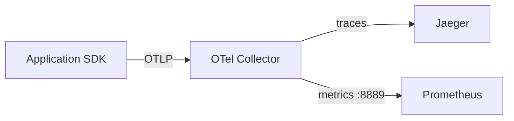

# 01. OpenTelemetry и distributed tracing

## Введение: «метрики зелёные, пользователи злятся»

Grafana показывает `up=1`, error rate 0.1%, p99 latency в норме — но **один клиент** видит таймауты 30 с. Агрегаты усредняют хвост; без **trace** вы не увидите, что запрос завис на `payment-service` → `legacy-db` после успешного cache hit в Redis.

На advanced вы строите **сквозную картину**: метрика сказала «что сломалось», лог — «где искать», trace — «какой путь запроса и где потерялось время».

## Три столпа observability

| Столп | Вопрос | Пример инструмента |
|-------|--------|-------------------|
| **Metrics** | Сколько? Как быстро? | Prometheus, CloudWatch |
| **Logs** | Что произошло в точке? | Loki, CloudWatch Logs |
| **Traces** | Как запрос прошёл по сервисам? | Jaeger, Tempo, X-Ray |

Они **дополняют** друг друга. Метрики дешёвые для алертов; traces дороже — нужен **sampling**.

## Модель trace

- **Trace** — один запрос end-to-end (общий `trace_id`).
- **Span** — один участок работы (HTTP handler, SQL, Redis `GET`).
- **Parent/child** — дерево вызовов.
- **Attributes** — ключи (`http.status_code`, `db.statement` — осторожно с PII).
- **Events** — точечные отметки внутри span.

Пример JSON (OTLP): [`examples/otel-span.json`](examples/otel-span.json).

## OpenTelemetry (OTel)

**OTel** — vendor-neutral SDK + протокол **OTLP** (gRPC `4317`, HTTP `4318`).

Типичный путь в нашем стенде:

Конфиг collector: [`deploy/observability/config/otel-collector.yml`](../../deploy/observability/config/otel-collector.yml).

| Компонент | Роль |
|-----------|------|
| **SDK** (auto-instrumentation) | Создаёт spans в коде |
| **Collector** | Приём, batch, routing, sampling |
| **Backend** | Jaeger UI, Tempo, Honeycomb, X-Ray |

## Propagation (W3C Trace Context)

Сервис A должен передать `traceparent` (и опционально `tracestate`) в HTTP/gRPC к сервису B — иначе trace **обрывается**.

| Заголовок | Назначение |
|-----------|------------|
| `traceparent` | `version-trace_id-parent_span_id-flags` |
| `tracestate` | Vendor-specific hints |

**На собеседовании:** «Забыли propagation в async queue — в Jaeger два несвязанных trace».

## Sampling

| Стратегия | Когда |
|----------|-------|
| **Head-based** (1%) | Дешёво, равномерно |
| **Tail-based** (в collector) | Хранить все ошибки и медленные |
| **Parent-based** | Дочерние spans следуют решению root |

Правило: **100% traces в prod** на высоком RPS — взорвёт storage. Алертите по **метрикам**; traces — для расследования.

## OTel vs «просто Jaeger»

Jaeger — **backend + UI**. OTel — **стандарт сбора**. В AWS аналог traces — [X-Ray](../aws-intermediate/19-cloudwatch.md) (`tracing_config` на Lambda).

## Связь с Redis monitoring

Медленный API часто — не HTTP, а **Redis**. В trace добавьте child span `redis.GET` с `db.system=redis`. Метрики смотрите в [`redis-intermediate/15-monitoring`](../redis-intermediate/15-monitoring.md): `SLOWLOG`, `commandstats`, latency doctor — это **узкий срез datastore**, trace покажет **долю** Redis в общем запросе.

## Типичные ошибки

| Ошибка | Последствие |
|--------|-------------|
| `user_id` в span name | Cardinality в backend |
| Spans без `service.name` | «unknown» в Jaeger |
| Нет correlation trace_id ↔ log | Прыжки между UI |
| Sync export из app | Backpressure, latency |

## На собеседовании

1. **Чем trace отличается от лога?** Лог — событие в одном процессе; trace — связанное дерево через сервисы.
2. **Зачем Collector, а не напрямую в Jaeger?** Sampling, PII scrubbing, fan-out (metrics + traces), единая точка конфигурации.
3. **Как дебажить 0.01% ошибок?** Tail sampling + metric `http_errors` + exemplars (Prometheus 2.x) или trace_id в логах.

## Резюме

- Traces отвечают на **«где время и кто виноват в цепочке»**.
- OTel + OTLP — стандарт; Jaeger — UI в [`deploy/observability`](../../deploy/observability/README.md) на порту **16686**.
- Sampling обязателен в production; propagation — обязательна между сервисами.

Следующий урок: [02-lab-jaeger.md](02-lab-jaeger.md).
