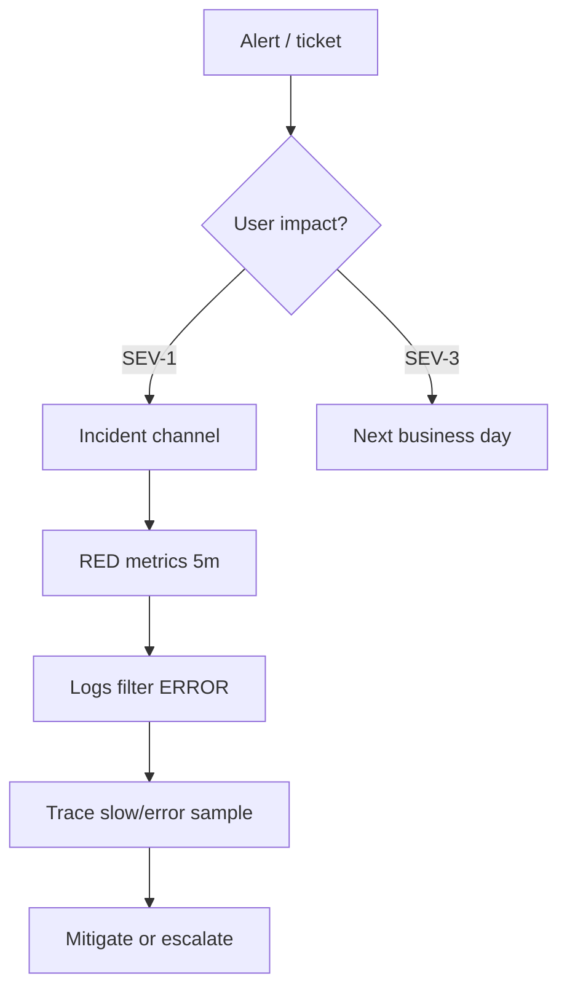

# 07. Troubleshooting и runbooks

## Введение: on-call без runbook = heroics

В 03:00 страница **Checkout down**. Новый инженер перезапускает pods «на удачу». Senior открывает runbook: **symptom → metrics → logs → traces → mitigation** — за 12 минут rollback deploy. Runbook — часть **observability**, не PDF в Confluence.

Шаблон: [`examples/runbook-template.md`](examples/runbook-template.md).

## Framework: первые 10 минут



| Шаг | Инструмент | Вопрос |
|-----|------------|--------|
| 1 | Alertmanager / PagerDuty | Что горит? |
| 2 | Grafana RED | Rate, Errors, Duration |
| 3 | Loki / CloudWatch Logs | Новый ERROR pattern? |
| 4 | Jaeger / X-Ray | Какой span медленный? |
| 5 | `kubectl` / runbook | Mitigation |

## RED и USE

| Метод | Для чего | Пример |
|-------|----------|--------|
| **RED** | Microservices | Rate, Errors, Duration |
| **USE** | Infra (CPU, disk, net) | Utilization, Saturation, Errors |

```promql
# Error ratio
sum(rate(demo_http_requests_total{status=~"5.."}[5m]))
/ sum(rate(demo_http_requests_total[5m]))

# p99 latency
histogram_quantile(0.99,
  sum(rate(demo_http_request_duration_seconds_bucket[5m])) by (le, path))
```

## Корреляция signals

| Связка | Как |
|--------|-----|
| trace_id в логах | JSON field `trace_id` из OTel |
| Exemplars | Prometheus → jump to trace (если настроено) |
| Время | Один timezone UTC; note deploy time |

## Сценарии (шпаргалка)

### 1. Latency spike, errors низкие

- Проверить **dependency** spans (DB, Redis).
- Redis: `SLOWLOG`, `INFO commandstats` — [redis-advanced/09](../redis-advanced/09-troubleshooting.md).
- Node saturation: `container_cpu_usage_seconds_total`, throttling.

### 2. Error rate 5xx

- Deploy correlation (`kube_deployment_status_replicas_updated`).
- Recent config / feature flag.
- Downstream 503 в trace.

### 3. «Нет данных» в Grafana

- Target `up==0`?
- Scrape interval vs alert `for:`?
- CloudWatch: wrong region/namespace — [19-cloudwatch](../aws-intermediate/19-cloudwatch.md).

### 4. Alert storm

- Alertmanager **inhibition**: node down → suppress app alerts.
- Fix root cause, не 50 silences навсегда.

## Runbook quality bar

Хороший runbook:

- **Copy-paste PromQL** и log queries
- **Ожидаемые значения** («норма < 0.01»)
- **Escalation** с таймерами
- Ссылка на **dashboard** и **previous incidents**

Плохой: «проверьте мониторинг».

## Параллель с Redis runbooks

[`redis-advanced/09`](../redis-advanced/09-troubleshooting.md) — первые 5 минут: `PING`, `INFO`, `SLOWLOG`. Observability runbook **включает** datastore-шаги как ветку, не заменяет их.

## AWS hybrid

Lambda errors: metric filter + alarm → SNS ([20-lab-cloudwatch](../aws-intermediate/20-lab-cloudwatch.md)). EKS workloads — Prometheus + optional **CloudWatch agent** для control plane logs.

## На собеседовании

1. **Как отличить infra vs app?** Node USE vs RED на service; trace показывает layer.
2. **Когда эскалировать?** SLO burn, нет mitigation 15–30 min, data loss risk.
3. **Postmortem без blame** — action items: alert, runbook, cardinality fix.

## Резюме

- Runbook = воспроизводимый путь от симптома к действию.
- RED + logs + traces; Redis/AWS — специализированные ветки.
- Шаблон в `examples/runbook-template.md`.

Следующий урок: [08-lab-oncall-drill.md](08-lab-oncall-drill.md).
