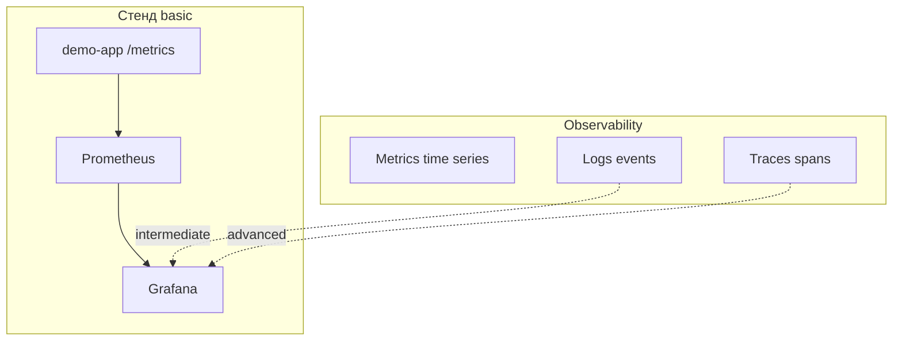

# 01. Зачем observability: метрики, логи, трейсы

## Введение: «всё зелёное, пользователи кричат»

Релиз прошёл: healthcheck `/health` отвечает 200, деплой зелёный. Через час support: **checkout падает на 30% запросов**. В логах миллионы строк, в APM — «всё нормально» по среднему latency. Оказывается, **5% запросов** к платёжному API занимают 40 с, а остальные — 50 мс; среднее **скрывает хвост**. SRE открывает **Grafana**: p99 latency вырос в 10 раз, **error rate** по `status=5xx` — 8%. За 15 минут находят **утечку connection pool** — не «магия продакшена», а **наблюдаемость**.

Эта глава — **ментальная карта**: что такое observability, чем она отличается от «просто мониторинга» и с чего начать на стенде Prometheus + Grafana.

## Что вы узнаете

- Три столпа: **metrics**, **logs**, **traces** — роли и порядок в инциденте.
- Разница **monitoring** vs **observability** (известные vs неизвестные сбои).
- Почему **Prometheus + Grafana** — де-факто стандарт в cloud-native.
- Границы basic: метрики и алерты; логи — [11. Логи](11-logs-preview.md), k8s — [kuber-advanced/14](../kuber-advanced/14-observability.md).

## Три столпа

| Столп | Вопрос | Пример на стенде |
|-------|--------|------------------|
| **Metrics** | Сколько? Как быстро? Какой % ошибок? | `demo_http_requests_total`, histogram latency |
| **Logs** | Что случилось в этом запросе? | stdout контейнера → Loki (intermediate) |
| **Traces** | Где потерялись 200 мс между сервисами? | Jaeger / OTel (advanced) |



**Метрики** — числа во времени с labels (низкая кардинальность, дешёвые алерты). **Логи** — текстовые события (высокая детализация, дороже хранить). **Трейсы** — дерево вызовов одного request id.

## Monitoring vs observability

| | Monitoring | Observability |
|---|------------|---------------|
| Цель | знать заранее «что сломалось» | **понять почему** при новом сбое |
| Дашборды | фиксированный набор KPI | **ad-hoc** запросы (PromQL, Explore) |
| Данные | заранее экспортированные метрики | метрики + логи + трейсы, корреляция |

Observability не отменяет **SLO и алерты** — она даёт **инструменты расследования**, когда алерт сработал впервые.

## Типовой путь инцидента

1. **Alert** в Alertmanager: `DemoHighErrorRate` firing.
2. **Grafana**: панель error rate, RPS, p95 latency — [10. Золотые сигналы](10-golden-signals.md).
3. **Prometheus → Graph**: `sum by (status)(rate(...))` — какой код?
4. **Логи** (если есть Loki): фильтр по `trace_id` или `pod` — [11. Логи](11-logs-preview.md).
5. **Трейс** (advanced): узкое место в downstream DB.

На basic-уровне вы закрепляете шаги **1–3** на [`deploy/observability`](../../deploy/observability/README.md).

## Почему Prometheus, а не «сразу Datadog»

| | Prometheus (pull) | SaaS APM |
|---|-------------------|----------|
| Модель | scrape `/metrics`, TSDB | agent / SDK push |
| Стоимость | self-hosted, предсказуемо | per host / per span |
| Экосистема | CNCF, kube-prometheus, exporters | богатый UI из коробки |
| Порог входа | PromQL, labels | быстрый старт |

В продакшене часто **и то, и другое**: Prometheus для инфраструктуры и SLO, SaaS — для бизнес-трейсов. Сравнение — [12. vs CloudWatch/Datadog](12-vs-cloudwatch-datadog.md).

## На стенде: первое касание

```bash
cd deploy/observability
docker compose up -d --build
docker compose ps
bash scripts/smoke.sh
```

| URL | Назначение |
|-----|------------|
| [localhost:9090](http://localhost:9090) | Prometheus UI |
| [localhost:3000](http://localhost:3000) | Grafana (`admin` / `admin`) |
| [localhost:8000/metrics](http://localhost:8000/metrics) | текстовые метрики demo-app |

Сгенерируйте нагрузку:

```bash
bash scripts/traffic.sh
```

В Prometheus → **Graph** выполните `up` — все targets должны быть `1`.

## Типичные ошибки

| Ошибка | Почему плохо | Как правильно |
|--------|--------------|---------------|
| «Смотрим только averages» | скрывает p99 и хвосты | percentiles из histogram, RED |
| «Логи = мониторинг» | нет агрегации, дорого алертить | метрики для алертов, логи для деталей |
| «1000 labels на user_id» | взрыв кардинальности, OOM TSDB | labels: `service`, `status`, `route` |
| «Алерт на каждый чих» | alert fatigue | `for:`, severity, SLO-based |
| «Дашборд без runbook» | паника при firing | annotation + ссылка на playbook |

## В продакшене

- **SLO**: error budget, burn rate alerts (advanced).
- **Retention**: 15d–90d Prometheus; долгосрочное — Thanos/Mimir.
- **HA**: два Prometheus + federation или remote write (intermediate/advanced).
- **Kubernetes**: тот же стек через **kube-prometheus-stack** — см. [kuber-advanced/14-observability](../kuber-advanced/14-observability.md) (ServiceMonitor, kube-state-metrics).
- **Безопасность**: не светить `/metrics` в интернет без auth; отдельная сеть scrape.

## Заметки для собеседования

- **Observability** — способность ответить на **новый** вопрос о системе без передеплоя кода.
- **Pull vs push**: Prometheus тянет метрики по HTTP; pushgateway — исключение для batch jobs.
- **Cardinality** — число уникальных time series = metric × комбинации labels.
- **RED**: Rate, Errors, Duration — для сервисов; **USE**: Utilization, Saturation, Errors — для ресурсов.

## Резюме

Observability — не один инструмент, а **культура и стек**: метрики для **трендов и алертов**, логи для **контекста**, трейсы для **распределённых задержек**. Basic-курс строит фундамент на **Prometheus + Grafana** локально; дальше — Loki, OTel, Kubernetes.

## Чек-лист

- Назовите три столпа и один вопрос каждому.
- Чем p99 latency важнее среднего?
- Зачем labels в Prometheus и чем опасен `user_id`?
- Какой URL метрик на стенде demo-app?

Следующий урок: [02. Модель Prometheus](02-prometheus-model.md).
