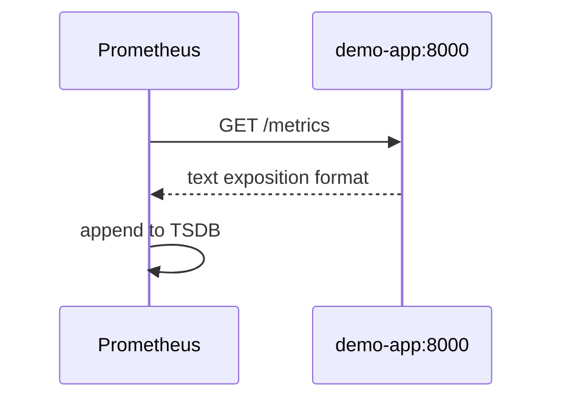

# 02. Модель Prometheus: метрики, labels, TSDB

## Введение: «одна метрика — тысяча серий»

Разработчик добавил label `request_id` в counter «для удобства». Через сутки Prometheus **съел 32 ГБ RAM** и упал — каждый запрос создал **новую time series**. На собеседовании спрашивают не «как установить», а **как устроены типы метрик и labels**. Эта глава — модель данных Prometheus на примере **demo-app** стенда.

## Что вы узнаете

- Типы: **Counter**, **Gauge**, **Histogram**, **Summary**.
- Имена, **labels**, **job** / **instance** от scrape.
- Как Prometheus **хранит** сэмплы (TSDB, scrape interval).
- Связь экспорта в приложении с текстом `/metrics`.

## Pull-модель



Каждые `scrape_interval` (на стенде **15s**, см. `config/prometheus.yml`) Prometheus опрашивает targets из `scrape_configs`. Target «жив» — метрика **`up{job="demo-app"} == 1`**.

## Типы метрик

| Тип | Монотонность | Пример demo-app | PromQL |
|-----|--------------|-----------------|--------|
| **Counter** | только растёт (reset при рестарте) | `demo_http_requests_total` | `rate()`, `increase()` |
| **Gauge** | вверх/вниз | `demo_http_in_progress` | мгновенное значение |
| **Histogram** | распределение + buckets | `demo_http_request_duration_seconds` | `histogram_quantile()` |
| **Summary** | квантили на клиенте | реже в basic | `quantile` label |

**Counter** никогда не уменьшается — для «сколько запросов всего». **Gauge** — «сколько сейчас в полёте». **Histogram** — для **SLI latency**: клиент записывает наблюдения в buckets `_bucket`, `_sum`, `_count`.

Фрагмент exposition (см. [localhost:8000/metrics](http://localhost:8000/metrics)):

```text
demo_http_requests_total{method="GET",path="/",status="200"} 42
demo_http_request_duration_seconds_bucket{path="/",le="0.05"} 38
demo_http_in_progress 0
```

## Labels и кардинальность

Метрика = имя + набор labels:

```text
demo_http_requests_total{job="demo-app", instance="demo-app:8000", method="GET", path="/", status="200"}
```

| Label | Кто задаёт | Зачем |
|-------|------------|-------|
| `job` | `scrape_configs.job_name` | логическая группа |
| `instance` | target host:port | конкретный pod/контейнер |
| `method`, `path`, `status` | приложение | разрез HTTP |

**Правило:** labels — **низкая кардинальность** (`status`, `path` без id). Не кладите UUID, email, `request_id`.

Оценка: 3 статуса × 5 path × 2 method ≈ 30 series на counter — OK.  
1M пользователей как label — **катастрофа**.

## Именование

- Суффикс `_total` для counters (конвенция Prometheus).
- `_seconds` для длительностей в **секундах** (не миллисекунды).
- `_bytes` для памяти.
- Один бизнес-смысл — одно имя метрики; разрезы — labels.

## TSDB и retention

Prometheus хранит **блоки** сэмплов на диске (в Docker-volume на стенде). Параметры:

- **scrape_interval** — как часто снимаем точку.
- **evaluation_interval** — как часто пересчитываем rules.
- **retention** — сколько держим (по умолчанию 15d; на учебном стенде мало данных).

Запросы **всегда** к прошлому: `rate(metric[5m])` — средняя скорость за окно **5 минут** (не «последняя точка»).

## Jobs на стенде

Из [`deploy/observability/config/prometheus.yml`](../../deploy/observability/config/prometheus.yml):

| job | target | Метрики |
|-----|--------|---------|
| `prometheus` | self | `prometheus_*` |
| `demo-app` | `:8000` | `demo_http_*` |
| `node-exporter` | `:9100` | `node_*` |
| `cadvisor` | `:8080` | `container_*` |

Подробнее scrape — [06. Exporters](06-exporters-scrape.md).

## PromQL — ментальная модель (превью)

| Задача | Идея | Пример |
|--------|------|--------|
| RPS | производная counter | `rate(demo_http_requests_total[5m])` |
| % 404 | отношение rates | см. [`examples/promql-queries.txt`](examples/promql-queries.txt) |
| p95 latency | квантиль по buckets | `histogram_quantile(0.95, sum by (le)(rate(..._bucket[5m])))` |
| Жив ли target | built-in | `up{job="demo-app"}` |

Практика — [03. Лаба PromQL](03-lab-promql.md).

## Типичные ошибки

| Ошибка | Симптом | Исправление |
|--------|---------|-------------|
| `rate()` на Gauge | бессмысленные пики | Gauge без rate или `deriv()` осознанно |
| Забыли `[5m]` | синтаксическая ошибка | всегда range для `rate/increase` |
| `histogram_quantile` без `sum by (le)` | неверный квантиль | агрегировать buckets перед quantile |
| Дубли labels при join | лишние series | `on()`, `group_left` — intermediate |
| Читать counter как «RPS» | завышение | только `rate` / `increase` |

## В продакшене

- **Recording rules** — предвычисленные тяжёлые запросы для дашбордов.
- **Federation** / **remote write** — несколько кластеров (advanced).
- **Service discovery** — Kubernetes SD вместо static_configs ([kuber-advanced/14](../kuber-advanced/14-observability.md)).
- Экспорт из приложения: официальные клиенты (`prometheus_client` в demo-app), не hand-written text без тестов.

## Заметки для собеседования

- **Counter** + `rate` = события в секунду.
- **Histogram** vs **Summary**: histogram агрегируется на сервере PromQL; summary — квантили на клиенте, хуже merge между репликами.
- **`up`** — synthetic metric scrape health.
- **High cardinality** — главный враг стабильности Prometheus.

## Резюме

Prometheus — **time series DB** с **pull-scrape** и богатым языком **PromQL**. Вы проектируете метрики как **тип + умеренные labels**; counters и histograms покрывают RED для HTTP. Следующий шаг — руки в Graph UI.

## Чек-лист

- Чем Counter отличается от Gauge на примере demo-app?
- Зачем у histogram суффиксы `_bucket`, `_sum`, `_count`?
- Что означает `up==0`?
- Почему `user_id` в labels — антипаттерн?

Следующий урок: [03. Лаба: PromQL](03-lab-promql.md).
