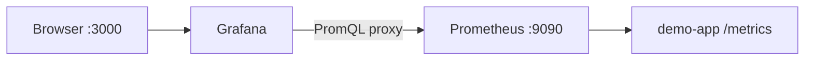

# 04. Grafana: datasource, панели, переменные

## Введение: «Prometheus умеет графики, зачем Grafana?»

Prometheus Graph хорош для **отладки запроса**. Но для on-call нужны **дашборды с рядами панелей**, переменные `environment=prod|staging`, единый вход для **логов и метрик**, права доступа для команды. **Grafana** — слой визуализации и (позже) корреляции; Prometheus остаётся **источником истины по метрикам**.

На стенде Grafana уже смонтирована с datasource Prometheus — см. provisioning в `deploy/observability/config/grafana/`.

## Что вы узнаете

- **Organization**, **dashboard**, **panel**, **datasource**.
- Типы панелей: **Time series**, **Stat**, **Gauge**, **Table**.
- **Explore** vs dashboard.
- Переменные dashboard и аннотации.

## Архитектура на стенде



Логин по умолчанию: **`admin` / `admin`** (смените в проде). URL: [http://localhost:3000](http://localhost:3000).

## Datasource

**Configuration → Data sources → Prometheus** (provisioning уже создал):

- URL внутри compose: `http://prometheus:9090`
- Access: **Server** (Grafana backend ходит в Prometheus, браузер — только в Grafana)

Проверка: **Save & test** → «Successfully queried». Если **No data** на панелях — см. troubleshooting в [`deploy/observability/README.md`](../../deploy/observability/README.md).

## Dashboard и панели

| Элемент | Назначение |
|---------|------------|
| **Dashboard** | страница для сервиса/кластера |
| **Row** | группировка панелей |
| **Panel** | один график или stat |
| **Query** | PromQL (или LogQL позже) |
| **Legend** | подписи series из labels |

Рекомендуемый ряд для HTTP (RED) — [10. Золотые сигналы](10-golden-signals.md):

1. **RPS** — `sum(rate(demo_http_requests_total[5m]))`
2. **Error %** — доля non-2xx или 5xx
3. **p95 latency** — `histogram_quantile(...)`

**Unit** панели: requests/sec, percent (0–1 или 0–100 — настройте), seconds (s).

## Типы визуализаций

| Тип | Когда |
|-----|-------|
| **Time series** | тренды во времени |
| **Stat** | одно число «сейчас» (RPS, up) |
| **Gauge** | утилизация с порогами цветов |
| **Table** | топ N по label (`sum by (path)(...)`) |

**Min step** / **Resolution**: не дробите интервал меньше scrape_interval (15s на стенде).

## Explore

**Explore** (иконка компаса) — песочница PromQL без сохранения дашборда. Удобно во время инцидента: построили запрос → **Add to dashboard**.

Hotkeys: Run query — `Shift+Enter`.

## Переменные (variables)

Переменная **query** из Prometheus:

- Name: `job`
- Query: `label_values(up, job)`
- Multi-select, Include All

В панели:

```promql
sum(rate(demo_http_requests_total{job="$job"}[5m]))
```

На стенде jobs: `demo-app`, `node-exporter`, `cadvisor`, `prometheus`.

## Аннотации и пороги

- **Thresholds** на Stat/Gauge: зелёный / жёлтый / красный по SLO.
- **Annotations** — вертикальные линии деплоев (manual или из CI) — связывают «что выкатили» с скачком latency.

## Provisioning vs UI

В репозитории:

- `config/grafana/provisioning/datasources/` — datasource
- `config/grafana/provisioning/dashboards/` — JSON дашборды (папка `json/`)

В basic вы создаёте дашборд **в UI** ([05. Лаба](05-lab-dashboard.md)); в CI/CD дашборды версионируют как JSON (intermediate).

## Типичные ошибки

| Ошибка | Симптом | Исправление |
|--------|---------|-------------|
| Datasource URL `localhost:9090` внутри Grafana container | connection refused | `http://prometheus:9090` |
| Percent 0–100, а запрос 0–1 | вводящие в заблуждение цвета | unit Percent (0.0–1.0) |
| Слишком много series на одном графике | нечитаемо | `topk`, агрегация `sum by` |
| Instant query на time series panel | пусто/точка | Range query + `$__rate_interval` |
| Нет трафика | flat zero | `scripts/traffic.sh` |

## В продакшене

- **SSO** (OAuth), RBAC: viewer / editor / admin.
- Папки дашбордов по командам; **теги** `service=treasury`.
- Версионирование JSON в Git; запрет правок в prod UI (optional).
- **Grafana OnCall** / интеграция с Alertmanager — advanced.
- В Kubernetes дашборды из **kube-prometheus-stack** — обзор [kuber-advanced/14](../kuber-advanced/14-observability.md).

## Заметки для собеседования

- Grafana **не хранит** метрики долгосрочно — запрашивает backend.
- **`$__rate_interval`** — авто-окно для `rate` в зависимости от zoom.
- **Dashboard as code** — снижает drift между средами.

## Резюме

Grafana превращает PromQL в **операционную картину**: RED-панели, переменные, пороги. Datasource на стенде уже настроен — ваша задача **собрать смысловой дашборд** для demo-app.

## Чек-лист

- Где проверить, что Prometheus datasource жив?
- Какие три панели вы бы добавили для checkout API?
- Чем Explore отличается от dashboard?
- Почему в Docker-compose URL Prometheus не `localhost`?

Следующий урок: [05. Лаба: дашборд](05-lab-dashboard.md).
