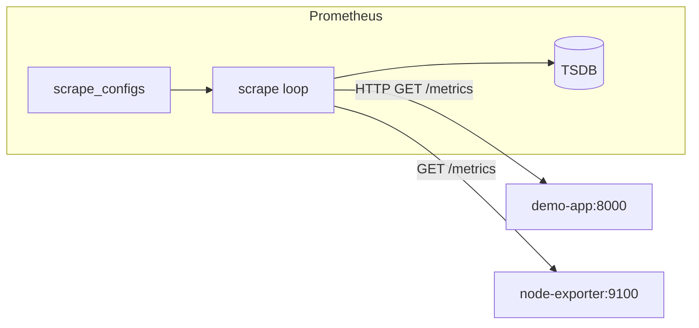

# 06. Exporters и scrape: jobs, targets, `up`

## Введение: «приложение не в Prometheus, но „работает“»

Команда открыла `/metrics` только внутри pod — снаружи Prometheus **не достучался**, target **DOWN**, алертов нет, потому что правило не написали. Другая команда поставила **node-exporter** на каждую VM — и наконец увидела **disk full за день до падения**. Эта глава — как Prometheus **узнаёт** о мире: scrape config, exporters, метка **`up`**.

## Что вы узнаете

- **`scrape_configs`**: `job_name`, `static_configs`, интервалы.
- **Exporters**: node-exporter, cAdvisor, application `/metrics`.
- Метрики **`up`**, **`scrape_duration_seconds`**.
- Relabeling — на уровне идей (детали — intermediate).

## Scrape lifecycle



Каждый успешный scrape добавляет `up{job,instance}=1`. Ошибка сети или HTTP → sample может отсутствовать, **`up=0`**.

Глобальные интервалы в [`config/prometheus.yml`](../../deploy/observability/config/prometheus.yml):

```yaml
global:
  scrape_interval: 15s
  evaluation_interval: 15s
```

## Job и target

| Понятие | Пример на стенде |
|---------|------------------|
| **job** | `demo-app` — логическая роль |
| **target** | `demo-app:8000` — host:port |
| **instance** label | `demo-app:8000` (по умолчанию = target) |

Несколько targets в одном job — одна конфигурация, разные instance:

```yaml
- job_name: demo-app
  static_configs:
    - targets: ["demo-app:8000"]
```

## Типы источников метрик

| Источник | Как отдаёт метрики | Когда |
|----------|-------------------|-------|
| **Application** | встроенный `/metrics` (client library) | ваш сервис |
| **Exporter** | отдельный процесс, переводит stats в Prom format | Postgres, Redis, hardware |
| **Infrastructure** | cAdvisor, kubelet | контейнеры, k8s |

На стенде:

- **demo-app** — приложение ([`demo/app.py`](../../deploy/observability/demo/app.py))
- **node-exporter** — CPU, RAM, disk хоста
- **cadvisor** — per-container CPU/memory ([localhost:8082](http://localhost:8082) UI)
- **prometheus** — self-monitoring

## Exposition format

Текстовый формат OpenMetrics/Prometheus:

```text
# HELP demo_http_requests_total HTTP requests
# TYPE demo_http_requests_total counter
demo_http_requests_total{method="GET",path="/",status="200"} 100
```

Prometheus парсит **lines**; `#` — комментарии HELP/TYPE.

Проверка с хоста:

```bash
curl -s http://localhost:8000/metrics | head -20
```

## `up` и health

| Запрос | Смысл |
|--------|-------|
| `up` | 1 = последний scrape успешен |
| `up{job="demo-app"}==0` | приложение недоступно для Prometheus |
| `scrape_duration_seconds` | длительность опроса — рост = медленный endpoint |

**Важно:** `up` — доступность **для мониторинга**, не замена healthcheck балансировщика. Приложение может отвечать `/health` пользователям, но быть недоступным из сети Prometheus.

## Service discovery (обзор)

В Docker Compose — **static_configs**. В Kubernetes Prometheus Operator подставляет pods через **kubernetes_sd_configs** или CRD **ServiceMonitor** — см. [kuber-advanced/14-observability](../kuber-advanced/14-observability.md):

```yaml
endpoints:
  - port: metrics
    interval: 30s
```

Там же **kube-state-metrics** даёт `kube_pod_status_phase` — метрики объектов API, не cgroup.

## Relabeling (идея)

Перед записью Prometheus может **изменить labels** (`relabel_configs`):

- выбросить ненужные targets
- добавить `environment="lab"`
- заменить port

Без relabeling легко случайно scrape **все** endpoints sidecar'ов — дублирование series.

## Типичные ошибки

| Ошибка | Симптом | Исправление |
|--------|---------|-------------|
| Неверный DNS в compose | `up=0` | имя сервиса из `docker-compose.yml` |
| Metrics на другом path | DOWN | `metrics_path: /actuator/prometheus` |
| TLS без `scheme: https` | scrape fail | certs или insecure_skip_verify (осторожно) |
| Два scrape одного процесса | дубли series | один job на приложение |
| Огромный `/metrics` | долгий scrape | уменьшить cardinality |

## В продакшене

- **Network policies**: только Prometheus → :9100 / :8080.
- **Отдельный internal LB** для scrape в multi-AZ.
- **Blackbox exporter** — синтетика снаружи (HTTP probe).
- **Recording** `instance:up` не нужен — `up` уже есть.
- Лимит **scrape_timeout** < interval.

## Заметки для собеседования

- Prometheus **pull** — обнаружение «кто жив» через targets, не push от агента.
- **Exporter** — sidecar/process, не замена instrumentирования бизнес-метрик в app.
- **cAdvisor** vs **node-exporter**: контейнер vs хост.
- **ServiceMonitor** — декларативный scrape в k8s (operator).

## Резюме

Scrape — сердце Prometheus: **job** группирует targets, **`up`** — быстрый сигнал доступности. Exporters расширяют охват на OS и контейнеры; приложение обязано отдавать **осмысленные** business-метрики на `/metrics`.

## Чек-лист

- Из чего состоит `static_configs` на стенде?
- Чем отличается недоступность app для пользователя и `up==0`?
- Зачем node-exporter на каждой ноде?
- Где в k8s описывают scrape приложения?

Следующий урок: [07. Лаба: targets](07-lab-targets.md).
