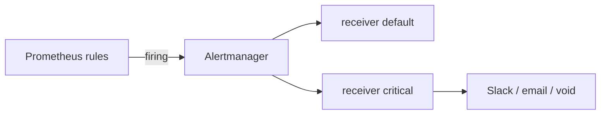

# 08. Алертинг: правила, Alertmanager, routing

## Введение: «дашборд красный, телефон молчит»

On-call смотрит Grafana в 3 ночи — **никто не позвонил**, потому что «красный порог» был только на панели, без **alert rule**. И наоборот: **50 алертов в час** на CPU > 50% — все игнорируют. Зрелый стек: **Prometheus rules** → **Alertmanager** (группировка, routing) → PagerDuty/Slack. На стенде Alertmanager уже подключён в `prometheus.yml`.

## Что вы узнаете

- **Alerting rule** vs **recording rule**.
- Поля: `expr`, `for`, `labels`, `annotations`.
- **Alertmanager**: route, receiver, inhibit.
- Связь с RED и runbook.

## Цепочка алерта



1. Каждый `evaluation_interval` Prometheus вычисляет `expr`.
2. Условие истинно → alert **Pending**; после `for` — **Firing**.
3. Firing отправляется в Alertmanager.
4. Alertmanager **группирует**, **подавляет дубликаты**, маршрутизирует.

## Alerting rule

Пример со стенда [`config/rules/demo-alerts.yml`](../../deploy/observability/config/rules/demo-alerts.yml):

```yaml
- alert: DemoTargetDown
  expr: up{job="demo-app"} == 0
  for: 1m
  labels:
    severity: critical
  annotations:
    summary: "demo-app scrape target is down"
```

| Поле | Назначение |
|------|------------|
| `alert` | имя алерта (кардинальность по labels) |
| `expr` | PromQL → boolean / vector |
| `for` | сколько держится перед firing |
| `labels` | `severity`, `team` — для routing |
| `annotations` | текст для человека, ссылки на runbook |

**Recording rule** (не шлёт в AM):

```yaml
- record: job:demo_rps:5m
  expr: sum(rate(demo_http_requests_total[5m]))
```

Ускоряет дашборды; в basic достаточно знать, что существует.

## Хорошие выражения

| Плохо | Лучше |
|-------|-------|
| `demo_http_requests_total > 1000` | `rate(...[5m]) > N` на counter |
| alert без `for` | `for: 2m` — отсечь флап |
| только `avg(cpu)<20` | USE + saturation, SLO-based |
| 404 в dev как critical | severity по среде |

Образец доли ошибок — [`examples/alert-rule.yml`](examples/alert-rule.yml).

## Alertmanager

[`config/alertmanager.yml`](../../deploy/observability/config/alertmanager.yml):

- **route.tree** — match `severity: critical` → receiver `critical`
- **group_by** — одно письмо на группу `alertname`
- **group_wait** / **repeat_interval** — не спамить
- **inhibit_rules** — critical подавляет warning с тем же `alertname`

На учебном стенде receivers **пустые** (алерты видны в UI AM, не уходят в Slack). UI: [http://localhost:9093](http://localhost:9093).

## Severity и runbook

| severity | Пример | Действие |
|----------|--------|----------|
| `warning` | рост 404, диск 80% | разбор в рабочее время |
| `critical` | `up==0`, error rate > SLO | немедленный on-call |

В `annotations` добавьте:

```yaml
runbook_url: "https://wiki.example/demo-app-down"
```

## Связь с RED

| Сигнал | Пример expr |
|--------|-------------|
| Rate drop | `sum(rate(...[5m])) < 0.1` |
| Errors | доля 5xx > 5% (demo rule `DemoHighErrorRate`) |
| Duration | `histogram_quantile(0.95, ...) > 0.5` |

Практика — [09. Лаба Alertmanager](09-lab-alertmanager.md).

## Типичные ошибки

| Ошибка | Последствие |
|--------|-------------|
| Алерт на каждый pod без aggregate | N одинаковых pages |
| Нет `for` на шумных метриках | alert fatigue |
| Разные пороги в Grafana и rules | недоверие к дашборду |
| Забыли `alertmanagers` в prometheus.yml | firing только в Prometheus UI |
| Высокая кардинальность в `alert` labels | взрыв уведомлений |

## В продакшене

- **On-call rotation**, эскалация, **silence** с TTL на плановые работы.
- **Alertmanager HA** — пара инстансов (intermediate).
- **Unit tests** для rules: `promtool test rules`.
- В k8s те же правила через PrometheusRule CRD — [kuber-advanced/14](../kuber-advanced/14-observability.md).

## Заметки для собеседования

- **Pending vs Firing** — роль `for`.
- **Alertmanager** не вычисляет PromQL — только маршрутизация.
- **Inhibition** — «master» alert глушит зависимые.
- **Watchdog** / **Dead man’s switch** — алерт «сам мониторинг жив» (advanced).

## Резюме

Алерт — **контракт с on-call**: осмысленный PromQL, `for`, severity, annotation с runbook. Alertmanager доставляет **сгруппированно** и **маршрутизированно**.

## Чек-лист

- Чем alerting rule отличается от recording rule?
- Зачем `for: 2m`?
- Где на стенде смотреть firing alerts кроме Prometheus?
- Какой alert на стенде срабатывает при остановке demo-app?

Следующий урок: [09. Лаба: Alertmanager](09-lab-alertmanager.md).
