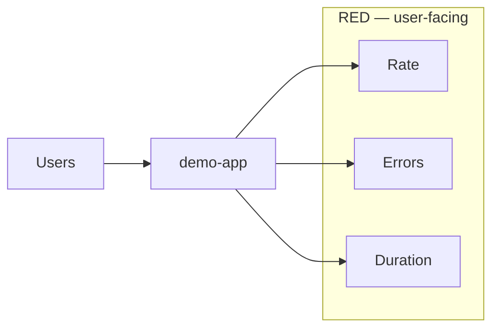
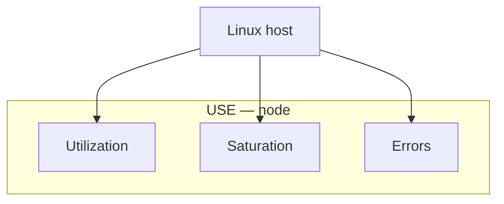

# 10. Золотые сигналы: RED и USE

## Введение: «CPU 30%, а клиенты ждут минуту»

Дашборд инфраструктуры зелёный: CPU низкий, RAM свободна. Но **очередь запросов** в приложении забита — saturation. Другой инцидент: CPU 95%, но ошибок нет — просто **batch job**. Методологии **RED** (сервисы) и **USE** (ресурсы) помогают не смешивать «железо» и «опыт пользователя».

## Что вы узнаете

- **RED**: Rate, Errors, Duration — для request-driven сервисов.
- **USE**: Utilization, Saturation, Errors — для CPU, disk, network.
- Маппинг на метрики **demo-app** и **node-exporter**.
- Как выбирать SLI и пороги алертов.

## RED — для сервисов

| Буква | Вопрос | demo-app | PromQL (идея) |
|-------|--------|----------|---------------|
| **R** Rate | сколько запросов/с? | throughput | `sum(rate(demo_http_requests_total[5m]))` |
| **E** Errors | какой % провалов? | non-2xx, 5xx | `rate(...{status!~"2.."}) / rate(...)` |
| **D** Duration | насколько медленно? | latency SLI | `histogram_quantile(0.95, ...)` |

**Duration:** для SLO почти всегда **percentile** (p95/p99), не среднее. Histogram в demo-app — правильный тип.

**Errors:** договоритесь, что считать ошибкой:

- только **5xx** (сервер виноват);
- **4xx** отдельно (клиент / routing);
- timeout как 5xx или отдельная метрика.

## USE — для ресурсов

| Буква | Вопрос | node-exporter |
|-------|--------|---------------|
| **U** Utilization | занят ли ресурс? | CPU non-idle %, disk space used |
| **S** Saturation | есть ли очередь? | load average, disk IO wait, network drops |
| **E** Errors | сбои устройства? | `node_network_receive_errs_total` |

**Utilization** 80% CPU не всегда плохо; **saturation** — «сколько работы **ждёт**» (run queue, disk queue depth).

## Когда RED, когда USE

| Слой | Метод | Пример алерта |
|------|-------|---------------|
| HTTP API | RED | p95 > 500ms 5m |
| VM / k8s node | USE | disk < 10% free |
| DB | USE + custom | replication lag (Gauge) |
| Queue (Kafka) | lag, rate | consumer lag (intermediate kafka) |

На одном дашборде **сверху RED** сервиса, **снизу USE** нод, где он крутится — связь «медленно» ↔ «диск кончился».

## Четыре золотых сигнала Google (кратко)

Latency, Traffic, Errors, Saturation — близко к RED+USE. В cloud-native чаще говорят **RED/USE** явно.

## Пороги и SLO (введение)

| Подход | Пример |
|--------|--------|
| Static | p95 < 0.5s |
| Error budget | 99.9% monthly → burn rate alert (advanced) |
| Относительный | RPS упал на 50% от недельного median |

На стенде: warning при 404 > 10%, critical при `up==0` — разная **severity**.

## cAdvisor и контейнеры

Между USE ноды и RED сервиса — слой **контейнера**:

- `container_cpu_usage_seconds_total` — utilization cgroup
- throttling, memory limit — saturation в k8s ([kuber-advanced/14](../kuber-advanced/14-observability.md): `container_memory_working_set_bytes`)

## Типичные ошибки

| Ошибка | Почему плохо |
|--------|--------------|
| Только CPU alert | пропускаем latency и errors |
| Средняя latency | скрывает хвост |
| RED на batch job | нет steady RPS — свои метрики (lag, duration) |
| Один порог на dev/prod | шум или слепота |
| Игнор saturation | «CPU низкий», но диск IO wait 40% |

## В продакшене

- **SLI dashboard** один на сервис; USE — отдельный infra board.
- **Multi-window burn alerts** для SLO (Google SRE book).
- **Synthetic probes** дополняют RED (blackbox снаружи).
- Service mesh добавляет RED per-route — cardinality осторожно.

## Заметки для собеседования

- **RED** — микросервис с HTTP/gRPC.
- **USE** — БД, диск, CPU, сеть.
- **Saturation** ≠ **Utilization**.
- **Histogram** нужен для корректных квантилей latency.

## Резюме

RED отвечает «как чувствует себя **клиент**». USE — «как чувствует себя **инфраструктура**». Вместе они покрывают типичный инцидент: сначала RED, при норме RED — USE и зависимости.

## Чек-лист

- Расшифруйте RED и приведите PromQL для demo-app.
- Чем utilization отличается от saturation на диске?
- Почему p99 важнее mean для checkout?
- Какие три панели RED вы уже собрали в лабе 05?

Следующий урок: [11. Логи — preview](11-logs-preview.md).
