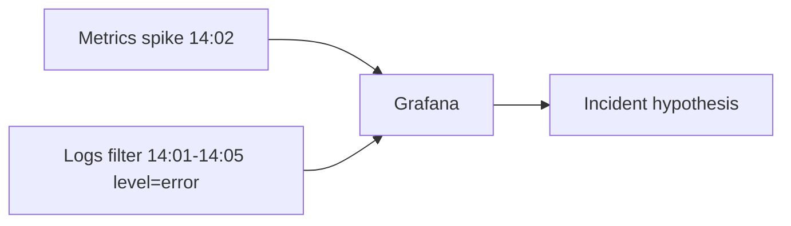

# 11. Логи: зачем, формат и связка с метриками

## Введение: «метрика сказала „ошибки“, лог сказал почему»

Prometheus показал скачок **5xx rate** в 14:02. PromQL не объяснит, **какой** `order_id` и **какой** stack trace. Лог строки `ERROR payment timeout upstream=bank-api` — мост к исправлению. Метрики **агрегируют**, логи **детализируют**; без метрик вы утонете в grep. Эта глава — теория логов в observability; hands-on Loki — **observability-intermediate**.

## Что вы узнаете

- Уровни логирования и **structured logs**.
- Корреляция **timestamp**, **labels в Loki**, **trace_id**.
- Когда логи не заменяют метрики.
- Как поднять Loki на том же стенде (preview).

## Метрики vs логи

| | Metrics | Logs |
|---|---------|------|
| Кардинальность | низкая, labels умеренные | высокая (каждое событие) |
| Стоимость хранения | относительно дёшево | дороже при объёме |
| Алерты | native PromQL | log-based metrics / Loki ruler |
| Вопрос | «сколько / как часто» | «что именно случилось» |



Типичный workflow: алерт по **rate(5xx)** → Grafana **Explore Loki** с тем же интервалом → фильтр `service="demo-app"`.

## Structured logging

Текст:

```text
2026-05-18T14:02:11Z ERROR payment failed user=42
```

JSON (предпочтительно):

```json
{"ts":"2026-05-18T14:02:11Z","level":"error","service":"checkout","msg":"payment failed","user_id":"42","trace_id":"abc"}
```

Поля **стабильны** — по ним индексируют Loki (`| json | level="error"`). Не логируйте PAN, пароли, полные карты.

## Уровни

| Level | Когда |
|-------|-------|
| DEBUG | dev, временно в prod при инциденте |
| INFO | штатные события (start, config) |
| WARN | деградация, retry |
| ERROR | запрос провален, нужна реакция |
| FATAL | процесс завершается |

**Правило:** ERROR в логе должен отражаться в **метрике** (counter `errors_total` или HTTP status).

## Корреляция

| Ключ | Связь |
|------|-------|
| `trace_id` | метрика → Jaeger span → логи (advanced OTel) |
| `request_id` | один запрос через микросервисы |
| `pod` / `instance` | `up{instance}` → LogQL `{pod="demo-xyz"}` |
| timestamp | тот же range в Prometheus и Loki |

На стенде demo-app **подавляет** access log (`log_message` no-op) — метрики учебные; в intermediate добавят stdout + Promtail.

## Loki на стенде (preview)

В [`deploy/observability/README.md`](../../deploy/observability/README.md):

```bash
docker compose -f docker-compose.yml -f docker-compose.logs.yml up -d
```

| Компонент | Роль |
|-----------|------|
| **Loki** | хранение log streams |
| **Promtail** | shipping с Docker/json logs |
| **Grafana** | datasource Loki (provisioning) |

Пример LogQL (intermediate):

```logql
{container="observability-demo-app-1"} |= "error"
```

Курс: [`observability-intermediate`](../observability-intermediate/README.md) — полные лабы Loki/Promtail.

## Log volume и стоимость

- **Sampling** debug в prod.
- **Retention** 7–30d hot, архив в S3 (advanced).
- **Cardinality** в Loki labels — как в Prometheus: не `user_id` как label stream.

## Типичные ошибки

| Ошибка | Последствие |
|--------|-------------|
| Алерт только по grep в логах | медленно, ненадёжно |
| Нет структуры | невозможен LogQL |
| Логировать тело запроса с PII | compliance риск |
| Метрики без логов | нет root cause |
| Логи без метрик | нет раннего предупреждения |

## В продакшене

- **Централизованный** сбор (Promtail, Fluent Bit, Vector).
- **Единый** `service`, `environment`, `version` labels.
- **RBAC** в Grafana на log datasources.
- **Kubernetes**: логи pod + **events** (`kubectl get events`) + метрики kube-state — [kuber-advanced/14](../kuber-advanced/14-observability.md).

## Заметки для собеседования

- **Loki** индексирует **labels**, не full-text как Elasticsearch (с оговорками по версиям).
- **Promtail** — агент; аналог — Fluent Bit, Vector.
- **Exemplars** — связь histogram sample с trace_id (advanced).

## Резюме

Логи — второй столп observability. Basic даёт **метрики и алерты**; следующий шаг — **Loki** на том же compose и корреляция в Grafana Explore.

## Чек-лист

- Назовите вопрос, на который логи отвечают лучше метрик.
- Зачем JSON-логи?
- Какая команда поднимает Loki overlay на стенде?
- Куда продолжение курса по логам?

Следующий урок: [12. vs CloudWatch/Datadog](12-vs-cloudwatch-datadog.md).
