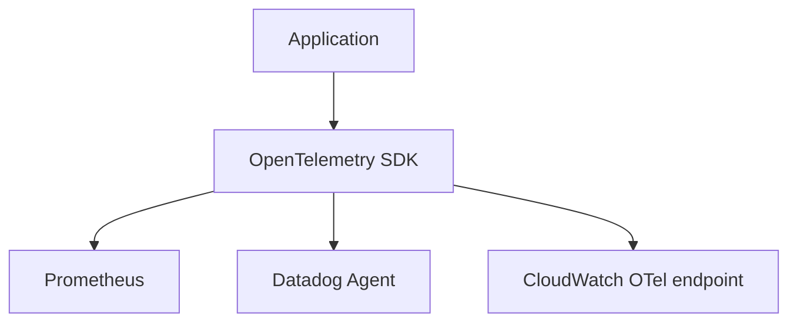

# 12. Prometheus/Grafana vs CloudWatch vs Datadog

## Введение: «в AWS уже есть мониторинг — зачем Prom?»

Стартап на **EC2** смотрит только CloudWatch. Через год — **EKS**, custom metrics, дашборды в Grafana OSS, а billing CloudWatch **Custom metrics** удивляет CFO. Другая команда платит **Datadog** per host и per span — идеальный UX, но контракт на $200k/год. Эта глава — **не война инструментов**, а карта выбора для архитектора и SRE.

## Что вы узнаете

- Позиционирование **Prometheus + Grafana** (OSS, CNCF).
- **Amazon CloudWatch**: метрики, логи, alarms в AWS.
- **Datadog**: SaaS APM/logs/infra unified.
- Гибриды и миграционные паттерны.

## Сравнительная таблица

| Критерий | Prometheus + Grafana | CloudWatch | Datadog |
|----------|---------------------|------------|---------|
| Модель | pull scrape, PromQL | push/agent, Metrics API | agent + SaaS backend |
| Хостинг | self-managed / managed (AMP, Mimir) | managed AWS | SaaS |
| Сильная сторона | k8s, OSS, предсказуемость | нативная AWS интеграция | быстрый time-to-value, APM UI |
| Слабая сторона | ops burden, PromQL learning | vendor lock-in AWS, cost custom metrics | стоимость, cardinality billing |
| Логи | Loki / ELK отдельно | CloudWatch Logs | встроенные |
| Трейсы | Jaeger/Tempo/OTel | X-Ray | APM traces |
| Алерты | Alertmanager | CloudWatch Alarms | Monitors |

## Prometheus + Grafana

**Когда выбирают:**

- Kubernetes (**kube-prometheus-stack** — [kuber-advanced/14](../kuber-advanced/14-observability.md))
- Multi-cloud, bare metal, on-prem
- Команда готова поддерживать TSDB, rules, AM
- Нужен **единый** стек dev/stage/prod без per-seat SaaS

**Managed варианты:** Amazon Managed Prometheus, Grafana Cloud, Mimir, Thanos — снимают ops, сохраняют PromQL.

Учебный стенд [`deploy/observability`](../../deploy/observability/README.md) — тот же mental model, что в prod k8s.

## Amazon CloudWatch

**Когда выбирают:**

- Преимущественно **AWS**, минимум своей инфраструктуры мониторинга
- Метрики сервисов AWS (ALB, RDS, Lambda) **из коробки**
- Compliance: данные не покидают регион

| Плюс | Минус |
|------|-------|
| IAM, без отдельного scrape network | PromQL-мышление не переносится 1:1 |
| Logs + metrics + alarms в одном биллинге | Дорогие custom metrics / high resolution |
| EventBridge интеграции | Дашборды слабее OSS Grafana для ad-hoc |

**Гибрид:** Prometheus **remote_write** в AMP; Grafana datasource CloudWatch + Prometheus.

## Datadog

**Когда выбирают:**

- Нужен **полный** observability suite быстро (infra + APM + logs + RUM)
- Небольшая platform-команда, нет желания админить Prometheus
- Бюджет на SaaS, важен **корреляционный** UI (trace ↔ log ↔ metric)

| Плюс | Минус |
|------|-------|
| Agent autodiscovery, богатые интеграции | стоимость растёт с hosts/spans/custom metrics |
| Anomaly detection, SLO UI | риск vendor lock-in |
| On-call продукт | нужна дисциплина по тегам (иначе bill shock) |

## Модель данных

| | Prometheus labels | CloudWatch dimensions | Datadog tags |
|---|-------------------|----------------------|--------------|
| Пример | `status="500"` | `StatusCode=500` | `http.status_code:500` |
| Риск | cardinality | custom metric cost | indexed spans cost |

Практики **низкой кардинальности** одинаковы везде.

## OpenTelemetry как мост

**OTel** — нейтральная инструментация: один SDK → экспорт в Prometheus, Datadog, X-Ray, Jaeger. На стенде overlay `docker-compose.otel.yml` — [observability-advanced](../observability-advanced/README.md). Basic закладывает **метрики**; OTel объединяет три столпа позже.

## Типичные ошибки

| Ошибка | Последствие |
|--------|-------------|
| Два полных стека без владельца | дублирование, расхождение цифр |
| CloudWatch custom metric на каждый user | счёт AWS |
| «Datadog заменит runbooks» | alert fatigue остаётся |
| Игнор OSS навыков в AWS-only shop | боль при переходе на EKS |
| Нет стратегии long-term metrics | потеря истории > 15d |

## В продакшене

- **Единый источник истины для SLO** — один backend (часто Prometheus family).
- **FinOps**: review custom metrics и indexed spans ежеквартально.
- **Grafana** как UI даже поверх CloudWatch/Datadog datasources.
- **Runbooks** не привязаны к вендору — шаги диагностики те же (RED/USE).

## Заметки для собеседования

- **Pull vs push** — не «лучше/хуже», а operational trade-off.
- **AMP / Grafana Mimir** — managed Prometheus-совместимые.
- **CNCF** landscape: Prometheus, OpenTelemetry, Grafana — разные проекты, часто вместе.
- **Cardinality** — общий враг CloudWatch и Datadog billing.

## Резюме

Prometheus+Grafana — **стандарт cloud-native** с контролем и PromQL. CloudWatch — **нативный AWS**. Datadog — **скорость и полнота SaaS**. Выбор — по команде, бюджету и среде; OTel снижает стоимость смены вендора.

## Чек-лист

- Назовите два сценария «только CloudWatch достаточно».
- Чем Managed Prometheus отличается от self-hosted?
- Почему дублировать Prometheus и Datadog на одни метрики опасно?
- Какой компонент k8s-стека из kuber-advanced/14 аналог node-exporter?

Следующий урок: [13. Финальный проект](13-final-project.md).
