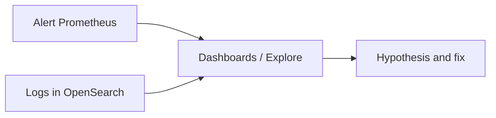

# 01. Зачем OpenSearch: поиск логов, Loki и базы данных

## Введение: «grep по 200 ГБ не спасает»

Инцидент в 03:00: support просит **все ошибки checkout за последний час** с полем `upstream=bank-api` и статусом **не** 200. `kubectl logs` по сотне подов — медленно; **grep по NFS-архиву** — часы. Метрики Prometheus уже показали всплеск 5xx, но **текст ошибки** и **конкретные order_id** — в логах. Команда открывает **OpenSearch Dashboards**: фильтр `level:error` + `service:checkout` + интервал времени — ответ за секунды. Это не «замена PostgreSQL» и не «ещё один Prometheus» — это **поисковый движок** над документами (часто — логами).

Эта глава — **ментальная карта**: зачем OpenSearch в observability-стеке, чем он отличается от **Loki** и от **реляционной БД**.

## Что вы узнаете

- Три способа работать с логами: **файлы/grep**, **log stream (Loki)**, **inverted index (OpenSearch/Elasticsearch)**.
- Вопросы, на которые отвечает **полнотекстовый поиск** vs **LogQL** vs **SQL**.
- Почему на стенде **`DISABLE_SECURITY_PLUGIN`** и когда это недопустимо в проде.
- Связь с курсом Loki: [observability-intermediate/03-loki](../observability-intermediate/03-loki-logql.md).

## Три столпа observability и место логов

| Столп | Вопрос | Типичный инструмент |
|-------|--------|---------------------|
| **Metrics** | Сколько? Как быстро? | Prometheus |
| **Logs** | Что случилось в событии? | Loki, OpenSearch, CloudWatch Logs |
| **Traces** | Где потерялось время? | Jaeger, Tempo |

Метрики **агрегируют** (низкая кардинальность). Логи **детализируют** (высокий объём). OpenSearch не заменяет **алерт по rate(5xx)** — он помогает **расследовать** после алерта.



Подробнее про метрики + логи — [observability-basic/11](../observability-basic/11-logs-preview.md).

## OpenSearch в одном абзаце

**OpenSearch** — распределённый **поисковый и аналитический** движок (форк Elasticsearch). Данные — **JSON-документы** в **индексах**; поиск — через **inverted index** (термин → список документов). Запросы — **Query DSL** (JSON) или Dashboards UI. Для логов типичен сценарий: **Bulk API** → индекс `logs-*` → поиск, агрегации, дашборды.

На учебном стенде: [`deploy/opensearch`](../../deploy/opensearch/README.md) — API [localhost:9200](http://localhost:9200), UI [localhost:5601](http://localhost:5601).

## Loki vs OpenSearch: не «лучше/хуже»

| Критерий | Loki | OpenSearch |
|----------|------|------------|
| Индекс | в первую очередь **labels** (как Prometheus) | **поля mapping** + полнотекст |
| Сильная сторона | дешёвый объём, единый стек с Grafana | сложный поиск, агрегации, Kibana/Dashboards |
| Слабая сторона | широкий full-text без узкого selector | стоимость RAM/диска, ops кластера |
| Запросы | **LogQL** | **Query DSL** |
| Модель мышления | «выбери поток, отфильтруй строки» | «запрос к схеме полей и тексту» |

**Loki** хорош, когда потоки логов уже размечены labels (`namespace`, `pod`, `app`) и нужна корреляция с Prometheus в **одной Grafana**. **OpenSearch** — когда нужны **сложные фильтры по полям**, **агрегации по бизнес-полям**, **поиск по фразе** в message, security analytics, или организация уже стандартизировала ELK/OpenSearch.

Теория Loki на стенде observability: [03. Loki и LogQL](../observability-intermediate/03-loki-logql.md).

## OpenSearch vs реляционная БД

| | PostgreSQL / ClickHouse | OpenSearch |
|---|-------------------------|------------|
| Схема | жёсткая таблица | **mapping** (гибкий, но осознанный) |
| Запрос | SQL | Query DSL |
| Сильная сторона | транзакции, JOIN, отчёты по схеме | **поиск**, **релевантность**, **горизонтальный** shard |
| Логи как основной кейс | возможно, но не default | **типичный** кейс (ELK) |

Не кладите **первичный бизнес-ledger** в OpenSearch. Кладите **события**, **логи**, **трейсы (иногда)**, **аудит** — append-heavy, search-heavy.

## Когда выбирать OpenSearch на проекте

**Подходит:**

- Централизованные **application / nginx / audit** логи с поиском по `message`, `status`, `user_id` (в поле, не в label stream).
- **Security / SIEM**-подобные запросы (bool + filter + aggregations).
- Команда знакома с **Elasticsearch** API (OpenSearch совместим по духу).

**Сомнительно:**

- Только «посмотреть stdout одного pod» — достаточно `kubectl logs` или Loki.
- Маленький объём, редкие запросы — стоимость кластера не окупается.

## На стенде: первое касание

```bash
cd deploy/opensearch
docker compose up -d
docker compose ps
bash scripts/smoke.sh
```

```bash
curl -s http://localhost:9200/
curl -s http://localhost:9200/_cluster/health?pretty
```

| URL | Назначение |
|-----|------------|
| [localhost:9200](http://localhost:9200) | REST API |
| [localhost:5601](http://localhost:5601) | Dashboards (Discover, Dev Tools) |

**Без security на лабе:** в `docker-compose.yml` задано `DISABLE_SECURITY_PLUGIN=true` — иначе каждый `curl` требовал бы HTTPS и учётные данные. В продакшене — **Fine-Grained Access Control**, TLS, роли index-level.

## Типичные ошибки

| Ошибка | Почему плохо | Как правильно |
|--------|--------------|---------------|
| «Все логи только в OpenSearch» | дорого, дубли с Loki | метрики → алерт; Loki или OS — по объёму и запросам |
| «OpenSearch = база заказов» | нет ACID, плохой JOIN | OLTP в SQL, события в OS |
| `*` mapping на всё | огромные индексы, конфликты типов | явный mapping для логов |
| Игнор retention | диск забит, read-only block | ISM / ILM (intermediate) |
| Security выключен в проде | утечка PII через API | FGAC, private network |

## В продакшене

- **Ingest**: Fluent Bit, Vector, Logstash → Bulk; не один гигантский `curl` из cron.
- **Hot/warm/cold**: ISM policies, снапшоты в S3 (intermediate-курс).
- **Sizing**: heap ~50% RAM, остальное OS cache; **shard size** 10–50 ГБ target.
- **PII**: маскирование до индексации; RBAC на индексы `logs-prod-*`.
- **Гибрид**: метрики Prometheus + логи OpenSearch + трейсы Tempo в одной Grafana (разные datasources).

## Заметки для собеседования

- **Inverted index** — основа быстрого term lookup.
- **Near real-time**: документ виден после **refresh** (не мгновенно после index).
- **Loki** не индексирует тело строки по умолчанию так же, как ES/OS.
- **OpenSearch** vs **Elasticsearch**: лицензия и governance; API близки, проверяйте версии клиентов.

## Резюме

OpenSearch — инструмент **поиска и аналитики по документам**, идеально стыкуется с **логами и расследованием**. Он дополняет **метрики** (Prometheus), а не заменяет их; с **Loki** конкурирует только в части «где хранить логи» — выбор по запросам, бюджету и команде. Basic-курс даёт руки на API и Dashboards локально.

## Чек-лист

- Назовите вопрос, на который OpenSearch отвечает лучше, чем PromQL.
- Чем Loki selector отличается от поля `keyword` в mapping?
- Зачем на лаб-стенде отключён security plugin?
- Какой URL API и Dashboards на стенде?

Следующий урок: [02. Архитектура](02-architecture.md).
