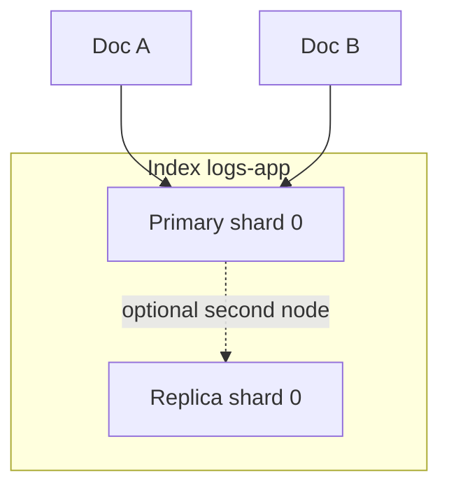

# 02. Архитектура: cluster, index, shard, document

## Введение: «индекс не таблица, но почти»

Новичок создаёт один **огромный** индекс `logs` на весь кластер. Через неделю — **yellow** cluster, медленный поиск, shard по 200 ГБ. SRE объясняет: данные режутся на **shards**, реплики дают отказоустойчивость, а **`_id`** — не primary key как в SQL. Эта глава — модель данных OpenSearch на учебном **single-node** стенде; в проде те же понятия, но узлов больше.

## Что вы узнаете

- Иерархия: **cluster → node → index → shard → document**.
- Роли **primary** и **replica** shard (на single-node реплика 0).
- Поля ответа API: **`_index`**, **`_id`**, **`_version`**, **`_source`**.
- Почему **routing** и число shards задают потолок масштабирования.

## Cluster и node

**Cluster** — логическое объединение узлов с одним именем (`cluster_name` в ответе `GET /`). **Node** — один процесс OpenSearch (JVM). На стенде [`deploy/opensearch`](../../deploy/opensearch/README.md):

- `discovery.type: single-node` — один узел, кворум не нужен.
- Health: **green** (все primary назначены) или **yellow** (реплики не могут разместиться на одном узле — норма для single-node с `number_of_replicas: 1`).

```bash
curl -s http://localhost:9200/_cluster/health?pretty
curl -s http://localhost:9200/_cat/nodes?v
```

## Index

**Index** — именованная коллекция документов (логическая «база» для типа данных). Имя в нижнем регистре, без пробелов: `logs-app-20260518`, `products-v1`.

| Операция | HTTP | Пример |
|----------|------|--------|
| Создать | `PUT /my-index` | с optional `mappings`, `settings` |
| Проверить | `HEAD /my-index` | 200 / 404 |
| Удалить | `DELETE /my-index` | осторожно в проде |
| Список | `GET /_cat/indices?v` | размер, health |

Индекс = **mapping** (схема полей) + **settings** (число shards, replicas, analyzers).

## Document

**Document** — JSON-объект с полями. При индексации кластер:

1. Определяет **shard** (по `_id` или `routing`).
2. Сохраняет **`_source`** (исходный JSON).
3. Строит **inverted index** для поисковых полей.

Пример документа лога:

```json
{
  "@timestamp": "2026-05-18T10:00:02Z",
  "level": "error",
  "service": "api",
  "message": "GET /orders 500",
  "status": 500
}
```

Ответ `GET /index/_doc/ID`:

```json
{
  "_index": "logs-app-20260518",
  "_id": "xYz123",
  "_version": 1,
  "_source": { ... }
}
```

**`_id`**: если не передать — генерируется автоматически; можно задать явно при `PUT /index/_doc/my-id`.

## Shard и replica

Данные индекса делятся на **primary shards** (по умолчанию часто 1 на малых индексах). Каждый документ попадает ровно в **один** primary shard.

| | Primary | Replica |
|---|---------|---------|
| Запись | да | нет (копия с primary) |
| Чтение | да | да (масштабирование read) |
| На single-node | 1 | обычно 0 в лабах |



**Правило:** число primary shards **не меняется** без reindex. Планируйте при создании индекса (intermediate: rollover, ISM).

На стенде для лаб:

```json
PUT /lab-demo
{
  "settings": { "number_of_shards": 1, "number_of_replicas": 0 }
}
```

## Сегменты и refresh

Внутри shard данные в **сегментах** (неизменяемых). **Refresh** (по умолчанию ~1s) делает новые документы **видимыми для search**, не обязательно fsync на диск. После bulk в лабах вызывают `POST /index/_refresh` для предсказуемого поиска.

| | Index API | Search API |
|---|-----------|------------|
| Видимость | после refresh (near real-time) | только проиндексированное |
| Транзакция | нет multi-doc ACID | — |

## Aliases и шаблоны (превью)

В проде логи пишут в **`logs-app-2026.05.18`**, а читают через **alias** `logs-app-read` — упрощает rollover. **Index templates** задают mapping для `logs-*`. В basic достаточно знать, что **имя индекса** — часть операционной модели; детали — intermediate.

## OpenSearch Dashboards

**Dashboards** — UI поверх API (Discover, Visualize, Dev Tools). Подключается к `OPENSEARCH_HOSTS` в compose. Dev Tools дублирует `curl` — удобно для обучения; в CI и лабах мы используем **`curl`** для воспроизводимости.

## На стенде: обзор API

```bash
curl -s http://localhost:9200/
curl -s http://localhost:9200/_cat/indices?v
curl -s http://localhost:9200/_cat/shards?v
```

После [лабы 03](03-lab-first-index.md) появится индекс `lab-first-*` или ваше имя — проверьте в `_cat/indices`.

## Типичные ошибки

| Ошибка | Симптом | Исправление |
|--------|---------|-------------|
| Слишком много мелких индексов | тысячи shards, heap pressure | rollover, один shard target size |
| Один shard на терабайт | медленный recovery | больше primary при создании (неувеличиваемо потом) |
| Путать `_id` и бизнес-id | дубликаты | `op_type=create` или внешний id в `_id` |
| Ждать search сразу после bulk | 0 hits | `_refresh` или `refresh=wait_for` |
| `number_of_replicas: 1` на 1 node | yellow cluster | replicas: 0 на dev |

## В продакшене

- **Dedicated master** роли на больших кластерах (3 master-eligible).
- **Cross-cluster search** / **CCR** — DR и федерация (advanced).
- **Snapshots** в S3 — backup индексов.
- Мониторинг: `_cluster/health`, JVM heap, **thread pool rejections**, disk watermark.

## Заметки для собеседования

- **Shard** — единица хранения и масштабирования; **document** — единица поиска.
- **Replica** — копия primary для HA и read scale.
- **Near real-time** — не «сразу после POST».
- **Split-brain** — проблема multi-node без quorum (не на single-node лабе).

## Резюме

OpenSearch хранит **JSON-документы** в **индексах**, физически разбитых на **shards**. API возвращает метаданные **`_index`**, **`_id`**, **`_source`**. Понимание shards и refresh объясняет поведение bulk и поиска в следующих главах.

## Чек-лист

- Чем index отличается от document?
- Сколько primary shard у документа?
- Зачем вызывать `_refresh` после учебного bulk?
- Что покажет `_cluster/health` на single-node с replica=1?

Следующий урок: [03. Лаба: первый индекс](03-lab-first-index.md).
