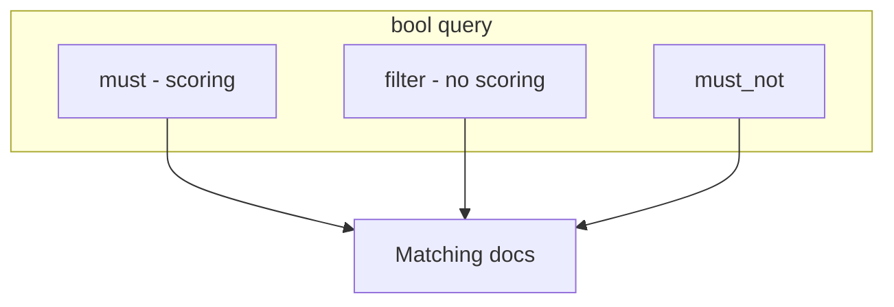

# 06. Query DSL: match, bool, filter

## Введение: «запрос в JSON, не SQL»

On-call открывает Dev Tools и пишет «SQL» к OpenSearch — не работает. Правильный путь — **Query DSL**: дерево JSON с `query`, опционально `sort`, `size`, `aggs`. В инциденте собирают **bool**: текст в `must`, статус и время в **filter** (без влияния на score). Эта глава — язык запросов для логов на стенде `localhost:9200`.

## Что вы узнаете

- Обёртка запроса: **`GET index/_search`** + body.
- **Match** vs **term** vs **range** (связь с mapping).
- **bool**: `must`, `should`, `must_not`, **filter**.
- Разница **query** (scoring) и **filter** (да/нет, кеш).

## Структура search request

```json
GET /lab-mapping/_search
{
  "query": { ... },
  "size": 10,
  "from": 0,
  "sort": [{ "@timestamp": "desc" }],
  "_source": ["@timestamp", "level", "message"]
}
```

| Поле | Назначение |
|------|------------|
| `query` | какие документы подходят |
| `size` | сколько hits вернуть (default 10) |
| `from` | пагинация (осторожно на больших from) |
| `sort` | сортировка; при `query` — по `_score` + полям |
| `_source` | какие поля в ответе |

Ответ: `hits.total`, `hits.hits[]` с `_score`, `_source`.

## Match query

**match** — полнотекст по полю `text` (analyzer на query):

```json
{ "match": { "message": "payment timeout" } }
```

Варианты: `operator: "and"` (все термы), `minimum_should_match` для мягкости.

**match_phrase** — фраза целиком (порядок слов).

## Term-level queries

| Query | Поле | Пример |
|-------|------|--------|
| **term** | keyword | `{ "term": { "service": "api" } }` |
| **terms** | keyword, список | `{ "terms": { "level.keyword": ["error", "warn"] } }` |
| **range** | date, number | `{ "range": { "status": { "gte": 500 } } }` |
| **exists** | любое | `{ "exists": { "field": "trace_id" } }` |

**term** не анализирует query string — значение должно совпасть с индексированным keyword.

## bool query

```json
{
  "query": {
    "bool": {
      "must": [
        { "match": { "message": "orders" } }
      ],
      "filter": [
        { "term": { "level.keyword": "error" } },
        { "range": { "@timestamp": { "gte": "now-1h" } } }
      ],
      "must_not": [
        { "term": { "service": "healthcheck" } }
      ],
      "should": [],
      "minimum_should_match": 0
    }
  }
}
```



| Клауза | Scoring | Типичное use |
|--------|---------|--------------|
| **must** | да | текст, релевантность |
| **filter** | нет | level, time, status |
| **must_not** | нет | исключить шум |
| **should** | да (OR) | «хотя бы одно из» |

**Filter context** — быстрее, кешируется; для логов **90% фильтров** — в `filter`, не в `must`.

## Query string (кратко)

**query_string** / **simple_query_string** — синтаксис `level:error AND service:api` в полях. Удобно в UI, рискованно без экранирования спецсимволов. В лабах предпочитаем явный bool.

## Пагинация и scroll (превью)

`from` + `size` для первых страниц. Экспорт миллионов строк — **scroll** или **search_after** (intermediate). На basic — `size` ≤ 1000 для лаб.

## Примеры на стенде

Файл [`examples/search-queries.json`](examples/search-queries.json) — тела для:

```bash
curl -s -X GET "http://localhost:9200/lab-mapping/_search" \
  -H 'Content-Type: application/json' \
  -d @courses/opensearch-basic/examples/search-queries.json
```

(подставьте один объект из файла или скопируйте фрагмент в `-d '...'`).

Практика — [07. Лаба: поиск](07-lab-search.md).

## Типичные ошибки

| Ошибка | Симптом | Исправление |
|--------|---------|-------------|
| `term` в `must` для текста | странные score / 0 hits | `match` или `.keyword` |
| Всё в `must` | лишний scoring, медленнее | статусы в `filter` |
| Забыли `.keyword` | 0 hits на level | `level.keyword` |
| `now-1h` без date mapping | ошибка | `@timestamp` type date |
| Огромный `size` | OOM на client | aggregations вместо 100k hits |

## В продакшене

- **Search templates** — параметризованные запросы для Dashboards и API.
- **Slow query log** — порог > 5s.
- **Index pattern** в Dashboards = alias `logs-*`, не один жёсткий индекс.
- Ограничение **max_result_window** (10000) — не deep pagination через from/size.

## Заметки для собеседования

- **Query context** вычисляет релевантность; **filter context** — бинарно.
- **bool filter** не влияет на `_score`.
- **match** применяет analyzer к query; **term** — нет.
- Loki **LogQL** line filter `|=` аналогичен по духу `match` на message, но модель данных другая — [03-loki](../observability-intermediate/03-loki-logql.md).

## Резюме

Query DSL — основной язык расследования логов в OpenSearch: **match** для текста, **term/range** в **filter** внутри **bool**. Правильный mapping делает запросы предсказуемыми. Следующая лаба тренирует сценарий «ошибки API за час».

## Чек-лист

- Чем `filter` отличается от `must` в bool?
- Когда `term`, когда `match`?
- Как отсортировать логи по `@timestamp` desc?
- Где лежат примеры JSON для curl?

Следующий урок: [07. Лаба: поиск](07-lab-search.md).
