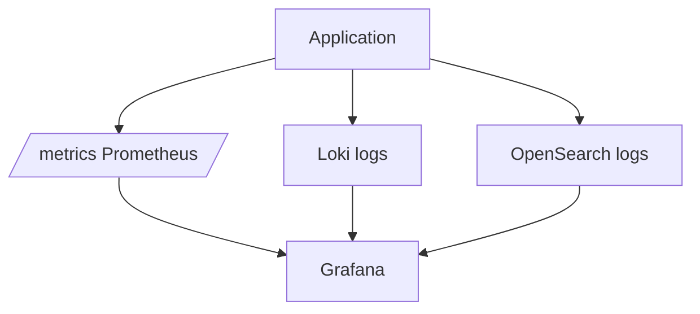

# 12. OpenSearch vs Loki vs Elasticsearch

## Введение: «у нас уже Grafana с Loki — зачем OpenSearch?»

Platform team внедрила **Loki** для kubernetes-логов. Через квартал security просит **поиск по message** и **агрегации по произвольным полям** без жёстких labels. Data team уже знает **Elasticsearch** API. Руководство спрашивает: **OpenSearch** — форк, совместим ли? Эта глава — карта выбора и типичные вопросы **собеседования**, не «один победитель».

## Что вы узнаете

- Позиционирование **OpenSearch** в CNCF/AWS экосистеме.
- **Loki** vs OpenSearch для логов (с отсылкой к [03-loki](../observability-intermediate/03-loki-logql.md)).
- **Elasticsearch** vs **OpenSearch**: лицензия, совместимость.
- Гибридные архитектуры с **Prometheus** и Grafana.

## Сравнительная таблица (логи)

| Критерий | Loki | OpenSearch | Elasticsearch |
|----------|------|------------|---------------|
| Проект | Grafana Labs | Linux Foundation / AWS | Elastic NV |
| Индекс | labels + chunks | inverted index + mapping | то же (до форка) |
| Запросы | LogQL | Query DSL | Query DSL |
| UI | Grafana | Dashboards | Kibana |
| Сильная сторона | дешёвый объём, k8s labels | сложный поиск, aggs, security | зрелый SaaS Elastic Cloud |
| Слабая сторона | слабый ad-hoc full-text | ops, RAM, shard planning | лицензия SSPL (продукт Elastic) |

На учебном стенде OpenSearch: [`deploy/opensearch`](../../deploy/opensearch/README.md). Loki: [`deploy/observability`](../../deploy/observability/README.md) + overlay logs.

## OpenSearch и Elasticsearch

**История:** Elasticsearch 7.10 → форк **OpenSearch** (AWS и сообщество) после смены лицензии Elastic.

| | OpenSearch | Elasticsearch (Elastic) |
|---|------------|---------------------------|
| Лицензия | Apache 2.0 | SSPL / Elastic License (продукты) |
| Клиенты | совместимость проверять по **мажорной версии** | official clients к Elastic Cloud |
| Фичи | Security, ISM, ML — свои плагины | Elastic Stack, APM, Enterprise |

**API:** bulk, search, mapping **концептуально одинаковы**; в собеседовании говорите «опыт Elasticsearch переносится на OpenSearch с тестом версий».

## Loki: когда достаточно

**Выбирайте Loki**, если:

- Логи уже в **Kubernetes** с хорошими labels (`namespace`, `app`, `pod`).
- Основной UI — **Grafana**, корреляция с **Prometheus**.
- Запросы — «поток + фильтр строки», не сложная аналитика по 50 полям.

**LogQL** (intermediate):

```logql
{container="mock-demo-app"} |= "error"
sum by (level) (count_over_time({app="api"}[1h]))
```

Подробнее: [observability-intermediate/03-loki-logql.md](../observability-intermediate/03-loki-logql.md).

## OpenSearch: когда нужен

**Выбирайте OpenSearch**, если:

- Нужен **полнотекст**, **fuzzy**, **highlight**, security analytics.
- Много **неструктурированных** полей (JSON log без строгих labels).
- Уже есть **ingest pipelines**, **ISM**, **cross-cluster search**.
- Организация стандартизировала **ELK/OpenSearch** для SIEM.

**Query DSL** (basic-курс):

```json
{
  "query": {
    "bool": {
      "filter": [
        { "term": { "level.keyword": "error" } },
        { "range": { "@timestamp": { "gte": "now-1h" } } }
      ]
    }
  }
}
```

## Prometheus + логи: три пути



| Сигнал | Инструмент | Алерт |
|--------|------------|-------|
| RPS, 5xx rate | Prometheus | Alertmanager |
| Строка stack trace | Loki или OpenSearch | log-based metric / external |
| Топ N route с 5xx | OpenSearch aggs | дашборд + порог |

Метрики **не заменяются** логами — [observability-basic/11](../observability-basic/11-logs-preview.md).

## Стоимость и ops

| | Loki | OpenSearch |
|---|------|------------|
| RAM | умеренно на ingester | heap + OS cache, чувствителен |
| Диск | object storage friendly | SSD, shard sizing |
| Команда | Grafana стек | search admins, ILM/ISM |
| SaaS | Grafana Cloud Logs | Amazon OpenSearch Service |

**FinOps:** cardinality в Loki labels; **shard count** и retention в OpenSearch.

## Модель данных — собеседование

| Вопрос | Loki | OpenSearch |
|--------|------|------------|
| Как индексируется текст message? | скан chunk после selector | inverted index (analyzer) |
| Фильтр `service=api` | label в `{}` | `term` на keyword |
| Агрегация по часам | `count_over_time` + range | `date_histogram` |
| Риск | слишком много labels | слишком много shards / fields |

## Типичные ошибки

| Ошибка | Последствие |
|--------|-------------|
| Два полных стека логов без владельца | двойная оплата, расхождение |
| Loki для SIEM full-text | медленно, неудобно |
| OpenSearch для всех метрик | не TSDB |
| «Elastic = OpenSearch 1:1» | breaking changes между версиями |
| Security disabled как в лабе | утечка в проде |

## В продакшене

- **Гибрид:** Loki для k8s stdout, OpenSearch для audit/application с богатым mapping.
- **OTel Collector** — fan-out в несколько backends (advanced).
- **Единая Grafana** с datasources Prometheus + Loki + OpenSearch.
- **Retention:** ISM на `logs-*`, Loki compactor + object storage.

## Заметки для собеседования

- **Inverted index** vs **label index** — ключевое различие OS vs Loki.
- **OpenSearch** — open-source fork; проверяйте совместимость плагинов.
- **Bulk** — стандарт ingest OS; Loki — push API (Promtail).
- **DISABLE_SECURITY_PLUGIN** — только dev ([deploy README](../../deploy/opensearch/README.md)).

## Резюме

**Loki** — потоки и LogQL в экосистеме Grafana; **OpenSearch** — поиск и аналитика документов; **Elasticsearch** — коммерческий родственник с другой лицензией. Выбор по запросам, команде и бюджету; метрики остаются в **Prometheus**. Basic-курс дал API и DSL; intermediate — pipelines и ISM.

## Чек-лист

- Назовите два сценария «только Loki достаточно».
- Назовите два сценария «нужен OpenSearch».
- Чем OpenSearch отличается от Elasticsearch юридически?
- Где в репозитории курс по LogQL?

Следующий урок: [13. Финальный проект](13-final-project.md).
