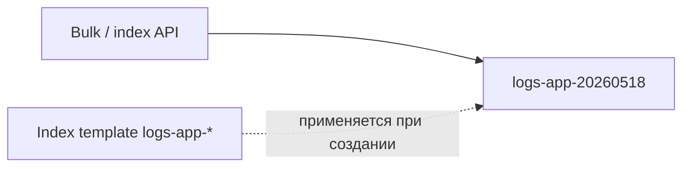

# 01. Index templates и mappings

## Зачем шаблон, если индекс и так создаётся

Первая запись в индекс `logs-app-20260518` заставляет OpenSearch **создать индекс «на лету»** с dynamic mapping: строки становятся `text` + `keyword`, числа — `long` или `double`. Для лаборатории это удобно; в продакшене — источник сюрпризов:

- поле `status` в одном сервисе приходит строкой `"200"`, в другом — числом `200`;
- высококардинальное поле попадает в mapping и раздувает индекс;
- анализатор по умолчанию не подходит для логов (нужен `keyword` для фильтров).

**Index template** (в OpenSearch 2.x — composable template API) задаёт **settings** и **mappings** **до** появления первого документа в индексе, чьё имя совпало с `index_patterns`.



## Composable index template

Современный API — `_index_template` (не устаревший `_template` без composable, если вы читаете старые статьи по Elasticsearch 6).

Ключевые поля:

| Поле | Смысл |
|------|--------|
| `index_patterns` | Маска имён: `logs-app-*`, `metrics-*` |
| `priority` | При нескольких совпадениях побеждает **больший** priority |
| `template.settings` | `number_of_shards`, `refresh_interval`, codec, … |
| `template.mappings` | Типы полей, `dynamic`, multi-fields |
| `template.aliases` | Опционально: единый alias `logs-app-write` на rolling indices |

Пример для курса — [examples/index-template-logs.json](examples/index-template-logs.json): индексы `logs-app-*`, один шард, ноль реплик (single-node lab), явные типы для `@timestamp`, `level`, `service`, `message`, `status`.

## Mapping: типы, которые нужны для логов

| Поле | Тип | Зачем |
|------|-----|--------|
| `@timestamp` | `date` | Сортировка, range-фильтры, time picker в Dashboards |
| `level`, `service`, `method` | `keyword` | Точные фильтры, агрегации terms |
| `message` | `text` | Полнотекстовый поиск (с осторожностью по объёму) |
| `status`, `bytes` | `integer` / `long` | Числовые диапазоны, avg/sum в визуализациях |
| `parsed` | `boolean` | Маркер успешного ingest pipeline |

**Dynamic mapping** можно ограничить:

```json
"dynamic": "strict"
```

Тогда неизвестное поле в документе вызовет ошибку индексации — полезно на границе «контракт схемы» (близко к Schema Registry в Kafka).

## Data stream vs «классический» daily index

В Elastic Stack 7+ популярны **data streams** (`logs-*-*` как stream + backing indices). На учебном стенде мы используем **именованные daily indices** `logs-app-YYYYMMDD` — проще для ISM и для понимания «один индекс = один день». В AWS OpenSearch Service оба подхода доступны; ISM привязывается к шаблону индексов в любом случае.

## Связь с bulk на стенде

Скрипт [`deploy/opensearch/scripts/bulk-sample.sh`](../../deploy/opensearch/scripts/bulk-sample.sh) пишет в `logs-app-$(date +%Y%m%d)`. Без template OpenSearch угадает mapping; с template — стабильная схема для Dashboards и для pipeline, который добавляет `method`, `path`, `parsed`.

## Метрики vs логи (контекст observability)

**Prometheus** хранит временные ряды с низкой кардинальностью labels. **OpenSearch** индексирует **события** с полнотекстом и богатым mapping — дороже, но сильнее для расследований «найди все 500 с path `/orders` за вчера». Разделение столпов — [observability-intermediate](../observability-intermediate/README.md); альтернатива только по логам с упором на labels — Loki ([03-loki-logql](../observability-intermediate/03-loki-logql.md)).

## Типичные ошибки

1. **Два template с одинаковым priority** — непредсказуемое слияние settings.
2. **Смена типа поля** после появления данных — нужен reindex, template сам не «переделает» старый индекс.
3. **`text` вместо `keyword`** для `level` — агрегация по `.keyword` subfield или лишняя нагрузка.
4. **Слишком много шардов** на малый объём — см. [07-shards-replicas.md](07-shards-replicas.md).

## Чек-лист

- [ ] Понимаете, когда применяется template (при **создании** индекса).
- [ ] Можете объяснить `priority` и `index_patterns`.
- [ ] Выбираете `keyword` vs `text` для полей логов.

**Дальше:** [02. Лаба: index templates](02-lab-templates.md).
