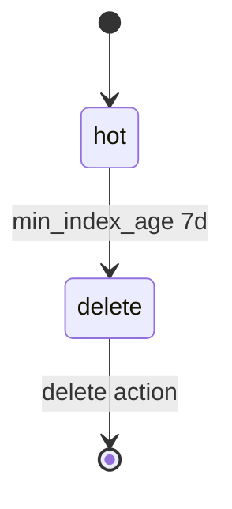

# 05. Index State Management (ISM)

## Проблема: логи растут бесконечно

Daily index `logs-app-20260518` удобен для записи и удаления «целым днём», но без политики диск заполнится. Ручной cron `curl -X DELETE logs-app-*` хрупок: забыли retention, удалили не тот индекс, нет аудита.

**Index State Management (ISM)** в OpenSearch — встроенный движок **состояний** для индекса: hot → warm → cold → delete (набор состояний настраивается). Аналог ILM в Elasticsearch.



## Политика: policy, states, transitions

Документ политики (см. [`deploy/opensearch/examples/ism-logs-policy.json`](../../deploy/opensearch/examples/ism-logs-policy.json)):

| Часть | Смысл |
|-------|--------|
| `policy.default_state` | Стартовое состояние нового индекса |
| `states[].actions` | Что выполнить **входя** в состояние (allocate, replica, snapshot, delete, …) |
| `states[].transitions` | Условия перехода в другое состояние |
| `policy.ism_template` | К каким `index_patterns` привязать политику автоматически |

Учебная политика минимальна:

- **hot** — без действий, ждём возраста индекса;
- **delete** — action `delete` {} удаляет индекс.

Условие перехода: `min_index_age: "7d"` (индексу исполнилось 7 суток с момента создания).

## Rollover vs delete-by-age

В продакшене часто используют **rollover** по alias:

- пишем в alias `logs-app-write` на индекс `logs-app-000001`;
- при достижении `max_size` / `max_age` / `max_docs` — **rollover** создаёт `logs-app-000002`;
- старые индексы уходят в warm/cold с меньшим числом реплик или на другой tier.

На single-node lab **rollover** ограничен (нет смысла в warm tier); лаба [06-lab-ism-rollover.md](06-lab-ism-rollover.md) сжимает `min_index_age` для **быстрой** проверки delete. Концепцию rollover зафиксируйте теоретически:

| Подход | Плюс |
|--------|------|
| Daily index `logs-app-YYYYMMDD` | Простой mental model, ISM по возрасту |
| Rollover + alias | Один «текущий» write index, меньше имён |

## ISM template и priority

`ism_template` с `index_patterns: ["logs-app-*"]` и `priority: 100` привязывает политику к новым индексам. Если несколько политик совпали — снова важен **priority** (как у index template).

Укороченный фрагмент для копирования в отчёты — [examples/ism-policy-snippet.json](examples/ism-policy-snippet.json).

## Мониторинг ISM

```bash
curl -s "http://localhost:9200/_plugins/_ism/policies?pretty"
curl -s "http://localhost:9200/_plugins/_ism/explain/logs-app-20260518?pretty"
```

В Dashboards: **Index Management → State management policies** (название меню может слегка отличаться по версии).

## Связь с Kafka и observability

- **Kafka:** retention topic (`log.retention.hours`) ≠ retention в OpenSearch; consumer может отставать — индексы копятся быстрее, чем ISM удаляет, если ingest не успевает ([kafka-intermediate/17-monitoring](../kafka-intermediate/17-monitoring.md)).
- **Loki:** retention в `loki.yml` ([observability-intermediate/03](../observability-intermediate/03-loki-logql.md)) — на уровне chunk/store; ISM — на уровне **индекса Lucene**.

## Ошибки

| Симптом | Действие |
|---------|----------|
| Политика не применилась | Индекс создан до регистрации policy; `explain` покажет `null` |
| Индекс не удалился | Job ISM раз в интервал (~5–30 мин); age считается от **создания** индекса |
| `cluster_block_exception` read-only | Диск полон — см. [08-lab-cluster-health.md](08-lab-cluster-health.md) |

## Чек-лист

- [ ] Различаете **state**, **transition**, **action**.
- [ ] Читаете `ism-logs-policy.json` и объясняете hot → delete.
- [ ] Знаете, зачем в prod нужен snapshot перед delete.

**Дальше:** [06. Лаба: ISM](06-lab-ism-rollover.md).
