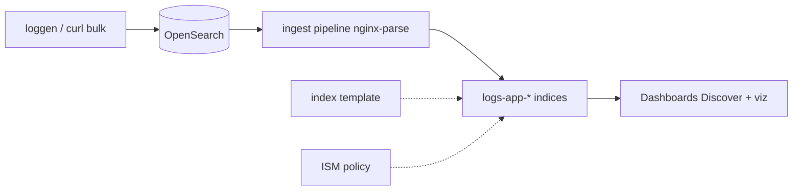

# 11. Финальный проект: ELK-style pipeline

## Цель

Собрать **сквозной пайплайн** в духе ELK (Elasticsearch, Logstash, Kibana — у вас OpenSearch + ingest + Dashboards):



Опционально опишите, как тот же поток шёл бы через **Kafka** ([kafka-basic/12-patterns](../kafka-basic/12-patterns.md)) и где остались бы **метрики** Prometheus ([observability-intermediate](../observability-intermediate/README.md)).

## Требования

| # | Компонент | Критерий приёмки |
|---|-----------|------------------|
| 1 | **Index template** | `logs-app-*`, mapping из [examples/index-template-logs.json](examples/index-template-logs.json) |
| 2 | **Ingest pipeline** | [ingest-pipeline-nginx.json](../../deploy/opensearch/examples/ingest-pipeline-nginx.json), поля `method`, `path`, `status`, `parsed` |
| 3 | **Данные** | ≥ 100 документов за 2 «дня» (два индекса `logs-app-YYYYMMDD` или rollover tabletop) |
| 4 | **ISM** | [ism-logs-policy.json](../../deploy/opensearch/examples/ism-logs-policy.json) привязана к `logs-app-*`; скрин `explain` |
| 5 | **Dashboards** | Index pattern, Discover saved search, ≥ 1 визуализация (errors over time или top `path`) |
| 6 | **Документация** | README 1–2 стр.: архитектура, команды, ссылки на kafka/observability |

## Подготовка стенда

```bash
cd deploy/opensearch
docker compose down -v   # чистый старт по желанию
docker compose up -d
bash scripts/smoke.sh
```

## Шаг 1. Template и ISM

```bash
curl -s -X PUT "http://localhost:9200/_index_template/logs-app" \
  -H 'Content-Type: application/json' \
  -d @courses/opensearch-intermediate/examples/index-template-logs.json

curl -s -X PUT "http://localhost:9200/_plugins/_ism/policies/lab-logs-delete" \
  -H 'Content-Type: application/json' \
  -d @deploy/opensearch/examples/ism-logs-policy.json
```

## Шаг 2. Pipeline и генерация логов

```bash
curl -s -X PUT "http://localhost:9200/_ingest/pipeline/nginx-parse" \
  -H 'Content-Type: application/json' \
  -d @deploy/opensearch/examples/ingest-pipeline-nginx.json
```

Скрипт генерации (сохраните как `courses/opensearch-intermediate/scripts/gen-logs.sh` или выполните в shell):

```bash
#!/usr/bin/env bash
set -euo pipefail
OS="${OS:-http://localhost:9200}"
PIPE="${PIPE:-nginx-parse}"
for day in 17 18; do
  IDX="logs-app-202605${day}"
  for i in $(seq 1 60); do
    METHODS=("GET" "POST" "PUT")
    PATHS=("/health" "/orders" "/users" "/pay")
    M=${METHODS[$((i % 3))]}
    P=${PATHS[$((i % 4))]}
    ST=$((200 + (i % 5) * 10)); [ $((i % 7)) -eq 0 ] && ST=500
    TS="2026-05-${day}T$(printf '%02d' $((10 + i % 10))):$(printf '%02d' $((i % 60))):01Z"
    echo "{\"index\":{\"_index\":\"$IDX\"}}"
    echo "{\"@timestamp\":\"$TS\",\"level\":\"$([ $ST -ge 500 ] && echo error || echo info)\",\"service\":\"api\",\"message\":\"$M $P $ST\"}"
  done
done | curl -sf -X POST "$OS/_bulk?pipeline=$PIPE" -H 'Content-Type: application/x-ndjson' --data-binary @-
curl -sf -X POST "$OS/logs-app-*/_refresh"
echo "done"
```

Проверка:

```bash
curl -s "http://localhost:9200/logs-app-*/_count"
curl -s "http://localhost:9200/logs-app-*/_search" -H 'Content-Type: application/json' -d '{
  "size": 0,
  "aggs": { "by_status": { "terms": { "field": "status" } } }
}' | head -c 1500
```

## Шаг 3. Dashboards

1. Index pattern `logs-app-*`, time field `@timestamp`.
2. **Discover:** saved search `errors` — `level:error` OR `status >= 500`.
3. **Visualize:** Vertical bar — Count, X-axis Date Histogram on `@timestamp`, split series `terms` on `level`.
4. **Dashboard:** объедините визуализацию и таблицу top 5 `path.keyword` (или `path` если keyword subfield).

## Шаг 4. Связь с Kafka (письменно)

В отчёте добавьте диаграмму:

```text
app → logs.raw (Kafka) → Connect OpenSearch Sink → ваш template/ISM
                      ↘ consumer metrics → Prometheus
```

Укажите:

- где выполняется **Grok** (только OpenSearch ingest, не дублировать в Connect SMT);
- как мониторить **lag** ([kafka-intermediate/17-monitoring](../kafka-intermediate/17-monitoring.md));
- что произойдёт, если ISM удалит индекс, а consumer ещё хранит offset (повторная индексация / idempotent write).

## Шаг 5. Связь с observability (письменно)

Таблица на 4 строки:

| Сигнал | Инструмент | Пример |
|--------|------------|--------|
| Error rate 5xx | Prometheus | `rate(http_requests_total{status=~"5.."}[5m])` |
| Текст ошибки stack | OpenSearch Discover | `service:api AND level:error` |
| Correlation | Общий `trace_id` в JSON log | (если есть в приложении) |
| Retention 7d | ISM delete | `ism-logs-policy.json` |

Ссылка: [observability-intermediate/03-loki-logql](../observability-intermediate/03-loki-logql.md) — когда выбрали бы Loki вместо OpenSearch.

## Критерии оценки (самопроверка)

- [ ] Template применился до bulk (mapping стабилен).
- [ ] ≥ 80% документов с `parsed: true` (остальные объяснены).
- [ ] ISM `explain` показывает policy на обоих дневных индексах.
- [ ] Dashboard открывается без ручного ввода query каждый раз.
- [ ] Отчёт связывает три курса: opensearch-intermediate, kafka-intermediate, observability-intermediate.

## Очистка

```bash
cd deploy/opensearch && docker compose down -v
```

## Что дальше

- Включить security на тестовом двухнодовом кластере и пройти [09-security-overview.md](09-security-overview.md) не tabletop, а hands-on.
- Поднять **Amazon OpenSearch Service** sandbox domain по [10-managed-opensearch.md](10-managed-opensearch.md).
- Параллельно пройти [observability-intermediate/16-final-project](../observability-intermediate/16-final-project.md) и сравнить два подхода к логам на одном приложении.

Поздравляем: вы прошли путь от template до управляемого жизненного цикла индексов и визуализации — ядро эксплуатации поискового кластера логов.
