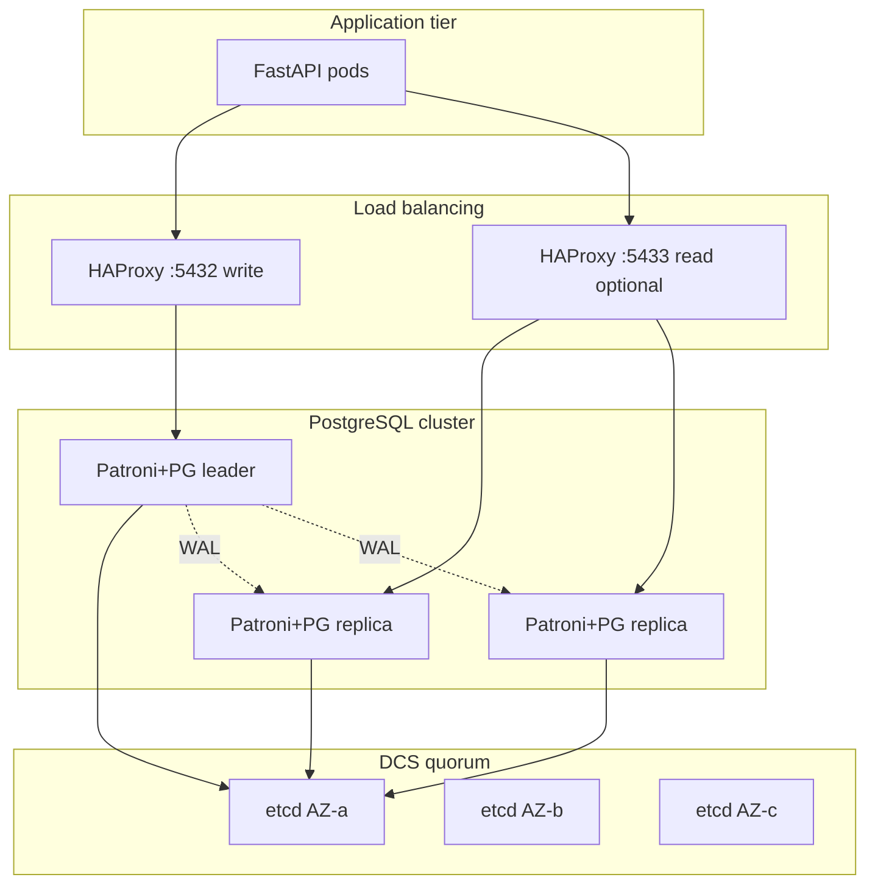

# 02. Лаба: Patroni (архитектура)

## Зачем эта лаба

Поднять полный Patroni+etcd локально — 8+ GB RAM и часы отладки. Для advanced достаточно **спроектировать** production HA: диаграмма, failover tabletop, RPO/RTO. Опционально — [официальный Patroni docker](https://github.com/patroni/patroni).

## Предусловия

- [01-patroni-ha](01-patroni-ha.md)
- [intermediate/05-streaming-replication](../postgresql-intermediate/05-streaming-replication.md)

## Задание 1. Диаграмма Mermaid

Создайте `docs/patroni-architecture.md` с диаграммой:



Подпишите: AZ, кто принимает writes, где PgBouncer ([intermediate/15](../postgresql-intermediate/15-pgbouncer.md)).

## Задание 2. Failover tabletop

Сценарий: **primary в AZ-a недоступен** (network partition, не disk).

Документируйте по шагам (минимум 10):

| Шаг | Что происходит |
|-----|----------------|
| T+0s | Health check Patroni на node1 fails |
| T+? | TTL lock в etcd истекает |
| T+? | Patroni на node2 acquire lock, `pg_promote()` |
| T+? | HAProxy убирает node1 из backend |
| T+? | App переподключается (connection pool retry) |
| ... | Старый node1: `pg_rewind` или rebuild replica |

Ответьте:

1. **RPO** при async replication и lag 5 секунд.
2. **RTO** при ваших таймингах Patroni.
3. Что делать со **старым primary** после восстановления сети (demote, rebuild).

## Задание 3. Sync vs async — решение

Таблица для вашего «магазина» mock-exams:

| Режим | RPO | RTO | Latency p99 write | Выбор |
|-------|-----|-----|-------------------|-------|
| Async | | | | |
| Sync 1 standby | | | | |

Обоснуйте одним абзацем для product owner.

## Задание 4. etcd quorum

Объясните в 5 предложениях:

- Почему **2 etcd nodes** — антипаттерн.
- Что происходит при потере quorum (2 из 3 etcd down).
- Связь с «кластер Postgres read-only».

## Задание 5. Опционально — Patroni local

Если есть 8+ GB RAM:

```bash
git clone https://github.com/patroni/patroni.git
# следуйте docker-compose из репозитория Patroni
```

Зафиксируйте: `patronictl list`, kill primary, наблюдение failover.

## Критерии успеха

- [ ] Mermaid-диаграмма с 3 AZ, etcd, HAProxy, app
- [ ] Failover steps ≥ 10, RPO/RTO указаны
- [ ] Упомянут etcd quorum (не 2 nodes)
- [ ] План для старого primary после split recovery

## Дальше

Партиционирование: [03-partitioning.md](03-partitioning.md).
