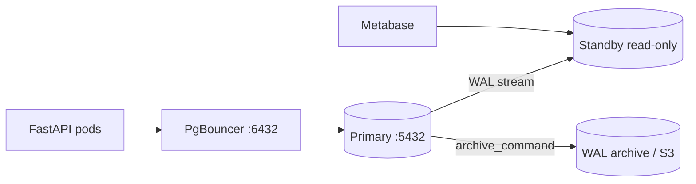

# 17. Финальный проект: HA-ready стенд

## Сценарий с работы

Lead просит: «Опиши, как наш Postgres выглядит в production — не схему таблиц, а **эксплуатацию**: бэкапы, replica, pool, мониторинг, что делает дежурный в 3 ночи». Этот проект собирает intermediate в пакет `docs/postgres-prod/`, который можно положить в GitLab рядом с [fastapi](../../deploy/fastapi/README.md) или [django](../../deploy/django/README.md).

Часть компонентов можно **документировать** без полной реализации (PITR drill, вторая AZ) — но артефакты должны быть проверяемыми, не «у нас всё в AWS, не парься».

## Цель

Спроектировать и частично реализовать **production-like** Postgres: HA-диаграмма, обоснованный конфиг, replication, PITR runbook, мониторинг, backup strategy, on-call cheat sheet.

## Предусловия

- Пройдены уроки 01–16.
- [basic/15-final-project](../postgresql-basic/15-final-project.md) желателен (схема приложения).
- Лабы: [06-streaming-replication](06-lab-streaming-replication.md), [10-lab-pitr](10-lab-pitr.md), [14-lab-monitoring](14-lab-monitoring.md).

## Структура сдачи

```text
docs/postgres-prod/
├── README.md              — обзор, ссылки
├── architecture.md        — диаграмма + пояснения
├── postgresql.conf.snippet
├── replication.md         — streaming или runbook
├── pitr-runbook.md        — из лабы 10, доработанный
├── monitoring.md          — панели Grafana + алерты
├── backup-strategy.md     — pg_dump + WAL archive
└── oncall-cheatsheet.md   — 10 команд
```

## Обязательные deliverables

### 1. Диаграмма app → PgBouncer → primary + standby



Поясните: кто пишет, кто читает, что при failover.

### 2. Фрагмент postgresql.conf с обоснованием

Минимум 8 параметров из [01-configuration](01-configuration.md):

| Параметр | Ваше значение | Почему |
|----------|---------------|--------|
| `shared_buffers` | | |
| `effective_cache_size` | | |
| `work_mem` | | |
| `wal_level` | | |
| `max_wal_size` | | |
| `log_min_duration_statement` | | |
| `autovacuum` | | |
| `idle_in_transaction_session_timeout` | | опционально |

Файл `postgresql.conf.snippet` + таблица в `architecture.md`.

### 3. Streaming replica или runbook

- **Реализовано:** скрин/SQL `pg_stat_replication`, `pg_is_in_recovery()` на 5433.
- **Tabletop:** `replication.md` ≥ 12 шагов из [06-lab-streaming-replication](06-lab-streaming-replication.md) под вашу инфраструктуру.

### 4. PITR runbook

Из [10-lab-pitr](10-lab-pitr.md): сценарий DROP в 14:00, recovery на 13:55, RPO/RTO, quarterly test.

### 5. Grafana dashboard mockup

Файл `monitoring.md` — список панелей (не обязательно живой Grafana):

| Панель | Метрика / запрос |
|--------|------------------|
| Connections | `pg_stat_activity` count vs max |
| Replication lag | bytes или seconds |
| Dead tuples | top tables `n_dead_tup` |
| Top query | pg_stat_statements total_ms |
| Disk PGDATA | node filesystem |
| Archiver failures | `pg_stat_archiver.failed_count` |
| Long transactions | idle in transaction > N min |
| Database size | `pg_database_size` |

5+ алертов с порогами.

### 6. Backup strategy

`backup-strategy.md`:

- Nightly `pg_dump -Fc` (scope: schema app)
- Continuous WAL archive (tool: pgBackRest / WAL-G / S3)
- Retention (7/30/90 days)
- Restore test calendar

### 7. On-call cheat sheet

`oncall-cheatsheet.md` — **10 команд** с одной строкой «когда использовать»:

Пример:

```sql
-- Кто блокирует
SELECT ... FROM pg_locks JOIN pg_stat_activity ...;

-- Top queries
SELECT ... FROM pg_stat_statements ORDER BY total_exec_time DESC LIMIT 5;

-- Replication lag
SELECT ... FROM pg_stat_replication;

-- Dead tuples
SELECT ... FROM pg_stat_user_tables ORDER BY n_dead_tup DESC;

-- Terminate idle in transaction (осторожно)
SELECT pg_terminate_backend(pid) FROM pg_stat_activity WHERE ...;
```

## Бонус

- Logical replication одной таблицы в warehouse ([08-lab-logical-replication](08-lab-logical-replication.md))
- `pg_repack` playbook при bloat
- Patroni overview — ссылка на [advanced](../postgresql-advanced/README.md)

## Критерии оценки

| Уровень | Критерии |
|---------|----------|
| **Pass** | Все 7 deliverables, связный README |
| **Strong** | Живая replica или drill log; параметры привязаны к RAM VM |
| **Gap** | Только диаграмма без runbook и backup |

## Самопроверка перед сдачей

- [ ] Дежурный без вас может найти PITR runbook
- [ ] Понятно, куда подключается app (6432 vs 5432)
- [ ] RPO/RTO согласованы с backup strategy
- [ ] Есть план при `too many clients`
- [ ] On-call sheet в одном месте

## Дальше

[`postgresql-advanced`](../postgresql-advanced/README.md) — Patroni, partitioning, major upgrade, CloudNativePG.

Специализации:

- [postgresql-performance](../postgresql-performance/README.md)
- [postgresql-ops](../postgresql-ops/README.md)
- [postgresql-security](../postgresql-security/README.md)

---

**postgresql-intermediate завершён.**
