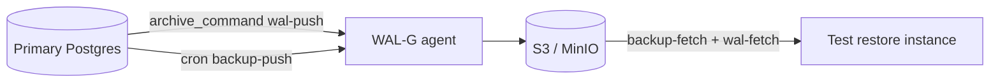

# 05. Лаба: WAL-G

## Зачем эта лаба

Tabletop архитектуры WAL-G → S3/MinIO и checklist restore drill — минимум для ops без полного WAL-G install. Опционально — MinIO из compose ops.

## Предусловия

- [04-wal-g](04-wal-g.md)
- Стенд Postgres

## Задание 1. MinIO (опционально)

```bash
cd deploy/postgres
docker compose -f docker-compose.yml -f docker-compose.ops.yml up -d
```

Console: http://localhost:9001 — создайте bucket `pg-wal`.

Зафиксируйте env vars для WAL-G:

```bash
WALG_S3_PREFIX=s3://pg-wal/course
AWS_ENDPOINT=http://localhost:9000
AWS_ACCESS_KEY_ID=minioadmin
AWS_SECRET_ACCESS_KEY=minioadmin
```

## Задание 2. Диаграмма

`wal-g-architecture.md`:



Подпишите: RPO (WAL), RTO (restore steps).

## Задание 3. archive_command design

Опишите текстом:

1. `archive_mode = on` на primary
2. `archive_command = 'wal-g wal-push %p'`
3. Мониторинг `pg_stat_archiver.failed_count`
4. Alert если archive fail > 0

## Задание 4. Restore drill checklist

Минимум 5 шагов:

```markdown
- [ ] 1. Isolate test host / new volume
- [ ] 2. wal-g backup-fetch PGDATA LATEST
- [ ] 3. Configure restore_command wal-fetch + recovery_target_time
- [ ] 4. Start Postgres, verify data
- [ ] 5. Record duration, update runbook
```

Schedule: **quarterly**, owner: DBA on-call rotation.

## Задание 5. Локально — WAL на диске

```bash
docker exec mock-postgres psql -U course -c "SELECT pg_current_wal_lsn();"
docker exec mock-postgres du -sh /var/lib/postgresql/data/pg_wal
docker exec mock-postgres psql -U course -c "SELECT * FROM pg_stat_archiver;"
```

Связь с [intermediate/03-wal](../postgresql-intermediate/03-wal.md): что случится если archive падает.

## Критерии успеха

- [ ] Диаграмма primary → WAL-G → object storage
- [ ] archive_command design описан
- [ ] Restore drill checklist ≥ 5 пунктов
- [ ] pg_stat_archiver просмотрен

## Дальше

Blue/green: [06-blue-green.md](06-blue-green.md).
