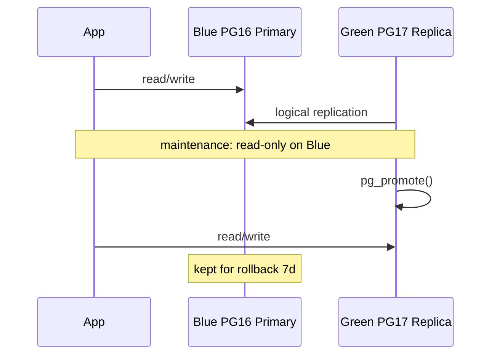

# 07. Лаба: blue/green

## Зачем эта лаба

Cutover — редкое событие; без checklist команда ошибается на lag, DNS и rollback. Вы построите sequence diagram, checklist и tabletop миграции 16→17.

## Предусловия

- [06-blue-green](06-blue-green.md)
- [advanced/09-major-upgrade](../postgresql-advanced/09-major-upgrade.md) — обзор

## Задание 1. Sequence diagram

`blue-green-cutover.md` с Mermaid:



## Задание 2. Checklist cutover (заполните)

- [ ] Green replication lag < 1 MB (или < 5 sec)
- [ ] Sequences synced on green
- [ ] App maintenance banner / read-only mode on blue
- [ ] Stop writes to blue (API deploy)
- [ ] Final sync wait — lag = 0
- [ ] `pg_promote()` on green or Patroni switchover
- [ ] Update DNS / K8s Service / Vault DATABASE_URL
- [ ] PgBouncer reload
- [ ] Smoke tests: login, checkout, migrations dry-run
- [ ] Monitor 24h on green
- [ ] Decommission blue after retention (7–14 days)

## Задание 3. Tabletop PG 16 → 17

10 шагов **до** cutover (подготовка):

```text
1. Provision green PG17 cluster
2. wal_level=logical on blue (restart)
3. Schema on green matches blue
4. CREATE PUBLICATION on blue
5. CREATE SUBSCRIPTION on green (copy_data=true)
6. Wait sync, monitor pg_stat_subscription
7. Test read-only workload on green replica
8. Document rollback: re-point app to blue
9. Schedule cutover window
10. Notify stakeholders RTO/RPO
```

## Задание 4. RPO/RTO table

| Replication | RPO at cutover | RTO estimate |
|-------------|----------------|--------------|
| Async physical | | |
| Sync physical | | |
| Logical (caught up) | | |

## Задание 5. Rollback scenario

Если smoke test failed на green — 5 шагов вернуть traffic на blue.

## Критерии успеха

- [ ] Mermaid sequence diagram
- [ ] Checklist ≥ 10 пунктов
- [ ] Tabletop 16→17 ≥ 10 шагов
- [ ] Rollback plan

## Дальше

Zero-downtime: [08-zero-downtime.md](08-zero-downtime.md).
