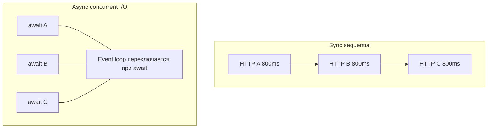
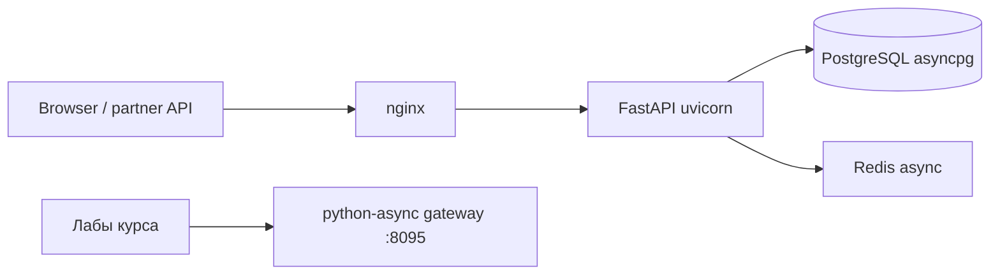

# 01. Sync vs async: когда и зачем

## Введение: «отчёт собирается 40 секунд, а пользователь ждёт»

Сервис агрегации тянет данные из **пяти внутренних HTTP API**. Каждый отвечает за **~800 ms**. Sync-код в цикле `for url in urls: requests.get(url)` даёт **4+ секунды** wall-clock — пользователь видит spinner, SLO горит. Команда предлагает «добавить потоков» или «переписать на asyncio». CTO спрашивает: **что реально даст выигрыш**, а что — только сложность?

Ответ начинается не с модного `async def`, а с **модели ожидания**: CPU-bound vs I/O-bound, один процесс vs много, и где живёт **event loop**. Эта глава — карта местности перед кодом. Углублённый разбор корутин — [02-coroutines-await](02-coroutines-await.md); прикладные паттерны в FastAPI — [27-async-patterns](../fastapi/27-async-patterns.md) (поверхностнее).

## Что вы узнаете

- Разницу **concurrency** и **parallelism** на примерах Python.
- Когда **asyncio**, **threading**, **multiprocessing** — правильный инструмент.
- Почему async ускоряет **I/O-bound**, но не **CPU-bound**.
- Как asyncio вписывается в стек mock-exams (FastAPI, httpx, Postgres, Redis).

---

## Concurrency vs parallelism

| | Concurrency | Parallelism |
|---|-------------|-------------|
| Идея | много задач **прогress** за период времени | задачи **одновременно** на разных ядрах |
| Модель | переключение при **ожидании** I/O | реальное параллельное выполнение |
| Python GIL | не мешает I/O wait | CPU на одном процессе — один поток «считает» |
| Типичный инструмент | **asyncio**, threads | **multiprocessing**, C-расширения |



**Wall-clock** для трёх независимых HTTP-запросов: sync sequential ≈ **2.4 s**; async concurrent ≈ **~800 ms** (плюс накладные расходы).

---

## Три способа «делать несколько дел»

| Подход | Сильные стороны | Слабые сторонes | Пример |
|--------|-----------------|-----------------|--------|
| **Sync + threads** | простой sync-код, blocking I/O | GIL, race conditions, overhead потоков | legacy `requests` |
| **asyncio** | тысячи I/O-ожиданий в одном потоке | нужен async stack; блокировка loop = катастрофа | httpx, asyncpg |
| **multiprocessing** | CPU на всех ядрах | тяжёлый IPC, память | pandas batch, ML inference |

```python
# I/O-bound: три sync запроса подряд — медленно
import time
import urllib.request

def fetch_sync(url: str) -> bytes:
    with urllib.request.urlopen(url, timeout=10) as r:
        return r.read()

t0 = time.perf_counter()
for _ in range(3):
    fetch_sync("http://localhost:8095/slow?extra_ms=100")
print(f"sync sequential: {time.perf_counter() - t0:.2f}s")
# ожидайте ~0.45s+ (3 × ~150ms на стенде deploy/python-async)
```

Async-версию напишете в [03-lab-first-async](03-lab-first-async.md).

---

## I/O-bound vs CPU-bound

| Нагрузка | Характер | Async помогает? | Альтернатива |
|----------|----------|-----------------|--------------|
| HTTP, DB, Redis, disk read | ждём сеть/диск | **да** | threads (хуже масштаб) |
| JSON parse 1 KB | микро-CPU | нет смысла | sync достаточно |
| resize 5000 изображений | тяжёлый CPU | **нет** (блокирует loop) | ProcessPool, Celery |
| crypto hash 1 GB | CPU | **нет** | отдельный worker |

**Правило:** asyncio — это **один поток**, который **не блокируется** на I/O. Любой **долгий sync** вызов (`time.sleep`, `requests.get`, тяжёлый pandas) **останавливает все** корутины в процессе.

См. [27-async-patterns](../fastapi/27-async-patterns.md): `asyncio.to_thread` — мост для legacy sync, не замена архитектуры.

---

## Где asyncio в архитектуре mock-exams



- **FastAPI** — ASGI, `async def` endpoints ([`deploy/fastapi`](../../deploy/fastapi/README.md), порт **8090**).
- **Лабы asyncio** — mock gateway ([`deploy/python-async`](../../deploy/python-async/README.md), порт **8095**).
- **Postgres** — asyncpg через SQLAlchemy ([`deploy/postgres`](../../deploy/postgres/README.md)).
- **Redis** — cache/rate limit ([`deploy/redis`](../../deploy/redis/README.md), [`redis-basic`](../redis-basic/README.md)).

Этот курс учит **механизму под FastAPI**, а не заменяет курс FastAPI.

---

## Когда НЕ asyncio

| Ситуация | Лучше |
|----------|-------|
| CLI-скрипт на 50 строк, 2 HTTP-вызова | sync + `httpx` или `requests` |
| Команда не готова к async ecosystem | sync Flask/Django + workers |
| 90% CPU в request handler | sync workers / process pool |
| Библиотека только sync (старый SDK) | thread pool или отдельный microservice |
| «Async ради async» без I/O | лишняя сложность без выигрыша |

---

## Мифы на собеседовании

| Миф | Реальность |
|-----|------------|
| «Async всегда быстрее» | быстрее только при **ожидании** I/O и **конкурентном** запуске |
| «Async = многопоточность» | один поток + cooperative multitasking |
| «GIL мешает async» | GIL отпускается на I/O; мешает **CPU** в том же потоке |
| «Перепишем всё на async за спринт» | нужны async драйверы, тесты, observability |

---

## На стенде: сравнение aggregate

Поднимите стенд (если ещё не поднят):

```bash
cd deploy/python-async
docker compose up -d --build
curl -s -w "\nTIME:%{time_total}s\n" http://localhost:8095/aggregate
curl -s -w "\nTIME:%{time_total}s\n" http://localhost:8095/aggregate-parallel
```

**Sequential** `/aggregate` — ~**1 s**; **parallel** `/aggregate-parallel` — ~**500 ms**. Gateway реализует то, что вы построите руками в [18-lab-parallel-fetch](18-lab-parallel-fetch.md).

---

## Типичные ошибки

| Ошибка | Почему плохо | Как правильно |
|--------|--------------|---------------|
| Async для CPU-bound hot path | блок event loop, p99 взлетает | ProcessPool / отдельный worker |
| Threads для 50k websocket | RAM и context switch | asyncio + один loop |
| `requests` внутри `async def` | freeze всех клиентов | `httpx.AsyncClient` ([17](17-async-http-httpx.md)) |
| Сравнивать только RPS без latency | «быстро» при 1 user, плохо при 100 | профиль под конкурентной нагрузкой |
| Игнорировать sync baseline | не знаете, есть ли выигрыш | замер sequential vs concurrent |

---

## В продакшене

- **Метрики:** p50/p95/p99 latency, не только среднее.
- **Graceful shutdown:** отмена tasks при SIGTERM ([08-lab-graceful-shutdown](08-lab-graceful-shutdown.md)).
- **Лимиты:** connection pool, semaphore на исходящие HTTP ([13-primitives-locks](13-primitives-locks.md)).
- **FastAPI:** несколько uvicorn workers = несколько процессов × event loop ([30-uvloop-production](30-uvloop-production.md)).

---

## Резюме

**Asyncio** — инструмент **конкурентного I/O** в **одном потоке** через **event loop** и **await**. Он не заменяет **multiprocessing** для CPU и не делает sync-код быстрее сам по себе. Выбор начинается с профиля нагрузки: **сколько времени процесс ждёт** vs **считает**.

## Чек-лист

- Чем concurrency отличается от parallelism?
- Почему три последовательных HTTP медленнее трёх concurrent await?
- Назовите два случая, когда asyncio — плохой выбор.
- Как `/aggregate-parallel` на порту 8095 связан с темой курса?

Следующий урок: [02. Корутины и await](02-coroutines-await.md).
