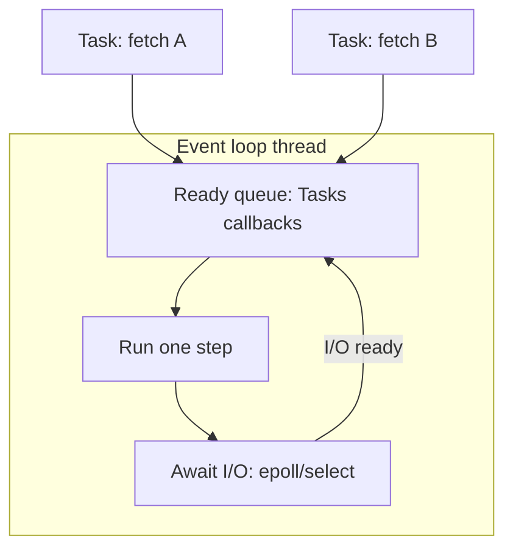

# 04. Event loop: сердце asyncio

## Введение: «всё await, но один запрос блокирует всех»

После миграции на FastAPI команда заметила: при **одном** тяжёлом отчёте **healthcheck** начинает таймаутить. В коде — `async def`, но внутри **`time.sleep(30)`** «для простоты». Event loop **один на процесс** uvicorn worker: sync sleep **не отдаёт** control — **ни одна** корутина не прогress 30 секунд.

Понимание **event loop** — ключ к диагностике таких инцидентов. Tasks и parallel fetch — [05-tasks-taskgroup](05-tasks-taskgroup.md); антипаттерны в API — [27-async-patterns](../fastapi/27-async-patterns.md).

## Что вы узнаете

- Как **event loop** планирует coroutines и callbacks.
- **`get_running_loop`** vs **`get_event_loop`** (legacy).
- **Call soon**, **call later**, **call_at**.
- Почему **блокировка loop** — системный сбой, не локальный баг.

---

## Event loop в одной картинке



Loop **один поток**:

1. Выбирает **готовую** задачу/callback.
2. Выполняет до следующего **`await`** (или завершения).
3. Регистрирует **I/O wait** (socket readable) или **timer** (`asyncio.sleep`).
4. Когда OS сигнализирует readiness — будит задачу.

**Cooperative:** задача сама yield через `await`. Нет preemption как у OS threads.

---

## Получение loop в коде

```python
import asyncio

async def show_loop():
    loop = asyncio.get_running_loop()
    print(loop)  # <_UnixSelectorEventLoop running=True ...>

async def main():
    await show_loop()

asyncio.run(main())
```

| API | Когда |
|-----|-------|
| `asyncio.get_running_loop()` | внутри coroutine — **текущий running** loop |
| `asyncio.run(main())` | создаёт **новый** loop для main thread |
| `asyncio.get_event_loop()` | **legacy**; в 3.10+ deprecated pattern в sync code |

**Правило:** в async-коде — **`get_running_loop()`**. Не создавайте второй loop в том же thread без веской причины.

---

## call_soon и timers

```python
import asyncio

def sync_callback():
    print("callback from loop")

async def main():
    loop = asyncio.get_running_loop()
    loop.call_soon(sync_callback)
    await asyncio.sleep(0)  # yield — дать выполниться callback
    loop.call_later(0.1, lambda: print("later"))
    await asyncio.sleep(0.15)

asyncio.run(main())
```

| Метод | Назначение |
|-------|------------|
| `call_soon(fn, *args)` | выполнить `fn` на **следующей** итерации |
| `call_later(delay, fn)` | через `delay` секунд |
| `call_at(when, fn)` | абсолютное время (monotonic clock) |

**Осторожно:** callback **sync** — должен быть **быстрым**. Долгая работа в callback блокирует loop.

---

## asyncio.sleep vs time.sleep

```python
import asyncio
import time

async def good():
    await asyncio.sleep(1)  # loop свободен для других tasks

async def bad():
    time.sleep(1)  # loop ЗАМОРОЖЕН на 1s
```

Демонстрация:

```python
import asyncio
import time

async def ticker():
    for i in range(3):
        print("tick", i)
        await asyncio.sleep(0.2)

async def with_bad_sleep():
    asyncio.create_task(ticker())
    time.sleep(1)  # ticker не печатает, пока sleep не кончится
    print("done bad")

async def with_good_sleep():
    asyncio.create_task(ticker())
    await asyncio.sleep(1)
    print("done good")

# asyncio.run(with_bad_sleep())  # tick только после 1s паузы
# asyncio.run(with_good_sleep()) # tick каждые 0.2s во время ожидания
```

---

## Default loop policy и платформы

| Платформа | Default loop |
|-----------|--------------|
| Linux/macOS | `SelectorEventLoop` |
| Windows | `ProactorEventLoop` (3.8+) |

Для большинства приложений **не меняйте** policy. Исключение — интеграция с lib, требующей specific loop (редко).

---

## Один loop на thread

```python
# ❌ два asyncio.run подряд в одном скрипте — OK (loop закрывается)
# ❌ asyncio.run внутри async — RuntimeError

async def inner():
    pass

async def outer():
    asyncio.run(inner())  # RuntimeError: cannot be called from a running event loop
```

**FastAPI:** uvicorn держит loop **живым** весь lifecycle процесса. Lifespan hooks — coroutines на том же loop ([`deploy/fastapi`](../../deploy/fastapi/README.md)).

---

## run_forever и run_until_complete (legacy mental model)

`asyncio.run(coro)` внутри делает примерно:

```python
# упрощённо, не копируйте в prod
loop = asyncio.new_event_loop()
asyncio.set_event_loop(loop)
try:
    return loop.run_until_complete(coro)
finally:
    loop.run_until_complete(loop.shutdown_asyncgens())
    loop.close()
```

Для **долгоживущих** сервисов loop крутится **`run_forever`** (uvicorn), не `run` на каждый запрос.

---

## Диагностика блокировок

```python
import asyncio

async def watchdog():
    while True:
        await asyncio.sleep(5)
        print("loop alive")

async def simulate_block():
    asyncio.create_task(watchdog())
    # имитация sync CPU — НЕ делайте в prod
    sum(i * i for i in range(50_000_000))
```

Если **watchdog** не печатает во время «block» — loop занят sync-кодом. В prod: **py-spy**, **asyncio debug mode** ([29-debug-profiling](29-debug-profiling.md)).

---

## Связь со стендом

Gateway на **8095** — FastAPI + uvicorn + **один event loop** на worker. `/aggregate-parallel` планирует три `fetch` как concurrent tasks на том же loop ([`app.py`](../../deploy/python-async/mock-server/app.py)).

---

## Типичные ошибки

| Ошибка | Последствие | Решение |
|--------|-------------|---------|
| `time.sleep` в coroutine | freeze | `await asyncio.sleep` |
| Sync DB driver в async route | freeze | asyncpg / `to_thread` |
| Тяжёлый JSON parse 50 MB в handler | spike latency | stream / executor |
| `get_event_loop()` в 3.12 без running loop | DeprecationWarning | `asyncio.run` или `get_running_loop` |
| Callback с await внутри | нельзя — callback sync | создайте Task |

---

## Резюме

**Event loop** — планировщик **одного потока**, который переключается между coroutines на **`await`** и I/O readiness. Любой **sync block** без await — **остановка всего процесса** async. `asyncio.run` создаёт loop для скриптов; **uvicorn** держит loop для API.

## Чек-лист

- Что происходит на `await asyncio.sleep(1)` с точки зрения loop?
- Почему `time.sleep` в `async def` опасен?
- Чем `get_running_loop()` отличается от `asyncio.run()`?
- Сколько event loop на один uvicorn worker?

Следующий урок: [05. Tasks и TaskGroup](05-tasks-taskgroup.md).
