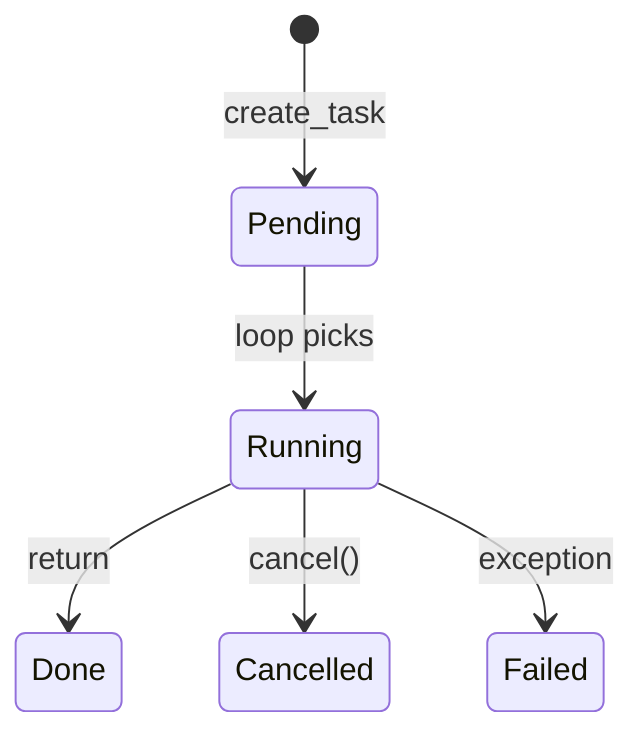

# 05. Tasks и TaskGroup

## Введение: «запустили fetch и забыли — данные потерялись»

Микросервис стартует **фоновую** отправку webhook через `asyncio.create_task(notify())`, но handler сразу return **200**. При деплое pod получает **SIGTERM** — task **убивается** без `await`, партнёр не получил callback. Нужно понимать **lifecycle Task**: когда она стартует, как дождаться, как **TaskGroup** (3.11+) гарантирует **structured** завершение.

Cancellation — [07-cancellation-timeouts](07-cancellation-timeouts.md); сравнение с gather — [09-gather-vs-taskgroup](09-gather-vs-taskgroup.md).

## Что вы узнаете

- **`asyncio.create_task`** и **`asyncio.Task`**.
- **`TaskGroup`** (Python 3.11+) для structured concurrency.
- **`asyncio.wait`**, **`wait_for`** (обзор).
- Fire-and-forget vs explicit await.

---

## create_task — schedule coroutine

```python
import asyncio

async def fetch(name: str, delay: float) -> str:
    await asyncio.sleep(delay)
    return f"{name}: ok"

async def main():
    # Плохо: coroutine не запланирована, пока не await
    coro = fetch("A", 0.2)

    # Хорошо: Task уже в очереди loop
    task_a = asyncio.create_task(fetch("A", 0.2))
    task_b = asyncio.create_task(fetch("B", 0.1))

    # Между create и await можно делать другую работу
    print("scheduled both")

    results = await asyncio.gather(task_a, task_b)
    print(results)

asyncio.run(main())
```

| Шаг | Эффект |
|-----|--------|
| `coro = fetch(...)` | объект coroutine, **не выполняется** |
| `create_task(coro)` | loop **начнёт** при первой возможности |
| `await task` | дождаться result или exception |

**Именование (3.8+):** `task.set_name("webhook")` — удобно в логах.

---

## Task states (упрощённо)



```python
task = asyncio.create_task(fetch("x", 0.1))
print(task.done())   # False
await task
print(task.done())   # True
print(task.result()) # 'x: ok'
```

---

## TaskGroup — structured batch (3.11+)

```python
import asyncio

async def worker(n: int) -> int:
    await asyncio.sleep(0.1 * n)
    return n * 10

async def main():
    async with asyncio.TaskGroup() as tg:
        t1 = tg.create_task(worker(1))
        t2 = tg.create_task(worker(2))
        t3 = tg.create_task(worker(3))
    # выход из блока — ВСЕ tasks завершены (или ExceptionGroup)

    print(t1.result(), t2.result(), t3.result())

asyncio.run(main())
```

| TaskGroup | Поведение |
|-----------|-----------|
| `async with TaskGroup()` | ждёт всех children при выходе |
| Исключение в одной task | **отменяет** остальные, raises **ExceptionGroup** |
| После блока | все results доступны через `.result()` |

**Structured concurrency:** scope группы = lifetime задач. Подробнее — [16-structured-concurrency](16-structured-concurrency.md).

---

## create_task vs gather vs TaskGroup

| API | Старт | Ошибка в одной | Стиль |
|-----|-------|----------------|-------|
| `await gather(a(), b())` | при вызове gather | `return_exceptions` опционально | функциональный |
| `create_task` + await | явный schedule | нужно обрабатывать вручную | гибкий |
| `TaskGroup` | `tg.create_task` | cancel siblings + ExceptionGroup | structured |

```python
# gather с исключениями
results = await asyncio.gather(
    fetch("ok", 0.1),
    fetch("fail", 0.1),  # если raise внутри
    return_exceptions=True,
)
```

---

## Fire-and-forget (осторожно)

```python
async def background_log(msg: str):
    await asyncio.sleep(0.01)
    print("logged:", msg)

async def handler():
    asyncio.create_task(background_log("event"))  # не await
    return {"status": "accepted"}
```

**Риски:**

- исключение в task **теряется**, если не `add_done_callback`.
- при shutdown task **обрывается**.

**Лучше:** явная очередь + worker ([14-asyncio-queues](14-asyncio-queues.md)) или **BackgroundTasks** FastAPI для короткой работы.

```python
def _log_task_result(task: asyncio.Task):
    if task.cancelled():
        return
    exc = task.exception()
    if exc:
        print("background failed:", exc)

task = asyncio.create_task(background_log("x"))
task.add_done_callback(_log_task_result)
```

---

## asyncio.wait и wait_for

```python
import asyncio

async def demo_wait():
    tasks = [
        asyncio.create_task(asyncio.sleep(1)),
        asyncio.create_task(asyncio.sleep(2)),
    ]
    done, pending = await asyncio.wait(tasks, timeout=0.5)
    for p in pending:
        p.cancel()
    print(len(done), len(pending))  # 0-1 done, rest pending

async def demo_wait_for():
    try:
        await asyncio.wait_for(asyncio.sleep(10), timeout=0.2)
    except asyncio.TimeoutError:
        print("timed out")
```

`wait_for` — обёртка с timeout ([07-cancellation-timeouts](07-cancellation-timeouts.md)). `wait` — низкоуровневый; в новом коде чаще **TaskGroup** + **`timeout()` context** (3.11+).

---

## Пример: concurrent fetch на стенде

```python
import asyncio
import httpx

BASE = "http://localhost:8095"

async def get_json(client: httpx.AsyncClient, path: str):
    r = await client.get(f"{BASE}{path}")
    r.raise_for_status()
    return r.json()

async def dashboard():
    async with httpx.AsyncClient(timeout=30) as client:
        async with asyncio.TaskGroup() as tg:
            t_health = tg.create_task(get_json(client, "/health"))
            t_json = tg.create_task(get_json(client, "/json?size=5"))
    return {"health": t_health.result(), "json": t_json.result()}
```

Лаба: [06-lab-concurrent-io](06-lab-concurrent-io.md).

---

## Типичные ошибки

| Ошибка | Симптом | Решение |
|--------|---------|---------|
| `gather` без await | coroutine never awaited | `await gather(...)` |
| Task после loop closed | RuntimeError | await/cancel в shutdown |
| ExceptionGroup не пойман | 500 без лога | `except* Exception` (3.11+) |
| create_task после первого await «серии» | потеря параллелизма | schedule до await других |
| Хранить thousands tasks без лимита | memory | Semaphore ([13](13-primitives-locks.md)) |

---

## Резюме

**Task** — coroutine, **запланированная** на event loop. **`create_task`** даёт параллелизм до первого `await`. **TaskGroup** (3.11+) — preferred способ **группы** задач с автоматической отменой siblings при ошибке. Fire-and-forget допустим только с **done callback** и пониманием shutdown.

## Чек-лист

- Чем coroutine отличается от Task после `create_task`?
- Что делает TaskGroup при exception в одной child?
- Когда gather предпочтительнее TaskGroup?
- Почему fire-and-forget опасен при SIGTERM?

Следующий урок: [06. Лаба: concurrent I/O](06-lab-concurrent-io.md).
