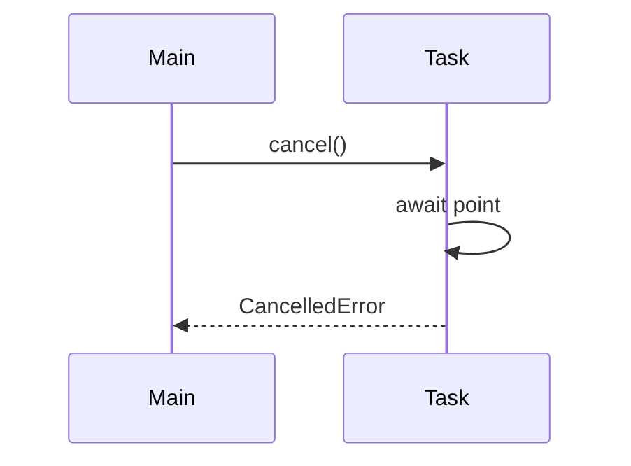

# 07. Cancellation и timeouts

## Введение: «деploy убил pod — транзакция висела в БД»

Kubernetes отправил **SIGTERM**, uvicorn начал shutdown, но handler всё ещё **await**-ил внешний API без timeout. Через **30 s** SIGKILL — соединение с PostgreSQL оборвано, строка в **idle in transaction**. Проблема: нет **верхней границы времени** и корректной **отмены** долгих tasks.

Эта глава — **`task.cancel()`**, **`CancelledError`**, **`asyncio.timeout`**, **`wait_for`**. Практика shutdown — [08-lab-graceful-shutdown](08-lab-graceful-shutdown.md); production FastAPI — [33-docker-production](../fastapi/33-docker-production.md).

## Что вы узнаете

- Как работает **cancellation** в asyncio (cooperative).
- **`async for` + cancel** и cleanup в `finally`.
- **Timeouts:** `asyncio.timeout` (3.11+), `wait_for`.
- Почему **глотать CancelledError** — баг.

---

## Cooperative cancellation

```python
import asyncio

async def long_job():
    try:
        await asyncio.sleep(60)
    except asyncio.CancelledError:
        print("cleanup before exit")
        raise  # ОБЯЗАТЕЛЬНО re-raise

async def main():
    task = asyncio.create_task(long_job())
    await asyncio.sleep(0.1)
    task.cancel()
    try:
        await task
    except asyncio.CancelledError:
        print("task was cancelled")

asyncio.run(main())
```

| Шаг | Что происходит |
|-----|----------------|
| `task.cancel()` | запрос отмены; task получит **CancelledError** на **ближайшем await** |
| `except CancelledError: raise` | propagation вверх — иначе cancel «проглочен» |
| Без await в task | cancel отложен до первого await |



---

## asyncio.timeout (3.11+)

```python
import asyncio

async def slow():
    await asyncio.sleep(10)
    return "done"

async def main():
    try:
        async with asyncio.timeout(0.5):
            await slow()
    except TimeoutError:
        print("too slow")

asyncio.run(main())
```

| API | Примечание |
|-----|------------|
| `async with asyncio.timeout(n)` | preferred в 3.11+ |
| `asyncio.wait_for(coro, timeout=n)` | legacy, всё ещё common |
| `TimeoutError` | при timeout (не `asyncio.TimeoutError` в 3.11+) |

**Важно:** timeout **отменяет** внутреннюю coroutine. Обрабатывайте cleanup в `finally` внутри `slow`, если нужен rollback.

---

## wait_for — классический паттерн

```python
import asyncio

async def fetch_simulated():
    await asyncio.sleep(2)
    return {"data": 1}

async def main():
    try:
        result = await asyncio.wait_for(fetch_simulated(), timeout=0.3)
    except asyncio.TimeoutError:
        print("wait_for timeout")
    else:
        print(result)
```

На httpx — задавайте **client timeout** *и* **business timeout** ([17-async-http-httpx](17-async-http-httpx.md)).

---

## Shield от cancel (редко)

```python
async def critical_commit():
    await asyncio.sleep(0.5)
    print("committed")

async def main():
    task = asyncio.create_task(asyncio.shield(critical_commit()))
    await asyncio.sleep(0.1)
    task.cancel()
    await task  # shield: inner может завершиться
```

**`shield`** защищает inner от **внешнего** cancel — используйте **очень редко** (риск «зомби» work при shutdown).

---

## Cancellation + httpx

```python
import asyncio
import httpx

async def fetch(url: str):
    async with httpx.AsyncClient(timeout=30.0) as client:
        try:
            async with asyncio.timeout(1.0):
                r = await client.get(url)
                return r.json()
        except TimeoutError:
            return {"error": "timeout"}

async def main():
    print(await fetch("http://localhost:8095/slow?extra_ms=500"))
```

**Что увидите:** timeout — запрос **прерван** на клиенте; на сервере handler может ещё завершиться (это нормально для HTTP).

---

## TaskGroup и cancel

При выходе из `TaskGroup` с ошибкой **все siblings cancel** ([05-tasks-taskgroup](05-tasks-taskgroup.md)). При **SIGTERM** uvicorn cancel-ит running requests — ваш код должен:

1. Ловить **CancelledError** на top-level await.
2. Закрывать pools (`await engine.dispose()`).
3. Не начинать новую долгую work после cancel flag.

---

## Типичные ошибки

| Ошибка | Последствие | Решение |
|--------|-------------|---------|
| `except CancelledError: pass` | shutdown зависает | **re-raise** |
| Нет timeout на external HTTP | hung requests, connection leak | `timeout` + httpx limits |
| Cancel sync blocking code | cancel не сработает до return | убрать block / to_thread |
| Думать, что cancel = kill thread | только на await | разбить на await chunks |
| shield везде | SIGTERM не останавливает | точечно |

---

## В продакшене

- **K8s** `terminationGracePeriodSeconds` ≥ worst-case graceful shutdown.
- **FastAPI lifespan** — закрыть httpx client, DB pool ([`deploy/fastapi`](../../deploy/fastapi/README.md)).
- **Idempotency** — cancel может случиться **после** успеха upstream.

---

## Резюме

**Cancellation** в asyncio **cooperative**: `cancel()` доставляет **CancelledError** на await. **Timeout** — частный случай cancel по таймеру. Всегда **re-raise CancelledError** после cleanup. Комбинируйте **httpx timeout** и **`asyncio.timeout`** для defense in depth.

## Чек-лист

- Где именно срабатывает cancel внутри task?
- Чем `asyncio.timeout` отличается от httpx timeout?
- Почему нельзя глотать CancelledError?
- Что происходит с sibling tasks в TaskGroup при ошибке?

Следующий урок: [08. Лаба: graceful shutdown](08-lab-graceful-shutdown.md).
