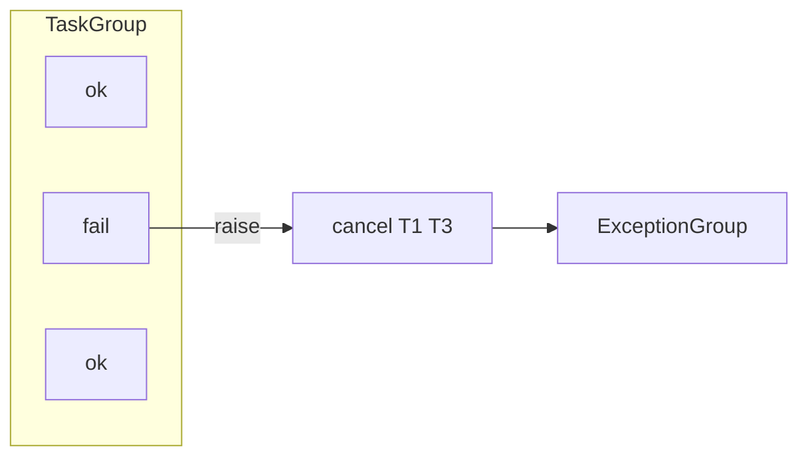

# 09. asyncio.gather vs TaskGroup

## Введение: «один упавший shard уронил весь batch»

ETL-скрипт тянет **20 API** через `gather`. Один endpoint вернул **500** — без `return_exceptions=True` весь batch упал, **19 успешных** ответов выброшены. Переписали на **TaskGroup** — при первой ошибке siblings **cancel**, но теперь нужен **`except*`** для **ExceptionGroup**. Какой API выбрать?

Сравнение — ключ к [16-structured-concurrency](16-structured-concurrency.md) и лабам [06](06-lab-concurrent-io.md), [18](18-lab-parallel-fetch.md).

## Что вы узнаете

- Семантику **`asyncio.gather`** и опции **`return_exceptions`**.
- Семантику **`TaskGroup`** и **ExceptionGroup**.
- Когда **gather** всё ещё уместен.
- Паттерны **partial success** vs **all-or-nothing**.

---

## gather — функциональный fan-in

```python
import asyncio

async def ok(v: int) -> int:
    await asyncio.sleep(0.05)
    return v

async def fail() -> None:
    await asyncio.sleep(0.05)
    raise RuntimeError("boom")

async def demo_gather_fail_fast():
    # без return_exceptions — первый raise propagates
    await asyncio.gather(ok(1), fail(), ok(2))

async def demo_gather_partial():
    results = await asyncio.gather(
        ok(1), fail(), ok(2),
        return_exceptions=True,
    )
    print(results)  # [1, RuntimeError('boom'), 2]
```

| Параметр | Эффект |
|----------|--------|
| `return_exceptions=False` (default) | первое исключение → cancel остальных? **Нет** — другие **добегают**, но gather raise |
| `return_exceptions=True` | исключения **в списке** как элементы |
| Порядок results | **порядок аргументов**, не completion order |

**Важно:** gather **не отменяет** siblings при ошибке (до завершения gather). TaskGroup — **отменяет**.

---

## TaskGroup — structured all-or-nothing

```python
import asyncio

async def demo_taskgroup():
    try:
        async with asyncio.TaskGroup() as tg:
            tg.create_task(ok(1))
            tg.create_task(fail())
            tg.create_task(ok(2))
    except* RuntimeError as eg:
        print("failures:", len(eg.exceptions))
```



При exit из `async with` **все** children done или cancelled. **Partial results** — только у уже завершившихся до ошибки (ненадёжно полагаться).

---

## Сравнительная таблица

| Критерий | gather | TaskGroup |
|----------|--------|-----------|
| Python | 3.7+ | **3.11+** |
| Ошибка в одной | raise (или in list) | **cancel siblings** + ExceptionGroup |
| Partial success | `return_exceptions=True` | не design goal |
| Доступ к Task objects | нужен create_task отдельно | `tg.create_task` |
| Читаемость scope | одна строка | явный `async with` block |
| Structured concurrency | нет | **да** |

---

## Когда gather

```python
# Независимые read-only sources — OK partial
async def load_dashboard(user_id: int):
    profile, settings, notifs = await asyncio.gather(
        fetch_profile(user_id),
        fetch_settings(user_id),
        fetch_notifications(user_id),
        return_exceptions=True,
    )
    if isinstance(profile, Exception):
        profile = None
    ...
```

- **Read-only** агрегация с **degraded** UI.
- Миграция legacy кода (широкая поддержка 3.9).
- Фиксированный набор coroutines **без** nested dynamic spawn.

---

## Когда TaskGroup

```python
async def transfer_funds(from_id: int, to_id: int, amount: int):
    async with asyncio.TaskGroup() as tg:
        tg.create_task(debit(from_id, amount))
        tg.create_task(credit(to_id, amount))
    # обе или ни одной — бизнес-инвариант
```

- **Транзакционные** инварианты (все или никто).
- **Dynamic** spawn в цикле внутри одного scope.
- Новый код на **3.11+** без legacy constraint.

---

## gather + create_task для раннего старта

```python
async def early_start():
    t1 = asyncio.create_task(ok(1))
    t2 = asyncio.create_task(ok(2))
    await asyncio.sleep(0)  # другая sync work
    return await asyncio.gather(t1, t2)
```

TaskGroup эквивалент:

```python
async with asyncio.TaskGroup() as tg:
    t1 = tg.create_task(ok(1))
    t2 = tg.create_task(ok(2))
# results here
```

---

## ExceptionGroup и except*

```python
try:
    async with asyncio.TaskGroup() as tg:
        tg.create_task(fail())
        tg.create_task(fail())
except* RuntimeError as eg:
    for e in eg.exceptions:
        print("got:", e)
```

Python 3.11 **PEP 654** — несколько ошибок в одном bubble. В логах uvicorn может появиться ExceptionGroup — не путать с single traceback.

---

## Пример: aggregate endpoints

Gateway **8095**:

- `/aggregate` — **sequential** for loop (не gather).
- `/aggregate-parallel` — **`asyncio.gather`** на три fetch.

См. [`app.py`](../../deploy/python-async/mock-server/app.py). В [18-lab-parallel-fetch](18-lab-parallel-fetch.md) воспроизведёте локально.

---

## Типичные ошибки

| Ошибка | Последствие | Решение |
|--------|-------------|---------|
| gather без await | never awaited | `await gather(...)` |
| TaskGroup без except* | unhandled ExceptionGroup | `except* Exception` |
| Partial success в TaskGroup | потеря данных | gather + return_exceptions |
| Ожидать cancel siblings в gather | лишние вызовы upstream | TaskGroup или manual cancel |
| gather в цикле N=10000 | memory spike | Semaphore + bounded pool ([13](13-primitives-locks.md)) |

---

## Резюме

**gather** — гибкий **fan-in** с опциональным **partial success**. **TaskGroup** — **structured** scope: ошибка **отменяет** siblings, ошибки — **ExceptionGroup**. Для нового кода на 3.11+ предпочитайте **TaskGroup** для инварианта «все или никто»; **gather** — для degraded read aggregation.

## Чек-лист

- Отменяет ли gather siblings при ошибке?
- Как получить partial success?
- Когда нужен `except*`?
- Что использует `/aggregate-parallel` на стенде?

Следующий урок: [10. Async context managers](10-async-context-managers.md).
