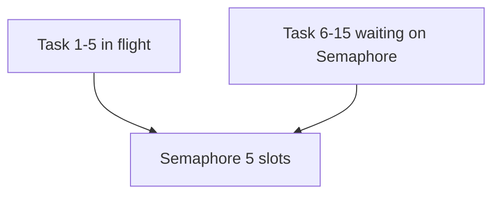

# 13. Lock, Semaphore, Event

## Введение: «100 parallel HTTP — upstream заблокировал нас»

Скрипт миграции запустил **`gather`** на **500 URL** без лимита. Upstream вернул **429** и **connection reset**; локально — **TIME_WAIT** лавина. Нужен **Semaphore(20)** — не больше 20 одновременных in-flight запросов. Параллельно другой сервис делил **mutable cache dict** между tasks — race, corrupted entries. Нужен **Lock**.

Примитивы asyncio — не «как threading», а **координация** coroutines на **одном потоке**. Queues — [14-asyncio-queues](14-asyncio-queues.md); rate limit в FastAPI+Redis — [28-redis-cache](../fastapi/28-redis-cache.md).

## Что вы узнаете

- **`asyncio.Lock`** — mutual exclusion.
- **`Semaphore` / `BoundedSemaphore`** — лимит параллелизма.
- **`Event`** — signal между tasks.
- **`Condition`** (обзор).

---

## Lock — один writer

```python
import asyncio

cache: dict[str, int] = {}
lock = asyncio.Lock()

async def upsert(key: str, delta: int):
    async with lock:
        cache[key] = cache.get(key, 0) + delta
        await asyncio.sleep(0.01)  # simulate work

async def main():
    await asyncio.gather(*(upsert("x", 1) for _ in range(100)))
    print(cache["x"])  # 100 без lock — race, меньше

asyncio.run(main())
```

| Примитив | Когда |
|----------|-------|
| **Lock** | mutate shared **mutable** state |
| **Semaphore** | limit **count** concurrent operations |
| **Event** | one-shot или persistent **flag** |

**Важно:** без **preemption** race window — между **await** внутри critical section. Держите section **короткой**, без I/O внутри lock если можно.

---

## Semaphore — bounded concurrency

```python
import asyncio
import httpx

BASE = "http://localhost:8095"
SEM = asyncio.Semaphore(5)

async def fetch_limited(client: httpx.AsyncClient, path: str, i: int):
    async with SEM:
        print(f"start {i}")
        r = await client.get(f"{BASE}{path}")
        r.raise_for_status()
        print(f"done {i}")
        return r.json()

async def main():
    async with httpx.AsyncClient(timeout=30) as client:
        await asyncio.gather(*(fetch_limited(client, "/slow?extra_ms=50", i) for i in range(15)))

asyncio.run(main())
```

**Что увидите:** не более **5** одновременных `start` — остальные ждут на `async with SEM`.



---

## BoundedSemaphore

```python
sem = asyncio.BoundedSemaphore(3)
# release() без acquire → ValueError (catch bugs)
```

Обычный Semaphore может «накапливать» лишние release — Bounded ловит ошибки.

---

## Event — координация

```python
import asyncio

ready = asyncio.Event()

async def waiter(name: str):
    print(f"{name} waiting")
    await ready.wait()
    print(f"{name} go")

async def setter():
    await asyncio.sleep(0.2)
    print("set event")
    ready.set()

async def main():
    await asyncio.gather(waiter("A"), waiter("B"), setter())

asyncio.run(main())
```

| Метод | Действие |
|-------|----------|
| `await event.wait()` | block пока не set |
| `event.set()` | wake **все** waiters |
| `event.clear()` | reset (редко) |

Shutdown pattern из [08-lab-graceful-shutdown](08-lab-graceful-shutdown.md) — частный случай **Event**.

---

## Condition (обзор)

```python
condition = asyncio.Condition()
items: list[int] = []

async def consumer():
    async with condition:
        while not items:
            await condition.wait()
        return items.pop(0)

async def producer(v: int):
    async with condition:
        items.append(v)
        condition.notify()
```

Для producer-consumer чаще проще **Queue** ([14-asyncio-queues](14-asyncio-queues.md)).

---

## Semaphore vs connection pool limits

| Layer | Что ограничивает |
|-------|------------------|
| `httpx.Limits(max_connections=N)` | TCP connections в client |
| **Semaphore** | business concurrent **operations** |
| Upstream rate limit | 429 / Retry-After |

Используйте **оба**: pool не заменяет application-level throttle.

---

## Redis distributed lock (cross-link)

In-process Lock **не работает** между uvicorn workers. Для cluster — Redis `SET NX` ([`redis-basic`](../redis-basic/README.md), [28-redis-cache](../fastapi/28-redis-cache.md)).

---

## Типичные ошибки

| Ошибка | Последствие | Решение |
|--------|-------------|---------|
| Lock на весь HTTP await | serial throughput = 1 | lock только mutate cache |
| Semaphore(1000) «на всякий» | нет защиты upstream | измерить + tune |
| Deadlock двух Lock | hang | fixed order acquire |
| threading.Lock в async | block event loop | asyncio.Lock |
| Event без clear при reuse | ложный wake | new Event или clear |

---

## Резюме

**Lock** защищает **shared mutable state**. **Semaphore** ограничивает **число одновременных** async операций — must-have для mass HTTP/DB. **Event** синхронизирует фазы (startup ready, shutdown). Все примитивы **async** — await на acquire/wait.

## Чек-лист

- Почему threading.Lock опасен в coroutine?
- Semaphore(5) + 20 tasks — сколько in-flight?
- Lock vs Semaphore — один вопрос на собеседовании?
- Где лимит connections в httpx?

Следующий урок: [14. asyncio.Queue](14-asyncio-queues.md).
