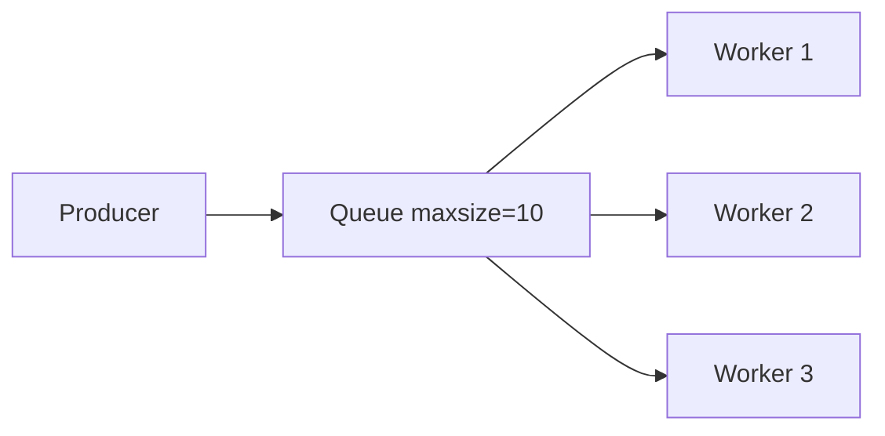

# 14. asyncio.Queue и producer-consumer

## Введение: «очередь Celery дорогая — нужен in-process worker pool»

Сервис принимает **1000 upload jobs** и обрабатывает их **httpx POST** на converter API. `gather(1000)` — OOM и ban. Архитектура: **3 worker coroutines** читают из **`asyncio.Queue`**, main **produce** job ids. Backpressure: **`Queue(maxsize=50)`** — producer **await put** когда очередь полна.

Worker pool lab — [15-lab-worker-pool](15-lab-worker-pool.md). Distributed queue — RabbitMQ/Kafka ([`rabbitmq-basic`](../rabbitmq-basic/README.md)); Redis lists — [`redis-basic`](../redis-basic/README.md).

## Что вы узнаете

- **`asyncio.Queue`** API: put, get, task_done, join.
- **Producer-consumer** с несколькими workers.
- **Sentinel** для graceful shutdown.
- **maxsize** как backpressure.

---

## Queue basics

```python
import asyncio

async def producer(q: asyncio.Queue):
    for i in range(5):
        await q.put(i)
        print("produced", i)
    await q.put(None)  # sentinel — stop consumer

async def consumer(q: asyncio.Queue):
    while True:
        item = await q.get()
        if item is None:
            q.task_done()
            break
        print("consumed", item)
        await asyncio.sleep(0.05)
        q.task_done()

async def main():
    q = asyncio.Queue()
    await asyncio.gather(producer(q), consumer(q))

asyncio.run(main())
```

| Метод | Описание |
|-------|----------|
| `await q.put(item)` | enqueue; блок если **maxsize** reached |
| `await q.get()` | dequeue; блок если empty |
| `q.task_done()` | mark item processed |
| `await q.join()` | ждать пока все items done |

---

## Multiple workers + sentinel

```python
async def worker(wid: int, q: asyncio.Queue):
    while True:
        item = await q.get()
        if item is None:
            q.task_done()
            break
        print(f"worker {wid} processing {item}")
        await asyncio.sleep(0.1)
        q.task_done()

async def main():
    q = asyncio.Queue(maxsize=10)
    workers = [asyncio.create_task(worker(i, q)) for i in range(3)]
    for job in range(12):
        await q.put(job)
    # shutdown: one sentinel per worker
    for _ in workers:
        await q.put(None)
    await q.join()
    await asyncio.gather(*workers)
```

**Sentinel pattern:** **`N` None** для **N** workers — каждый получает свой stop signal.



---

## Backpressure с maxsize

```python
async def slow_consumer(q: asyncio.Queue):
    while True:
        item = await q.get()
        if item is None:
            q.task_done()
            return
        await asyncio.sleep(0.2)
        q.task_done()

async def fast_producer(q: asyncio.Queue):
    for i in range(20):
        await q.put(i)  # blocks when q full
        print("put", i)
```

**maxsize=5** — producer **не может** обогнать consumer без bound на памяти.

---

## PriorityQueue (когда нужен приоритет)

```python
q = asyncio.PriorityQueue()
await q.put((1, "high"))
await q.put((10, "low"))
priority, item = await q.get()
```

Для fair FIFO достаточно обычного **Queue**.

---

## Queue vs gather

| gather 500 tasks | Queue + 10 workers |
|------------------|---------------------|
| 500 coroutines alive | ~10 active + queue buffer |
| spike memory | bounded |
| hard throttle | natural backpressure |

---

## Integration с Semaphore

```python
sem = asyncio.Semaphore(5)

async def worker(q: asyncio.Queue):
    while True:
        url = await q.get()
        if url is None:
            q.task_done()
            break
        async with sem:
            await fetch(url)
        q.task_done()
```

Double limit — избыточно; выберите **один** choke point.

---

## Mock gateway как job target

```python
import httpx

BASE = "http://localhost:8095"

async def process_job(client: httpx.AsyncClient, job_id: int):
    r = await client.get(f"{BASE}/slow", params={"extra_ms": job_id % 100})
    r.raise_for_status()
    return job_id, r.json()["delay_ms"]
```

Лаба [15-lab-worker-pool](15-lab-worker-pool.md) использует этот паттерн.

---

## Типичные ошибки

| Ошибка | Последствие | Решение |
|--------|-------------|---------|
| Забыли task_done | join hangs | always task_done after get |
| Один sentinel на N workers | N-1 workers hang | N sentinels |
| Unbounded Queue | OOM under spike | maxsize |
| put без await (sync) | wrong API | await put |
| Consumer exception без task_done | join leak | try/finally task_done |

---

## Резюме

**asyncio.Queue** — idiomatic **producer-consumer** в одном process. **maxsize** даёт **backpressure**. **Sentinel None** останавливает workers cleanly. Для multi-node — внешняя очередь (Redis, RabbitMQ).

## Чек-лист

- Что делает `await q.join()`?
- Зачем maxsize?
- Сколько sentinels для 5 workers?
- Queue vs Celery — когда что?

Следующий урок: [15. Лаба: worker pool](15-lab-worker-pool.md).
