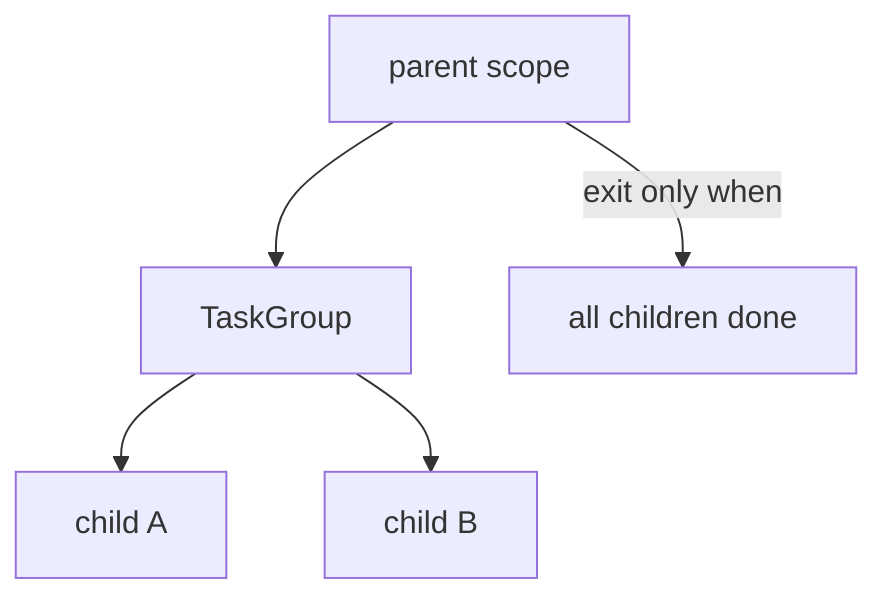

# 16. Structured concurrency

## Введение: «фоновая задача пережила родителя — писала в закрытую БД»

Legacy код: `asyncio.create_task(cleanup())` в handler **без await**; request завершился, session **closed**, task всё ещё **await session.execute**. Intermittent **`InterfaceError`**. **Structured concurrency** — правило: **lifetime дочерних tasks ⊆ lifetime родительского scope**. В Python 3.11+ это **`TaskGroup`**; концепция шире — Trio, **anyio** ([34-system-design-async](34-system-design-async.md)).

## Что вы узнаете

- Принципы **structured concurrency** (Nursery model).
- **TaskGroup** как Python implementation.
- **Anti-patterns:** orphan tasks, detached callbacks.
- Связь с **shutdown** и **testing**.

---

## Проблема unstructured tasks

```python
import asyncio

async def orphan_work():
    await asyncio.sleep(1)
    print("orphan still running")

async def handler_bad():
    asyncio.create_task(orphan_work())  # detached
    return "200 OK"  # scope ends — who awaits orphan?

async def handler_good():
    async with asyncio.TaskGroup() as tg:
        tg.create_task(orphan_work())
    # orphan_work MUST finish before return
    return "200 OK"
```

| Unstructured | Structured |
|--------------|------------|
| task может пережить parent | children **не переживают** scope |
| ошибки теряются | **ExceptionGroup** |
| shutdown сложен | cancel on scope exit |

---

## TaskGroup = structured scope

```python
import asyncio

async def child(name: str):
    await asyncio.sleep(0.1)
    return name

async def parent():
    async with asyncio.TaskGroup() as tg:
        a = tg.create_task(child("A"))
        b = tg.create_task(child("B"))
    return a.result(), b.result()
```



Сравнение gather — [09-gather-vs-taskgroup](09-gather-vs-taskgroup.md).

---

## Cancellation propagates down

```python
async def parent_with_cancel():
    try:
        async with asyncio.TaskGroup() as tg:
            tg.create_task(asyncio.sleep(10))
            tg.create_task(asyncio.sleep(10))
            raise ValueError("parent fail")
    except* ValueError:
        pass
    # оба sleep tasks cancelled
```

**Structured cancel:** ошибка в parent scope → siblings cancelled. Как **SIGTERM** на request tree в well-designed app.

---

## Nursery mental model (Trio → asyncio)

| Trio | asyncio 3.11+ |
|------|---------------|
| `async with nursery:` | `async with TaskGroup() as tg:` |
| `nursery.start_soon(fn)` | `tg.create_task(fn())` |
| Cannot leave with running tasks | same |

**anyio** абстрагирует asyncio и Trio — см. [34-system-design-async](34-system-design-async.md); uvicorn lifespan — [30-uvloop-production](30-uvloop-production.md).

---

## FastAPI request scope

```python
# anti-pattern
@router.post("/jobs")
async def create_job():
    asyncio.create_task(process_job())  # unstructured
    return {"accepted": True}

# better
@router.post("/jobs")
async def create_job():
    async with asyncio.TaskGroup() as tg:
        tg.create_task(process_job())
    return {"done": True}  # если process короткий

# production: external queue Celery/SQS
```

Долгая work — **не** в request TaskGroup; **Queue** или broker ([15-lab-worker-pool](15-lab-worker-pool.md)).

---

## Testing structured code

```python
import pytest

@pytest.mark.asyncio
async def test_parent():
    a, b = await parent()
    assert a == "A"
    assert b == "B"
```

Orphan tasks в tests → **warnings** «Task was destroyed but pending». TaskGroup делает tests **deterministic** ([27-pytest-asyncio](27-pytest-asyncio.md)).

---

## Capstone preview

[36-capstone](36-capstone.md) — aggregator service: **TaskGroup** per incoming batch, **Semaphore** on outbound, **timeout** per upstream — все три слоя structured.

---

## Типичные ошибки

| Ошибка | Последствие | Решение |
|--------|-------------|---------|
| create_task без scope | orphan + lost errors | TaskGroup or explicit await |
| TaskGroup для hours-long work | block request | external worker |
| Ignore ExceptionGroup in logs | silent partial fail | except* + metrics |
| Shield всех children | broken cancel | narrow shield |
| Mix gather + TaskGroup без правил | confusing semantics | один style per layer |

---

## Резюме

**Structured concurrency** — дисциплина **дерева задач**: дети **не переживают** родителя, ошибки **всплывают**, cancel **распространяется**. В asyncio 3.11+ — **`TaskGroup`**. Долгоживущая фоновая work — **Queue/broker**, не detached `create_task`.

## Чек-лист

- Чем orphan task опасен при closed DB session?
- TaskGroup vs fire-and-forget create_task?
- Когда TaskGroup **не** подходит для HTTP handler?
- Связь с graceful shutdown ([08](08-lab-graceful-shutdown.md))?

Следующий урок: [17. Async HTTP с httpx](17-async-http-httpx.md).
