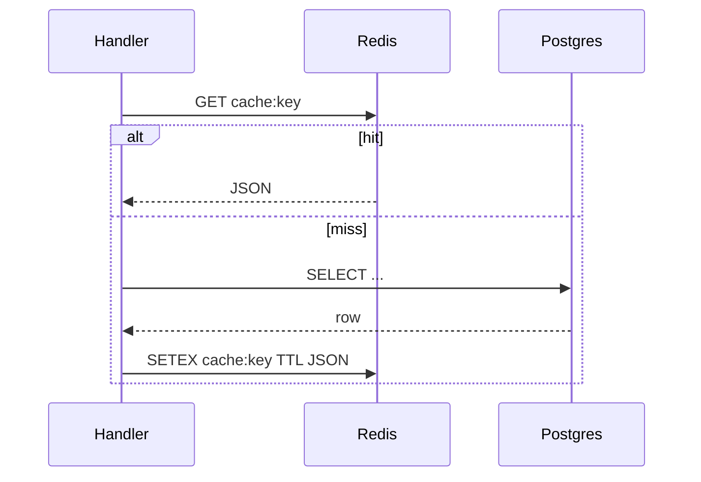

# 21. redis.asyncio и паттерны кэширования

## Введение: «Postgres спасён, но каждый отчёт бьёт в БД 50 раз»

После [20-lab-async-database](20-lab-async-database.md) данные живут в PostgreSQL. Отчёт dashboard запрашивает одни и те же агрегаты **каждые 200 ms** — нагрузка на БД растёт линейно с числом пользователей, хотя ответ не меняется 30 секунд. Решение — **async Redis**: `await redis.get()` не блокирует event loop, TTL снимает staleness.

Библиотека **`redis`** (redis-py 5.x) включает **`redis.asyncio`**. Старый пакет `aioredis` **слился** в redis-py — не ставьте оба. Практика — [22-lab-redis-async](22-lab-redis-async.md); стенд — [`deploy/redis`](../../deploy/redis/README.md).

## Что вы узнаете

- **`redis.asyncio.Redis`** и connection pool.
- Паттерны: **cache-aside**, **write-through**, **rate limit counter**.
- Pipeline и `MULTI/EXEC` в async контексте.
- Отличия от sync `redis.Redis` в `async def`.

---

## Клиент и пул

```bash
cd deploy/redis
docker compose up -d
redis-cli -h localhost -p 6379 ping
```

```python
import redis.asyncio as redis

async def main():
    client = redis.Redis(
        host="localhost",
        port=6379,
        decode_responses=True,
        socket_connect_timeout=5,
    )
    try:
        await client.set("course:hello", "async", ex=60)
        value = await client.get("course:hello")
        print(value)
    finally:
        await client.aclose()  # redis-py 5.x

# Рекомендуется: один клиент на приложение (lifespan)
```

| Параметр | Смысл |
|----------|--------|
| `decode_responses=True` | str вместо bytes |
| `ex=60` | TTL 60 секунд |
| `aclose()` | закрыть pool при shutdown |
| `from_url("redis://localhost:6379/0")` | URL-стиль для compose |

В Docker-сети: `redis://redis:6379/0` ([`deploy/redis`](../../deploy/redis/README.md)).

---

## Cache-aside



```python
import json

async def get_aggregate(client: redis.Redis, session, key: str) -> dict:
    cached = await client.get(f"cache:{key}")
    if cached:
        return json.loads(cached)

    data = await load_from_db(session, key)  # await SQL
    await client.setex(f"cache:{key}", 30, json.dumps(data))
    return data
```

**Инвалидация:** `await client.delete(f"cache:{key}")` после write в PG. Или короткий TTL для eventually consistent cache.

---

## Rate limiting (fixed window)

Связь с [32-backpressure-semaphores](32-backpressure-semaphores.md): semaphore — in-process; Redis — **между** инстансами API.

```python
async def allow_request(client: redis.Redis, user_id: str, limit: int = 100) -> bool:
    key = f"ratelimit:{user_id}:{int(time.time()) // 60}"
    pipe = client.pipeline()
    pipe.incr(key)
    pipe.expire(key, 120)
    count, _ = await pipe.execute()
    return int(count) <= limit
```

---

## Pipeline и транзакции

```python
async def batch_set(client: redis.Redis, items: dict[str, str]) -> None:
    async with client.pipeline(transaction=True) as pipe:
        for k, v in items.items():
            await pipe.set(k, v, ex=300)
        await pipe.execute()
```

Pipeline **не** делает операции атомарными между разными ключами без `MULTI`. Для строгой атомарности — Lua script или single-key ops.

---

## aioredis → redis.asyncio миграция

| Старый aioredis | redis-py 5.x |
|-----------------|--------------|
| `aioredis.create_redis_pool` | `redis.Redis()` / `ConnectionPool` |
| `await redis.close()` | `await redis.aclose()` |
| `redis.set` | `await redis.set` |

```python
# Singleton для FastAPI lifespan
_redis: redis.Redis | None = None

async def get_redis() -> redis.Redis:
    global _redis
    if _redis is None:
        _redis = redis.from_url("redis://localhost:6379/0", decode_responses=True)
    return _redis
```

---

## Типичные ошибки

| Ошибка | Почему плохо | Как правильно |
|--------|--------------|---------------|
| sync `redis.Redis` в async handler | блок loop | `redis.asyncio` |
| Новый клиент на каждый request | исчерпание sockets | один pool в lifespan |
| Кэш без TTL | stale forever / memory leak | `setex` / `expire` |
| `KEYS *` в production | блокирует Redis | `SCAN` |
| Хранить большие blob без сжатия | memory pressure | gzip + size limit |

---

## На стенде

```bash
cd deploy/redis && docker compose up -d
bash scripts/smoke.sh
# Redis Commander: http://localhost:8081
```

Проверка из Python:

```python
import asyncio
import redis.asyncio as redis

async def ping():
    r = redis.from_url("redis://localhost:6379/0")
    print(await r.ping())
    await r.aclose()

asyncio.run(ping())
```

---

## В продакшене

- **Eviction:** `maxmemory-policy` в [`deploy/redis/config`](../../deploy/redis/config/redis-single.conf).
- **TLS и ACL:** production Redis с паролем — `rediss://` + username.
- **Observability:** `INFO stats`, latency doctor; связь с capstone metrics — [36-capstone](36-capstone.md).
- **Fallback:** при Redis down — degrade to DB, не падать весь API ([34-system-design-async](34-system-design-async.md)).

---

## Резюме

**redis.asyncio** — стандартный async-клиент в экосистеме Python 3.11+. Используйте **один пул на процесс**, **TTL на кэш**, **pipeline** для batch. Redis дополняет asyncpg, не заменяет источник истины.

## Чек-лист

- Чем `redis.asyncio` отличается от sync клиента в корутине?
- Опишите cache-aside в три шага.
- Зачем `aclose()` при SIGTERM?
- Когда rate limit в Redis лучше, чем `asyncio.Semaphore`?

Следующий урок: [22. Лаба: Redis cache](22-lab-redis-async.md).
