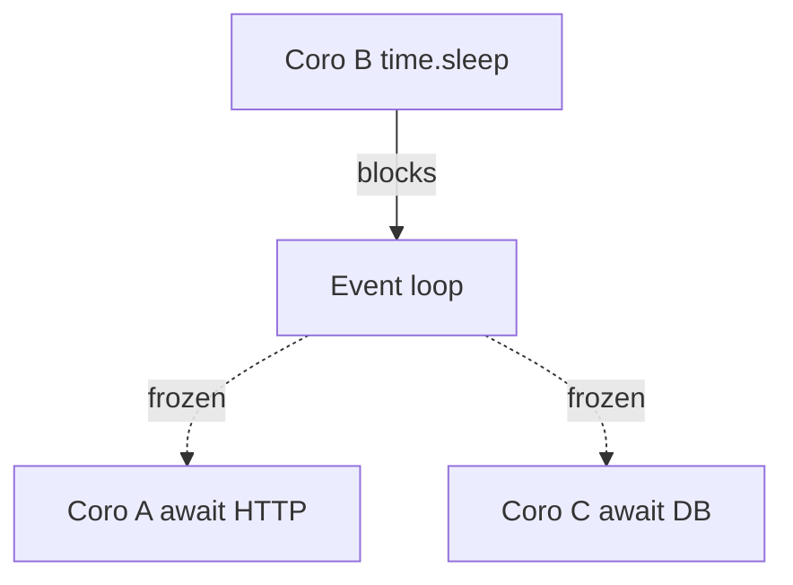

# 23. run_in_executor, to_thread и ProcessPoolExecutor

## Введение: «async API, но один pandas вызов убил p99»

Сервис на FastAPI отлично тянет **httpx** и **asyncpg**, но в handler вызывают **`json.loads` на 50 MB** и **`PIL.Image.resize`** — event loop замирает на **400 ms**, все остальные запросы стоят в очереди. Async не отменяет **CPU** и **sync I/O**: нужен мост в **thread** или **process** pool.

См. [27-async-patterns](../fastapi/27-async-patterns.md) для контекста API; эта глава — механика **executors**. Лаба — [24-lab-mixed-workload](24-lab-mixed-workload.md).

## Что вы узнаете

- **`loop.run_in_executor`** и **`asyncio.to_thread`** (3.9+).
- Когда **ThreadPoolExecutor** vs **ProcessPoolExecutor**.
- Ограничения GIL и размер пула.
- Как не превратить thread pool в «1000 потоков».

---

## Проблема: блокировка loop

```python
import time

async def bad_handler():
    time.sleep(2)  # НИКОГДА в async — блокирует ВСЕ корутины
    return "ok"
```



---

## asyncio.to_thread (предпочтительно для I/O sync)

```python
import asyncio

def sync_read_file(path: str) -> str:
    with open(path, encoding="utf-8") as f:
        return f.read()

async def main():
    content = await asyncio.to_thread(sync_read_file, "data.txt")
    print(len(content))
```

| API | Когда |
|-----|-------|
| `asyncio.to_thread(fn, *args)` | sync функция в default thread pool |
| `loop.run_in_executor(executor, fn, *args)` | свой executor или ProcessPool |

**Default pool size:** `min(32, os.cpu_count() + 4)` — не бесконечный.

---

## run_in_executor с ThreadPoolExecutor

```python
import asyncio
from concurrent.futures import ThreadPoolExecutor

def cpu_light_io(url: str) -> int:
    import urllib.request
    with urllib.request.urlopen(url, timeout=10) as r:
        return len(r.read())

async def fetch_sync_in_thread(url: str) -> int:
    loop = asyncio.get_running_loop()
    return await loop.run_in_executor(None, cpu_light_io, url)

async def main():
    size = await fetch_sync_in_thread("http://localhost:8095/health")
    print(size)
```

`None` = default executor. Для legacy SDK без async-версии — разумный компромисс.

---

## ProcessPoolExecutor для CPU-bound

```python
import asyncio
from concurrent.futures import ProcessPoolExecutor

def heavy_hash(data: bytes) -> str:
    import hashlib
    h = hashlib.sha256()
    for i in range(100_000):
        h.update(data)
        h.update(str(i).encode())
    return h.hexdigest()

async def main():
    loop = asyncio.get_running_loop()
    with ProcessPoolExecutor(max_workers=2) as pool:
        digest = await loop.run_in_executor(pool, heavy_hash, b"seed")
    print(digest[:16])
```

| Thread pool | Process pool |
|-------------|--------------|
| shared memory, GIL | отдельная память, нет GIL на CPU |
| быстрый старт | дорогой fork/spawn |
| sync I/O, мелкий CPU | numpy/pandas/crypto batch |

**Осторожно:** функция должна быть **picklable**; на Windows — `if __name__ == "__main__"`.

---

## Ограничение параллелизма executor

```python
import asyncio
from concurrent.futures import ThreadPoolExecutor

_executor = ThreadPoolExecutor(max_workers=4)
_semaphore = asyncio.Semaphore(4)

async def bounded_to_thread(fn, *args):
    async with _semaphore:
        return await asyncio.to_thread(fn, *args)
```

Связь с [32-backpressure-semaphores](32-backpressure-semaphores.md): semaphore на **число одновременных** offload-операций.

---

## Сравнение подходов

| Нагрузка | Решение |
|----------|---------|
| Legacy sync HTTP (`requests`) | `httpx.AsyncClient` лучше, чем thread |
| Sync DB driver | миграция на asyncpg, не thread forever |
| PIL / pandas hot path | ProcessPool или отдельный worker service |
| `open()` без aiofiles | `to_thread` для редких read |
| 100 ms CPU на request | **не** asyncio alone — multiprocessing |

---

## Типичные ошибки

| Ошибка | Почему плохо | Как правильно |
|--------|--------------|---------------|
| `to_thread` на каждый 1 KB parse | overhead > выигрыш | inline в loop |
| ProcessPool на каждый call | spawn дороже работы | переиспользуйте pool |
| 500 threads через executor | OOM, thrashing | cap + semaphore |
| Блокирующий код «спрятан» в library | скрытый freeze | профилировать loop |
| CPU в thread pool «для GIL» | GIL остаётся | ProcessPool |

---

## На стенде

Сравните freeze с mock gateway:

```python
import asyncio
import time
import httpx

async def with_sleep():
    time.sleep(0.5)  # плохо

async def with_to_thread():
    await asyncio.to_thread(time.sleep, 0.5)

async def benchmark():
    async with httpx.AsyncClient() as client:
        t0 = asyncio.get_event_loop().time()
        await asyncio.gather(
            client.get("http://localhost:8095/health"),
            with_to_thread(),
        )
        print("to_thread ok:", asyncio.get_event_loop().time() - t0)
```

`with_sleep` в gather **сериализует** HTTP; `to_thread` — HTTP и sleep параллельны.

---

## В продакшене

- Лимит **размера** задачи в process pool (timeout, max input).
- **Метрики:** queue depth executor, p99 с/без offload.
- Долгосрочно: вынести CPU в **Celery/RQ** или отдельный microservice ([26-when-not-async](26-when-not-async.md)).

---

## Резюме

**asyncio.to_thread** и **run_in_executor** — мост для **блокирующего** sync-кода. Threads — sync I/O и лёгкий CPU; processes — тяжёлый CPU. Не заменяют архитектурный выбор async-стека.

## Чек-лист

- Почему `time.sleep` в корутине опаснее, чем `asyncio.sleep`?
- Когда ProcessPool лучше ThreadPool?
- Какой default max workers у asyncio thread pool?
- Зачем Semaphore поверх to_thread?

Следующий урок: [24. Лаба: mixed workload](24-lab-mixed-workload.md).
