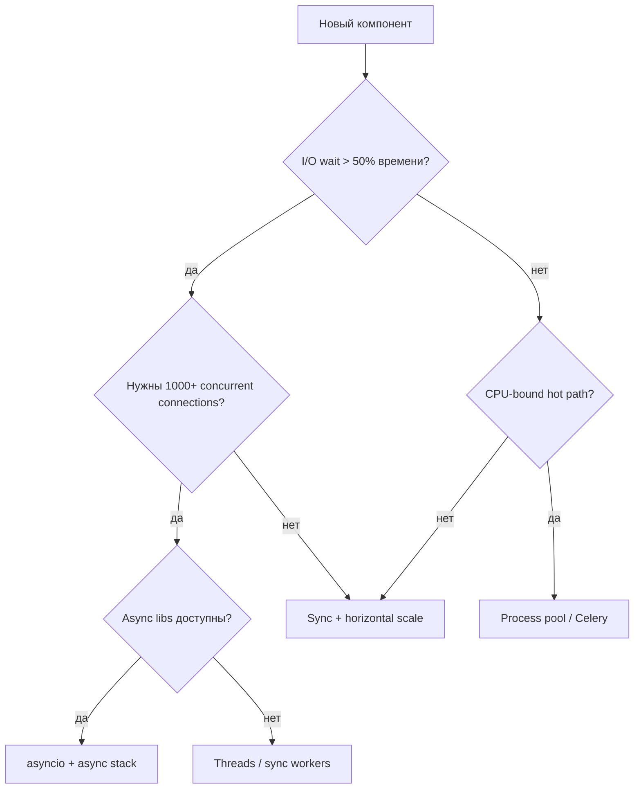
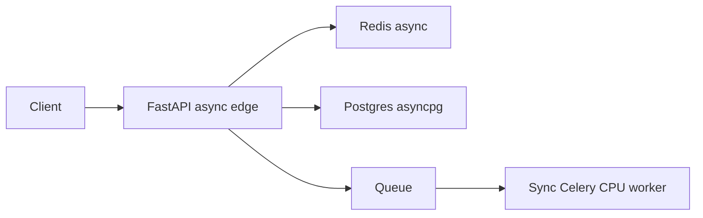

# 26. Когда НЕ использовать async

## Введение: «переписали всё на asyncio — команда устала, выигрыша нет»

После фаз 4–5 вы знаете executors, subprocess, DB и Redis. Риск — **переусложнить**: CLI на 80 строк, два HTTP-вызова в час, команда без async-культуры — asyncio добавит **cognitive load** без latency win. Зрелый инженер умеет сказать **«здесь sync + workers»**.

Связь: [01-sync-vs-async](01-sync-vs-async.md) (ландшафт), [31-fastapi-bridge](31-fastapi-bridge.md) (когда async в API оправдан).

## Что вы узнаете

- Decision tree: asyncio vs threads vs processes vs sync.
- Сигналы, что async — **неправильный** выбор.
- Как жить с **legacy sync** без «async всего».
- Организационные и операционные издержки async.

---

## Decision tree



---

## Когда sync достаточно

| Сценарий | Почему sync OK |
|----------|----------------|
| Batch ETL раз в ночь | throughput не latency; простота |
| Admin script, 5 SQL | один процесс, нет concurrency |
| CRUD с 20 RPS, p99 < 100 ms | sync workers + connection pool |
| Jupyter / data exploration | interactive, не production server |
| Команда без async тестов | стоимость обучения > выигрыш |

```python
# Честный sync — лучше, чем плохой async
import httpx

def fetch_report(urls: list[str]) -> list[dict]:
    with httpx.Client(timeout=30.0) as client:
        return [client.get(u).json() for u in urls]
```

Для **3 URL** sequential sync — **миллисекунды** overhead; asyncio не окупится.

---

## Когда threads лучше asyncio

| Ситуация | Threads |
|----------|---------|
| Много **sync-only** SDK (billing, legacy SOAP) | thread per request или pool |
| Блокирующий файловый I/O без aiofiles | проще thread pool |
| Миграция с Flask — постепенно | WSGI + threads, не big bang |
| CPU микро + sync I/O mix | не идеально, но pragmatic |

**GIL:** threads **не** параллелят CPU, но **отпускают** GIL на blocking I/O — как asyncio, но с большим RAM overhead.

---

## Когда processes / queue

| Ситуация | Решение |
|----------|---------|
| Image ML inference 2 s CPU | Celery worker, GPU pod |
| PDF generation farm | RQ / Kafka consumer |
| Изоляция crash (untrusted code) | subprocess sandbox |
| Масштаб CPU линейно с ядрами | N sync workers на N cores |

Async API может **принять** request и **положить** job в queue — pattern «async edge, sync core» ([34-system-design-async](34-system-design-async.md)).

---

## Скрытые издержки asyncio

| Издержка | Проявление |
|----------|------------|
| Весь стек async | httpx, asyncpg, redis.asyncio — нельзя один `requests` |
| Тестирование | pytest-asyncio, async fixtures ([27-pytest-asyncio](27-pytest-asyncio.md)) |
| Debugging | stack traces через await chains ([29-debug-profiling](29-debug-profiling.md)) |
| Junior onboarding | await poisoning, forgotten cancel |
| Ecosystem gaps | библиотека без async → костыли |

---

## Гибридные архитектуры (норма)



- **Edge** async — тысячи idle websocket / long poll.
- **Workers** sync — pandas, report, ffmpeg.
- **Не** тащите pandas в uvicorn process.

---

## Красные флаги «async ради моды»

1. Нет измерения: sequential vs concurrent baseline.
2. «Все endpoints async», но 95% времени — 2 ms ORM.
3. Blocking в `async def` «временно» годами.
4. Один uvicorn worker на 16-core CPU-only сервисе.
5. Отказ от sync тестов «потому что async».

---

## Типичные ошибки

| Ошибка | Последствие | Альтернатива |
|--------|-------------|--------------|
| Async CLI с 1 user | сложность | Typer sync |
| asyncio для CPU cluster | один core | multiprocessing |
| Игнор sync FastAPI `def` endpoints | thread pool starlette — OK для blocking | осознанный `def` |
| Микросервис async «везде» | 5 стеков async | async только на I/O boundary |

---

## На стенде mock-exams

| Стенд | Async? | Почему |
|-------|--------|--------|
| deploy/python-async gateway | да | fan-out I/O |
| deploy/postgres migrations | sync (Flyway) | one-shot |
| deploy/redis smoke script | sync redis-cli | CLI tool |

---

## Резюме

**Async** — не моральное превосходство, а **инструмент конкурентного I/O**. Sync, threads и processes остаются первоклассными. Выбирайте по **профилю нагрузки**, **экосистеме** и **стоимости сопровождения**.

## Чек-лист

- Назовите три случая «оставить sync».
- Когда thread pool лучше миграции на httpx?
- Что такое «async edge, sync core»?
- Какой красный флаг из списка видели в проектах?

Следующий урок: [27. pytest-asyncio](27-pytest-asyncio.md).
