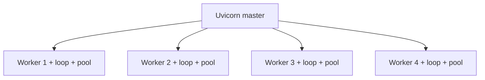

# 30. uvloop, uvicorn workers и backpressure

## Введение: «один worker на 8 ядер — CPU 12%, latency растёт»

Локально asyncio на **stdlib loop** работает. В production под **10k RPS** команда ставит **uvicorn --workers 4** и **uvloop** — и внезапно упирается в **исчерпание пула Postgres** и **OOM** на исходящих HTTP. Нужно понимать: **сколько event loops** в процессе, как **uvloop** ускоряет loop, и где начинается **backpressure**.

См. [32-backpressure-semaphores](32-backpressure-semaphores.md), FastAPI deploy — [`deploy/fastapi`](../../deploy/fastapi/README.md).

## Что вы узнаете

- **uvloop** vs default asyncio loop.
- **uvicorn workers** = процессы, не threads.
- Sizing: workers × DB pool × Redis connections.
- Backpressure на уровне ASGI и приложения.

---

## uvloop

```bash
pip install uvloop
```

```python
import asyncio
import uvloop

asyncio.set_event_loop_policy(uvloop.EventLoopPolicy())

async def main():
    ...

asyncio.run(main())
```

Uvicorn:

```bash
uvicorn app.main:app --loop uvloop --host 0.0.0.0 --port 8090
```

| | stdlib loop | uvloop |
|---|-------------|--------|
| Реализация | Python + selectors | libuv (C) |
| Throughput I/O | baseline | часто +10–30% на чистом I/O |
| Windows | да | **нет** (Linux/macOS) |
| Совместимость | 100% | редкие edge cases с custom loops |

**Не панацея:** блокирующий pandas по-прежнему блокирует.

---

## uvicorn workers

```bash
uvicorn app.main:app --workers 4 --loop uvloop
```



| Факт | Следствие |
|------|-----------|
| 1 worker = 1 process = 1 loop | корутины не шарятся между workers |
| 4 workers на 4 cores | CPU-bound **внутри** worker всё ещё 1 core |
| Каждый worker свой DB pool | 4 × pool_size connections |
| Shared in-memory state | **нет** без Redis — use Redis |

**Формула workers (грубо):** `(2 × CPU cores) + 1` для I/O — стартовая точка, не закон.

---

## Sizing connections

Из [19-asyncpg-database](19-asyncpg-database.md):

```
workers × (pool_size + max_overflow) ≤ max_connections - 20
```

Пример: 4 workers, `pool_size=5`, `max_overflow=5` → до **40** PG connections.

Redis: один `redis.asyncio` client на worker — **4 TCP** к Redis, обычно OK.

Исходящий HTTP: без лимита 4 workers × 100 concurrent = **400** sockets к upstream — нужен **Semaphore** ([32-backpressure-semaphores](32-backpressure-semaphores.md)).

---

## Backpressure (обзор)

**Backpressure** — система **отказывается** принимать работу быстрее, чем может обработать.

| Уровень | Механизм |
|---------|----------|
| TCP | kernel buffers fill → slow read |
| ASGI server | max connections, timeouts |
| Application | Semaphore, Queue maxsize |
| Upstream | 429, retry-after |
| Client | httpx limits, timeout |

```python
# приложение: не более 50 concurrent upstream calls
SEM = asyncio.Semaphore(50)

async def fetch_limited(client, url):
    async with SEM:
        return await client.get(url)
```

Без backpressure — memory spike (все ответы в RAM), cascade failure upstream.

---

## Graceful shutdown в production

```bash
# Docker / k8s SIGTERM
uvicorn app.main:app --workers 4 --timeout-graceful-shutdown 30
```

- Прекращает accept новых connections.
- Ждёт завершения in-flight requests (до grace).
- **lifespan** закрывает pools ([08-lab-graceful-shutdown](08-lab-graceful-shutdown.md), [31-fastapi-bridge](31-fastapi-bridge.md)).

---

## На стенде mock-exams

```bash
cd deploy/fastapi
docker compose up -d
curl -s http://localhost:8090/health
```

Сравните один worker vs несколько (если измените compose) — latency под `ab` или `hey` при 50 concurrent.

Gateway **8095** — один процесс FastAPI; для лаб asyncio достаточно stdlib loop.

---

## Типичные ошибки

| Ошибка | Эффект | Fix |
|--------|--------|-----|
| 16 workers на 4 cores | context switch hell | ≤ 2× cores для I/O |
| In-memory rate limit | не работает с N workers | Redis |
| uvloop на Windows dev | ImportError | stdlib на dev, uvloop в Linux CI |
| Нет graceful shutdown | обрыв DB transactions | lifespan + SIGTERM |
| Без semaphore на fan-out | upstream 502 storm | limit concurrency |

---

## Метрики production

- **Request latency** p50/p95/p99 per endpoint.
- **Active connections** Postgres / Redis.
- **Event loop lag** (custom: schedule noop, measure delay).
- **Process RSS** per worker.
- **502/503 rate** upstream.

---

## Резюме

**uvloop** ускоряет event loop на Linux; **workers** масштабируют **процессы**, не корутины внутри одного. Считайте **connections × workers** и внедряйте **backpressure** до OOM. Production asyncio — это sizing и observability, не только `async def`.

## Чек-лист

- Сколько event loops при `--workers 4`?
- Почему in-memory cache ломается с несколькими workers?
- Где uvloop не работает?
- Что такое backpressure на уровне приложения?

Следующий урок: [31. FastAPI bridge](31-fastapi-bridge.md).
