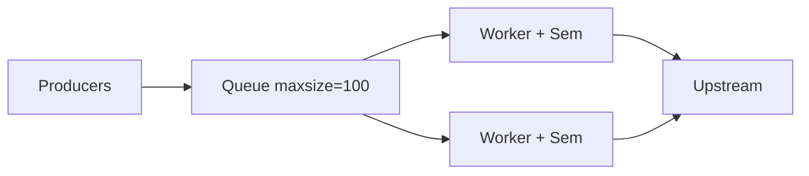

# 32. Backpressure и Semaphore в масштабе

## Введение: «1000 concurrent fetch — upstream лёг, наш API OOM»

Без лимита `asyncio.gather(*[fetch(u) for u in urls])` на 10 000 URL создаёт **10 000** открытых sockets и буферов ответа. Память кончается раньше, чем upstream ответит 429. **Semaphore** — простейший **backpressure** внутри процесса; вместе с Redis — между инстансами ([21-redis-asyncio](21-redis-asyncio.md)).

Лаба — [35-lab-rate-limited-fetcher](35-lab-rate-limited-fetcher.md). Теория production — [30-uvloop-production](30-uvloop-production.md).

## Что вы узнаете

- **`asyncio.Semaphore`** и **`BoundedSemaphore`**.
- Паттерны: worker pool, map с лимитом, batching.
- Комбинация с **Queue** ([14-asyncio-queues](14-asyncio-queues.md)).
- Rate limit vs concurrency limit.

---

## Semaphore basics

```python
import asyncio

SEM = asyncio.Semaphore(10)  # не более 10 одновременно

async def fetch(client, url: str) -> str:
    async with SEM:
        r = await client.get(url)
        r.raise_for_status()
        return r.text[:100]

async def fetch_many(client, urls: list[str]) -> list[str]:
    return await asyncio.gather(*[fetch(client, u) for u in urls])
```

| Параметр | Смысл |
|----------|--------|
| `Semaphore(10)` | 10 слотов; 11-я корутина ждёт на `async with` |
| `BoundedSemaphore` | нельзя release больше, чем acquire (защита от багов) |
| Value 0 | все ждут; deadlock если никто не release |

**Важно:** semaphore **не отменяет** уже запущенные tasks — ограничивает **вход** в критическую секцию.

---

## acquire / release явно

```python
async def fetch_explicit(sem: asyncio.Semaphore, client, url: str):
    await sem.acquire()
    try:
        return await client.get(url)
    finally:
        sem.release()
```

`async with` предпочтительнее — release при **CancelledError**.

---

## map с лимитом (шаблон)

```python
async def limited_map(
    sem: asyncio.Semaphore,
    client,
    urls: list[str],
    worker,
) -> list:
    async def one(url: str):
        async with sem:
            return await worker(client, url)

    return await asyncio.gather(*[one(u) for u in urls])
```

Для **миллионов** URL — не создавайте миллион tasks сразу; батчи по 500 + semaphore 50.

---

## Semaphore + Queue worker pool

См. [15-lab-worker-pool](15-lab-worker-pool.md), [`examples/worker_pool.py`](examples/worker_pool.py):



`Queue(maxsize=N)` — backpressure когда producers быстрее consumers: `await queue.put` блокируется.

---

## Concurrency vs rate

| | Concurrency limit | Rate limit |
|---|-------------------|------------|
| Ограничивает | одновременные in-flight | запросов в секунду |
| Инструмент | Semaphore | token bucket (Redis) |
| Пример | 20 parallel HTTP | 100 req/min per API key |
| Burst | до N сразу | сглаживает burst |

Можно **оба**: `Semaphore(20)` + Redis rate 1000/min ([21-redis-asyncio](21-redis-asyncio.md)).

---

## Retry + semaphore

```python
async def fetch_retry(sem, client, url, attempts=3):
    async with sem:
        for i in range(attempts):
            try:
                r = await client.get(url)
                r.raise_for_status()
                return r
            except httpx.HTTPStatusError:
                if i == attempts - 1:
                    raise
                await asyncio.sleep(2 ** i * 0.1)
```

Semaphore держится на **весь** retry — слот занят дольше. Альтернатива: semaphore только на «успешный slot attempt» — сложнее, но выше throughput.

---

## httpx Limits

```python
limits = httpx.Limits(max_connections=50, max_keepalive_connections=20)
async with httpx.AsyncClient(limits=limits) as client:
    ...
```

Дублирует часть семафора на уровне connection pool — используйте **оба** осознанно.

---

## Типичные ошибки

| Ошибка | Эффект | Fix |
|--------|--------|-----|
| Semaphore(10000) | как без лимита | sizing по upstream SLA |
| gather 1M tasks | OOM | chunk + semaphore |
| Забыли sem в retry loop | thundering herd | sem outside or inside consistently |
| Только process-wide sem | N workers = N×limit | Redis global limit |
| Deadlock: sem in sem | freeze | один уровень locking |

---

## На стенде 8095

```python
import asyncio
import httpx

SEM = asyncio.Semaphore(3)
BASE = "http://localhost:8095"

async def timed_fetch(client, i: int):
    async with SEM:
        t0 = asyncio.get_event_loop().time()
        await client.get(f"{BASE}/slow?extra_ms={i * 30}")
        return asyncio.get_event_loop().time() - t0

async def main():
    async with httpx.AsyncClient(timeout=30.0) as client:
        times = await asyncio.gather(*[timed_fetch(client, i) for i in range(9)])
    print("max batch of 3:", max(times))

asyncio.run(main())
```

9 запросов с sem=3 — ~3 «волны» по max slow delay.

---

## В продакшене

- Выводите **metric**: `sem_available`, queue depth.
- **Adaptive** concurrency (AIMD) — продвинутый уровень ([34-system-design-async](34-system-design-async.md)).
- Документируйте **лимит** в runbook для on-call.

---

## Резюме

**Semaphore** — минимальный backpressure в asyncio. Сочетайте с **Queue maxsize**, **httpx Limits**, **Redis rate limit** для multi-instance. Лаба 35 закрепляет на реальных URL.

## Чек-лист

- Чем Semaphore отличается от Lock?
- Почему 10 000 tasks хуже, чем 10 000 URL с sem=50?
- Где держать semaphore при retry?
- Как лимит масштабируется на 4 uvicorn workers?

Следующий урок: [33. Interview Q&A](33-interview-qa.md).
