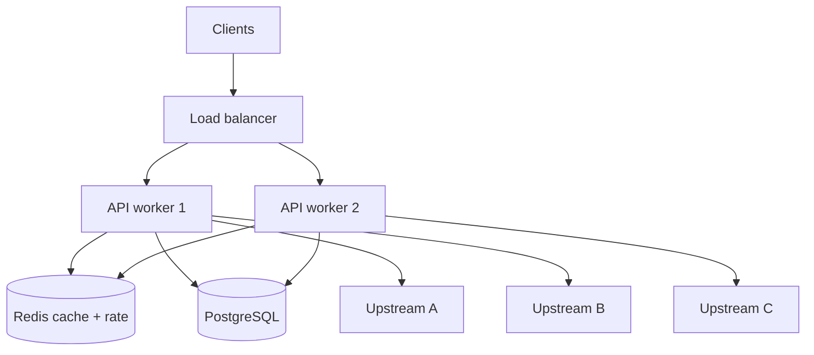

# 34. System design: async microservices

## Введение: «спроектируйте агрегатор цен с 50 API»

На system design интервью дают **fan-out**, **SLA**, **failure modes**. Async Python — хороший выбор для **I/O-bound edge**, если вы понимаете **лимиты**, **idempotency** и **observability**. Эта глава — каркас без привязки к одному фреймворку; реализация — [36-capstone](36-capstone.md).

Связь: [32-backpressure-semaphores](32-backpressure-semaphores.md), [33-interview-qa](33-interview-qa.md), стенды [`deploy/python-async`](../../deploy/python-async/README.md), [`deploy/postgres`](../../deploy/postgres/README.md), [`deploy/redis`](../../deploy/redis/README.md).

## Что вы узнаете

- Слои **edge / orchestrator / worker**.
- **Fan-out**, **timeout**, **partial failure**.
- **Circuit breaker** и **bulkhead** (обзор).
- Метрики и SLO для async pipeline.

---

## Референсная архитектура



| Слой | Роль | Async? |
|------|------|--------|
| Edge API | auth, validate, aggregate | да (I/O) |
| Cache | hot reads, rate counters | redis.asyncio |
| DB | source of truth, audit | asyncpg |
| CPU workers | PDF/ML | sync queue |

---

## Fan-out с лимитами

```python
SEM = asyncio.Semaphore(30)
TIMEOUT = 5.0

async def call_one(client, url: str) -> dict | None:
    async with SEM:
        try:
            async with asyncio.timeout(TIMEOUT):
                r = await client.get(url)
                r.raise_for_status()
                return r.json()
        except (TimeoutError, httpx.HTTPError):
            return None

async def aggregate(urls: list[str]) -> list[dict]:
    async with httpx.AsyncClient() as client:
        results = await asyncio.gather(*[call_one(client, u) for u in urls])
    return [r for r in results if r is not None]
```

| Решение | Зачем |
|---------|-------|
| Semaphore | не убить upstream и RAM |
| Per-call timeout | не ждать одного slow |
| `None` на ошибке | partial success лучше total fail |
| gather | concurrent I/O |

Для 10k URL — **chunk** URLs по 200, не один gather на все.

---

## Circuit breaker (обзор)

Состояния: **Closed** (норма) → **Open** (fail fast) → **Half-open** (probe).

| Параметр | Пример |
|----------|--------|
| Failure threshold | 5 ошибок за 10 s |
| Open duration | 30 s |
| Half-open probes | 1 request |

```python
class SimpleBreaker:
    def __init__(self, threshold: int = 5):
        self.failures = 0
        self.threshold = threshold
        self.open_until = 0.0

    def allow(self) -> bool:
        return time.monotonic() >= self.open_until

    def record_success(self):
        self.failures = 0

    def record_failure(self):
        self.failures += 1
        if self.failures >= self.threshold:
            self.open_until = time.monotonic() + 30
```

Production: библиотека + метрики state transitions. Breaker на **каждый upstream**, не один глобальный.

---

## Bulkhead

Изолируйте пулы: отдельный semaphore на **payments** vs **catalog** — сбой одного домена не съедает все slots.

---

## Idempotency и retries

- **Retry** только на idempotent GET или с **idempotency-key** на POST.
- Exponential backoff + jitter.
- Semaphore удерживается на весь retry — меньше thundering herd, но ниже throughput.

---

## Data consistency

| Паттерн | Consistency |
|---------|-------------|
| Cache-aside | eventual |
| Write-through | stronger, медленнее |
| Saga / outbox | distributed transactions |

Async не меняет CAP — меняет только **как быстро** вы вызываете узлы.

---

## Multi-instance concerns

| Проблема | Решение |
|----------|---------|
| In-memory semaphore | только 1 worker; Redis rate limit |
| Sticky sessions | обычно не нужны для stateless API |
| Connection storms | pool limits, pgbouncer |
| Thundering herd on cache miss | singleflight / lock ([22-lab-redis-async](22-lab-redis-async.md)) |

---

## Observability

- **RED**: Rate, Errors, Duration per endpoint.
- **Traces**: span на каждый downstream call (OpenTelemetry).
- **Logs**: correlation_id через fan-out.
- Стенд: [`deploy/observability`](../../deploy/observability/README.md).

Алерты: p99 > SLO, breaker open > 1 min, pool wait time ↑.

---

## Failure scenarios (чеклист design review)

1. Один upstream 10 s slow — timeout + partial response.
2. Все upstream 503 — 503 с retry-after или degraded mode.
3. Redis down — fallback DB, увеличенная latency OK.
4. PG pool exhausted — 503, не hang.
5. Deploy SIGTERM — drain in-flight 30 s.

---

## На стенде mock-exams

Прототип на **8095**:

```bash
curl http://localhost:8095/aggregate-parallel
```

Сравните с вашим semaphore-fetcher из [35-lab-rate-limited-fetcher](35-lab-rate-limited-fetcher.md). Добавьте Postgres audit из [20-lab-async-database](20-lab-async-database.md).

---

## Резюме

Async microservice design = **fan-out с лимитами** + **timeouts** + **partial failure** + **shared state в Redis/DB** + **метрики**. Circuit breaker и bulkhead защищают upstream и соседние домены. Реализуйте end-to-end в capstone.

## Чек-лист

- Нарисуйте fan-out с 3 upstream и укажите лимиты.
- Что возвращает API при 2/5 успешных upstream?
- Где хранить rate limit для 4 uvicorn workers?
- Когда queue лучше, чем async fan-out в API process?

Следующий урок: [35. Лаба: rate-limited fetcher](35-lab-rate-limited-fetcher.md).
