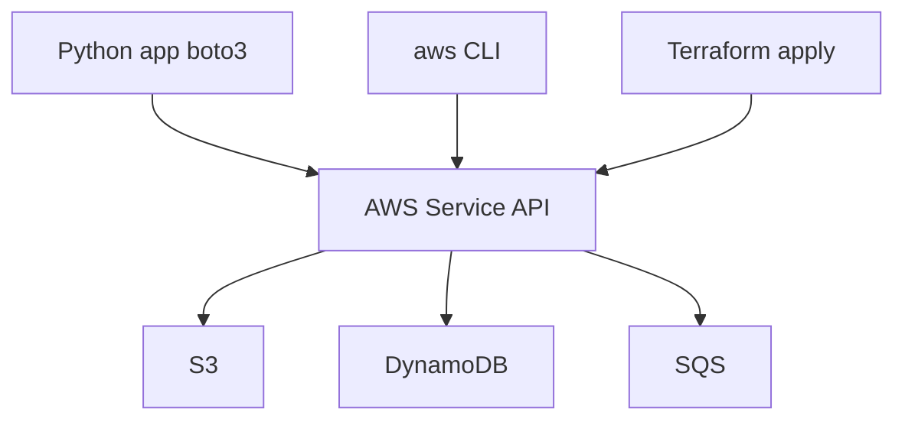

# 01. SDK landscape: boto3 vs CLI vs Terraform

## Введение: «скрипт работает у меня, в CI падает с AccessDenied»

Разработчик написал `aws s3 cp` в bash-скрипте деплоя. Локально — ок (профиль `dev`). В GitLab CI — **AccessDenied**. Коллега предлагает boto3, DevOps — Terraform, security — IAM roles. Что выбрать и **где граница ответственности**?

Python-backend в mock-exams чаще всего работает с AWS через **boto3** — официальный SDK. Но SDK — лишь один слой в экосистеме. Эта глава — карта, прежде чем писать первый `client("s3")`.

## Что вы узнаете

- Три способа «говорить с AWS»: **SDK**, **CLI**, **IaC**.
- Когда boto3 в application code, а когда Terraform в pipeline.
- Как это связано со стендом [`deploy/python-aws`](../../deploy/python-aws/README.md) и пакетом `shop_aws`.

---

## Три интерфейса к одному API

| Интерфейс | Язык / формат | Типичное использование |
|-----------|---------------|------------------------|
| **boto3** | Python | runtime: upload, query DB, send SQS |
| **AWS CLI** | shell | ops, debug, one-off scripts |
| **Terraform / CDK** | HCL / Python | create bucket, IAM, VPC — **инфраструктура** |

Все три вызывают **одни и те же HTTP API** AWS (REST/JSON). Разница — **кто**, **когда** и **с какими credentials**.



---

## boto3: когда и зачем

**boto3** — thin wrapper над **botocore** (HTTP client + serializers).

| Сценарий | boto3? |
|----------|--------|
| Upload файла из FastAPI endpoint | ✅ |
| CRUD item в DynamoDB из worker | ✅ |
| Создать VPC и 12 subnets | ❌ → Terraform |
| Разовый debug «есть ли объект в bucket» | CLI быстрее |
| Lambda handler читает S3 event | ✅ |

Эталон стека курса: [`shop_aws/clients.py`](../../deploy/python-aws/stack/shop_aws/clients.py), [`S3Service`](../../deploy/python-aws/stack/shop_aws/s3_service.py), [`DynamoDBRepository`](../../deploy/python-aws/stack/shop_aws/dynamodb_repo.py).

---

## AWS CLI vs boto3

```bash
# CLI — отладка, CI one-liner
aws s3 ls s3://shop-uploads/ --endpoint-url http://localhost:4566

# boto3 — то же в Python, типизируемо, тестируемо
from shop_aws.clients import client
client("s3").list_objects_v2(Bucket="shop-uploads")
```

| Критерий | CLI | boto3 |
|----------|-----|-------|
| Unit tests | сложно | moto / LocalStack |
| Встроить в app | subprocess hack | native |
| Credential chain | `~/.aws/credentials` | same + env vars |
| Tab completion | да | IDE autocomplete |

**Правило:** application logic → **boto3**; ops / smoke → **CLI или lab_cli**.

---

## Terraform: другой слой

Terraform **создаёт ресурсы** (bucket, table, queue, IAM policy). boto3 **использует** уже существующие.

```text
Terraform apply  →  bucket "shop-uploads" exists
FastAPI + boto3  →  put_object into shop-uploads
```

В локальном стенде bootstrap делает Python ([`bootstrap_localstack.py`](../../deploy/python-aws/stack/scripts/bootstrap_localstack.py)) — для labs проще, чем Terraform. В production — Terraform/CDK создаёт ресурсы, приложение только читает имена из env (`SHOP_BUCKET`).

См. также [`aws-terraform`](../aws-terraform/README.md).

---

## LocalStack vs real AWS

| | LocalStack `:4566` | AWS cloud |
|--|-------------------|-----------|
| Endpoint | `AWS_ENDPOINT_URL` | default (regional) |
| Credentials | `test` / `test` | IAM role / keys |
| Billing | free local | pay per request |
| Parity | ~90% для S3/DDB/SQS | 100% |

Курс использует **LocalStack 3.8** — те же boto3-вызовы работают в cloud с `endpoint_url=None`.

---

## Экосистема Python + AWS

| Компонент | Роль |
|-----------|------|
| **boto3** | high-level SDK |
| **botocore** | HTTP, retries, paginators |
| **aioboto3** | async wrapper (отдельный курс) |
| **moto** | mock в pytest без Docker |
| **LocalStack** | full emulator в Docker |

Тесты стенда: [`test_s3_moto.py`](../../deploy/python-aws/stack/tests/test_s3_moto.py).

---

## На собеседовании

- Чем boto3 отличается от AWS CLI на уровне архитектуры?
- Почему bucket не создают из request handler?
- Как LocalStack меняет конфигурацию endpoint?

---

## Типичные ошибки

| Ошибка | Последствие |
|--------|-------------|
| Создавать bucket из request handler | race, нет IaC, drift |
| Hardcode `us-east-1` без env | wrong region в staging |
| CLI в production cron без idempotency | fragile parsing |
| Смешать Terraform state и runtime config | secrets в коде |

## Резюме

**boto3** — для runtime Python. **CLI** — debug и ops. **Terraform** — provision инфраструктуры. Все три — клиенты одного API. Стенд курса: LocalStack + `shop_aws` services.

Далее: [02-session-client-resource](02-session-client-resource.md).
