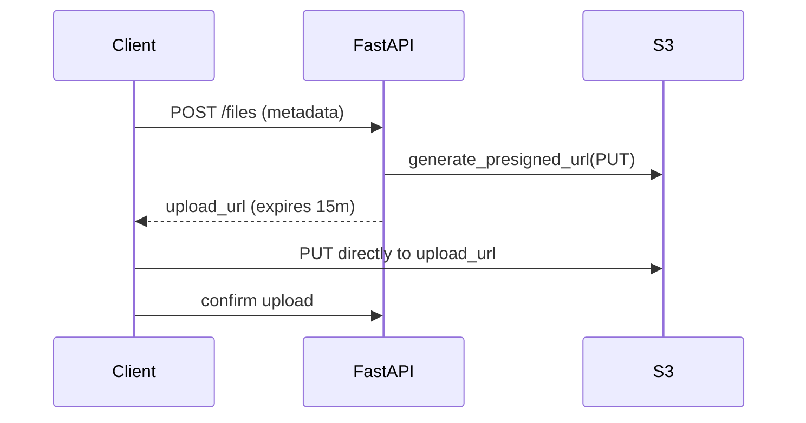

# 09. S3 advanced: presigned URLs, multipart overview

## Введение: «отдавать файлы через API — дорого и медленно»

FastAPI проксирует каждый download: app читает S3 → стримит клиенту. **Double bandwidth**, latency, нагрузка на pods. Правильнее: **presigned URL** — клиент качает напрямую из S3 с временной подписью.

Для файлов **> 5 GB** — **multipart upload**. В labs достаточно overview; в production — обязательно.

## Что вы узнаете

- Generate presigned URL для GET и PUT.
- TTL, security, LocalStack quirks.
- Multipart upload API surface.

---

## Presigned URL — idea



boto3 подписывает request credentials **вашего backend** — клиент не видит AWS keys.

---

## generate_presigned_url (GET)

```python
url = s3.generate_presigned_url(
    ClientMethod="get_object",
    Params={"Bucket": "shop-uploads", "Key": "reports/q1.pdf"},
    ExpiresIn=3600,
)
```

| Param | Note |
|-------|------|
| `ExpiresIn` | max 7 days (SigV4) |
| `ResponseContentDisposition` | force download filename |

---

## Presigned PUT (browser upload)

```python
url = s3.generate_presigned_url(
    ClientMethod="put_object",
    Params={
        "Bucket": "shop-uploads",
        "Key": f"uploads/{user_id}/{file_id}",
        "ContentType": "image/jpeg",
    },
    ExpiresIn=900,
)
```

Frontend: `fetch(url, { method: 'PUT', body: file })`. **Content-Type** в Params должен совпадать с request — иначе signature mismatch.

---

## generate_presigned_post (form upload)

```python
resp = s3.generate_presigned_post(
    Bucket="shop-uploads",
    Key="uploads/${filename}",
    Fields={"Content-Type": "image/png"},
    Conditions=[["content-length-range", 0, 10485760]],
    ExpiresIn=600,
)
```

Ограничивает size и content-type **на стороне policy**.

---

## Security checklist

| Rule | Why |
|------|-----|
| Short TTL (5–15 min) | leaked URL expires |
| Key includes random UUID | not guessable |
| Restrict Content-Type | no executable upload |
| HTTPS only | no MITM |
| Don't presign ListBucket | enumeration risk |

Presigned URL ≠ authorization — backend **решает** кому выдать URL.

---

## Multipart upload (overview)

```text
create_multipart_upload → upload_part (×N) → complete_multipart_upload
```

| API | Role |
|-----|------|
| `create_multipart_upload` | start, get UploadId |
| `upload_part` | chunk + PartNumber |
| `complete_multipart_upload` | assemble |
| `abort_multipart_upload` | cleanup on failure |

High-level: `transfer.upload_file` — boto3 splits automatically. LocalStack поддерживает multipart с ограничениями.

---

## LocalStack presigned

Endpoint в URL должен быть **доступен клиенту**: browser на host → `http://localhost:4566`. При генерации можно передать `Config(s3={'addressing_style': 'path'})` для path-style URLs.

---

## Типичные ошибки

| Ошибка | Symptom |
|--------|---------|
| Clock skew | SignatureDoesNotMatch |
| Wrong Content-Type on PUT | 403 |
| Expired URL | AccessDenied |
| Proxy через app без need | cost + latency |

## Резюме

**Presigned URLs** offload traffic на S3. GET — download; PUT/POST — direct upload. **Multipart** — файлы > 5 GB. Backend контролирует **кто** и **куда**, не проксирует bytes.

Далее: [10-lab-presigned-url](10-lab-presigned-url.md).
