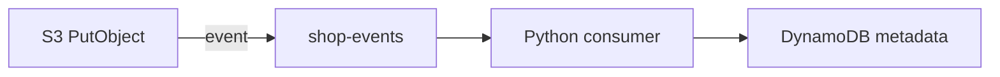

# 11. S3 event notifications: concept

## Введение: «файл загружен — кто запускает обработку?»

User upload в S3 завершён. Нужно: virus scan, thumbnail, запись metadata в DynamoDB. Polling bucket каждые 5 секунд — **дорого и медленно**. **S3 Event Notifications** push event в Lambda, SQS или SNS.

В стеке курса: [`process_s3_upload`](../../deploy/python-aws/stack/shop_aws/lambda_handlers/handlers.py) — Lambda handler pattern.

## Что вы узнаете

- Event types (`s3:ObjectCreated:*`).
- Destination: Lambda, SQS, SNS, EventBridge.
- Event payload structure и idempotency.

---

## Push vs poll

| Poll `list_objects` | Event notification |
|---------------------|-------------------|
| latency seconds–minutes | near real-time |
| cost per list request | cost per event |
| complex dedup | at-least-once delivery |

Production: **events**; batch analytics: poll + manifest ok.

---

## Notification configuration

```text
Bucket shop-uploads
  Event: s3:ObjectCreated:Put
  Filter prefix: uploads/
  Filter suffix: .jpg
  Destination: Lambda process_s3_upload
```

Terraform (conceptual):

```hcl
resource "aws_s3_bucket_notification" "uploads" {
  bucket = aws_s3_bucket.uploads.id
  lambda_function {
    lambda_function_arn = aws_lambda_function.processor.arn
    events              = ["s3:ObjectCreated:*"]
    filter_prefix       = "uploads/"
  }
}
```

---

## Event payload

Lambda получает:

```json
{
  "Records": [{
    "eventName": "ObjectCreated:Put",
    "s3": {
      "bucket": {"name": "shop-uploads"},
      "object": {"key": "uploads/photo.jpg", "size": 1024}
    }
  }]
}
```

Handler в стеке:

```python
def process_s3_upload(event, context):
    for record in event.get("Records", []):
        key = urllib.parse.unquote_plus(record["s3"]["object"]["key"])
        body_preview = s3.get_bytes(key)[:32]
        table.put_item(pk=f"file:{key}", data={...})
```

| Field | Note |
|-------|------|
| `key` | URL-encoded — **unquote_plus** |
| `size` | from event, verify if critical |
| multiple Records | batch in one invocation |

---

## Destinations comparison

| Target | When |
|--------|------|
| **Lambda** | sync processing < 15 min |
| **SQS** | buffer, retry, scale consumers |
| **SNS** | fan-out multiple subscribers |
| **EventBridge** | routing rules, cross-account |

[`SQSService`](../../deploy/python-aws/stack/shop_aws/sqs_service.py) — foundation для S3 → SQS → worker pattern.

---

## Delivery semantics

- **At-least-once** — duplicate events possible.
- Handler must be **idempotent** (`pk=file:{key}` upsert ok).
- Fail Lambda → retry (async) или DLQ.



---

## Filter rules

| Filter | Use |
|--------|-----|
| `prefix` | tenant folder |
| `suffix` | `.pdf` only |
| Event type | `ObjectRemoved` for cleanup |

Без filter — **каждый** object trigger → cost.

---

## Типичные ошибки

| Ошибка | Symptom |
|--------|---------|
| Forgot unquote key | wrong object path |
| Non-idempotent handler | duplicate DDB rows |
| Lambda in same VPC without S3 gateway | timeout |
| Recursive loop (Lambda writes same bucket unfiltered) | infinite triggers |

## Резюме

S3 **push events** в Lambda/SQS/SNS. Payload — `Records[]` с bucket/key. **Decode key**, design **idempotent** handlers. Стек: `process_s3_upload` → DynamoDB metadata.

Далее: [12-lab-s3-metadata](12-lab-s3-metadata.md).
