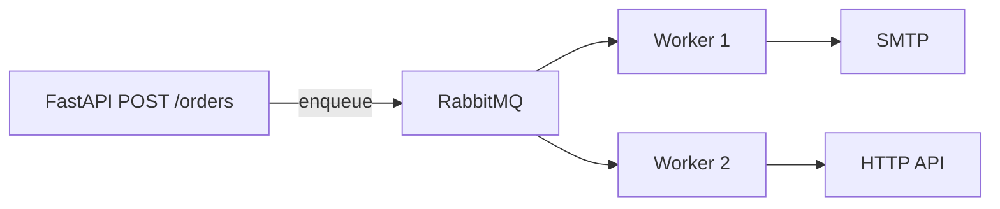

# 01. Task queues: Celery vs SQS vs raw AMQP

## Введение: «отправить email после заказа — но не блокировать checkout»

Пользователь нажал **Pay**. Нужно: списать оплату, создать заказ, **отправить email**, обновить аналитику, синхронизировать склад. Если всё в одном HTTP-request — latency 5–15 секунд, таймауты nginx, angry users.

**Решение:** вынести медленное и некритичное в **фоновую очередь**. Worker заберёт задачу когда сможет. HTTP ответ — «заказ принят» за 200 ms.

Celery — **de facto standard** для Python + RabbitMQ/Redis. Но не единственный инструмент.

## Что вы узнаете

- Когда нужна **очередь задач**, а когда хватит cron или Kafka.
- Celery vs **AWS SQS** vs **raw RabbitMQ consumer**.
- Где Celery в стеке mock-exams (FastAPI, Django, DevOps).

---

## Sync vs async processing

| Подход | Плюсы | Минусы |
|--------|-------|--------|
| **Sync в request** | простота | latency, cascade failures |
| **Thread pool в процессе** | быстро внедрить | теряется при restart, нет retry across nodes |
| **External queue + workers** | scale, retry, isolation | инфраструктура, eventual consistency |

---

## Celery vs alternatives

| Tool | Model | Best for |
|------|-------|----------|
| **Celery** | task queue, Python-native | email, reports, ETL chunks, Django/FastAPI |
| **AWS SQS** | managed queue | cloud-native, Lambda consumers |
| **RabbitMQ (raw pika)** | AMQP | full control, non-Python consumers |
| **Kafka** | distributed log | event streaming, replay, many consumers |
| **cron / Beat only** | schedule | periodic cleanup, no event trigger |
| **asyncio background** | in-process | lightweight, no durability |

[`messaging-deep`](../messaging-deep/README.md) — когда queue vs log.

---

## Celery building blocks (preview)

| Component | Role |
|-----------|------|
| **Producer** | ваш API вызывает `task.delay()` |
| **Broker** | RabbitMQ / Redis — хранит сообщения |
| **Worker** | процесс `celery worker` — выполняет task |
| **Result backend** | Redis / DB — хранит return value (optional) |
| **Beat** | scheduler periodic tasks |

Подробно: [02-celery-architecture](02-celery-architecture.md).

---

## When NOT to use Celery

- **Hard real-time** (< 100 ms SLA) — queue adds latency.
- **Exactly-once end-to-end** без design — Celery **at-least-once** delivery.
- **Heavy streaming analytics** — Kafka лучше.
- **One cron job per day** — systemd timer проще.

---

## Python ecosystem map

| Stack | Integration |
|-------|-------------|
| Django | `django-celery-results`, `@shared_task` |
| FastAPI | trigger `delay()` from endpoint |
| Flask | same pattern |
| Serverless | SQS + Lambda вместо Celery workers |

---

## Стенд курса

[`deploy/celery`](../../deploy/celery/README.md):

- API **8093** — trigger tasks
- RabbitMQ **5673** / UI **15673**
- Redis — results
- Flower **5555** — monitoring

---

## Типичные ошибки

| Ошибка | Последствие |
|--------|-------------|
| Queue для CPU-heavy без scale | workers pegged |
| No idempotency | duplicate charges on retry |
| Broker = result backend confusion | lost results or wrong config |

## Резюме

Celery — **distributed task queue** для Python. Broker decouples API от workers. At-least-once → проектируйте **idempotency**. Не путайте с Kafka event log.

Далее: [02-celery-architecture](02-celery-architecture.md).
