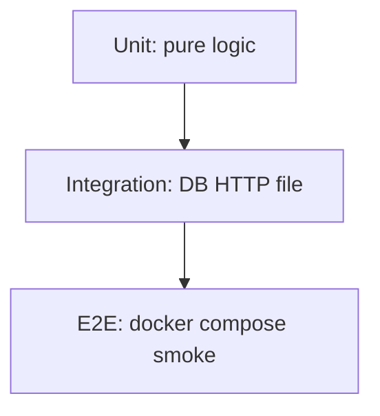

# 01. Ландшафт тестирования: пирамида, confidence, TDD

## Введение: «100% coverage — и баг в проде»

Релиз прошёл «зелёный» pipeline: **847 unit-тестов**, coverage **98%**. Через час в проде — инцидент: checkout падает на **реальной** PostgreSQL, потому что тесты мокали БД и проверяли только happy path mock-объекта. Coverage измерил **строки**, а не **поведение**.

Тестирование — не галочка в Jira, а **контракт с будущим собой**: «я могу менять код и узнать за минуты, что сломалось». Эта глава задаёт **ментальную модель** для всего курса: что тестировать, на каком уровне и зачем.

## Что вы узнаете

- Пирамиду **unit / integration / e2e** и типичные пропорции.
- Разницу **confidence** (уверенность) и **coverage** (метрика).
- Когда **TDD**, когда **test-after** — на практике backend/DevOps.
- Как пакет **`shop-lab`** в [`examples/`](examples/pyproject.toml) моделирует real project.

---

## Пирамида тестов

| Уровень | Объект | Скорость | Доля (ориентир) | Пример в shop-lab |
|---------|--------|----------|-----------------|-------------------|
| **Unit** | функция, класс без I/O | миллисекунды | 60–70% | `apply_discount()` |
| **Integration** | модуль + sqlite/HTTP | секунды | 20–30% | Cart + sqlite, UserService + mock |
| **E2E** | полный стек, curl | минуты | 5–10% | gateway :8095 smoke |

**Антипаттерн:** 90% e2e — pipeline 40 минут, разработчики перестают гонять тесты локально перед push.

**Антипаттерн:** 100% unit с mock всего подряд — «зелёный CI», красный prod.

---

## Confidence vs coverage

| | Coverage | Confidence |
|---|----------|------------|
| Измеряет | какие **строки** выполнились | можно ли **безопасно рефакторить** |
| Инструмент | pytest-cov | ваш мозг + review |
| Ловит | не вызванный dead code | сломанную бизнес-логику |

Coverage **98%** не спасает, если assert проверяет `mock.return_value == mock.return_value`. Хороший тест проверяет **наблюдаемое поведение**: return value, side effect, exception, вызов с правильными args.

---

## pytest vs unittest

| | unittest | pytest |
|---|----------|--------|
| Assert | `self.assertEqual(a, b)` | `assert a == b` |
| Setup | `setUp` / `tearDown` | `@pytest.fixture` |
| Parametrize | `subTest` | `@pytest.mark.parametrize` |
| Discovery | наследование `TestCase` | `test_*.py`, `test_*` |
| Plugins | ограничено | cov, asyncio, xdist, hypothesis |

В индустрии **pytest** — де-факто стандарт. unittest остаётся в legacy и stdlib; знать оба полезно на собеседовании.

---

## TDD и test-after

**TDD (Red → Green → Refactor):**

1. **Red** — пишете тест, он падает (функции ещё нет).
2. **Green** — минимальный код, чтобы тест прошёл.
3. **Refactor** — улучшаете код без смены поведения.

**Test-after** — норма для скриптов DevOps, hotfix и legacy. **Test-first** — для pricing, validation, публичных API.

| Подход | Когда |
|--------|-------|
| TDD | новая чистая логика, контракт API |
| Test-after | багфикс (сначала **regression test**) |
| Characterization test | legacy без docs — фиксируете текущее поведение |

---

## Что тестировать в shop-lab

| Модуль | Unit | Integration | E2E |
|--------|------|-------------|-----|
| [`pricing.py`](examples/src/shop/pricing.py) | parametrize, Hypothesis | — | — |
| [`cart.py`](examples/src/shop/cart.py) | fixtures, state | sqlite roundtrip | — |
| [`users.py`](examples/src/shop/users.py) | mock httpx | `responses` | live :8095 |
| [`async_utils.py`](examples/src/shop/async_utils.py) | pytest-asyncio | — | — |

Код лаб: [`examples/src/shop/`](examples/src/shop/).

---

## Связь с курсами mock-exams

| Курс | Связь |
|------|-------|
| [`fastapi/30-testing`](../fastapi/30-testing.md) | TestClient, API integration |
| [`python-async/27`](../python-async/27-pytest-asyncio.md) | async tests углублённо |
| [`gitlab-basic`](../gitlab-basic/README.md) | pytest job в CI |
| [`appsec-fundamentals`](../appsec-fundamentals/README.md) | SAST + tests в SDLC |

---

## Типичные ошибки

| Ошибка | Последствие | Что делать |
|--------|-------------|------------|
| Гнаться за 100% coverage | бессмысленные assert | порог 80–90% + review |
| Только e2e | медленный CI | пирамида |
| Mock всего подряд | ложная уверенность | mock только **границу** I/O |
| Нет regression на баг | баг возвращается | test-first на fix |

## На собеседовании

- Нарисуйте **пирамиду** и объясните, где у вашего последнего проекта unit vs integration.
- Чем **confidence** отличается от **coverage**?
- Когда mock, когда fake in-memory DB?

## Резюме

Тесты покупают **уверенность в изменениях**. Пирамида держит CI быстрым; pytest — основной инструмент курса. shop-lab — ваш тренажёр до capstone.

Далее: [02-pytest-basics](02-pytest-basics.md).
