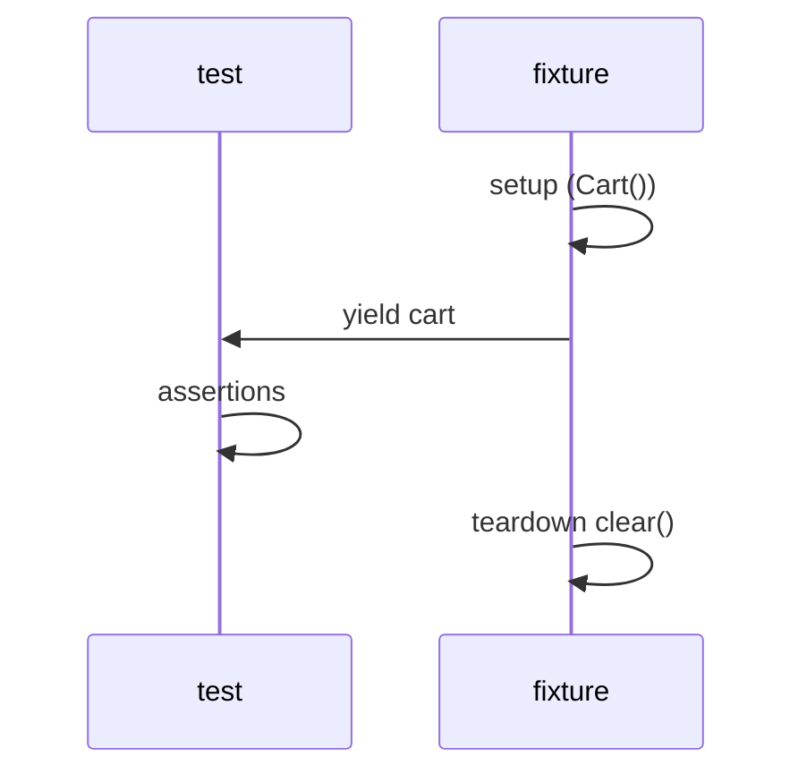

# 04. Fixtures: scope, autouse, yield, composition

## Введение: «тест B падает только после теста A»

Тест A добавил item в глобальный `Cart`. Тест B ожидал пустую корзину — **упал только в full suite**, локально проходил. Классика **shared mutable state**. Fixtures pytest — способ дать каждому тесту **свежий** объект и **гарантированно убрать** за собой, даже если test упал.

## Что вы узнаете

- **Scope** fixture: function, module, session.
- **Yield-fixtures** для teardown.
- **`autouse`** — когда уместен.
- **Composition** — fixture зависит от fixture.
- Связь с `conftest.py` — [12-conftest-layout](12-conftest-layout.md).

---

## Базовый fixture

```python
import pytest
from decimal import Decimal
from shop.cart import Cart


@pytest.fixture
def cart() -> Cart:
    return Cart()


def test_empty_cart(cart):
    assert cart.total() == 0


def test_add_item(cart):
    cart.add("SKU-1", Decimal("10.00"), 2)
    assert cart.total() == Decimal("20.00")
```

pytest **инжектит** fixture по имени аргумента test function.

---

## Scope: lifetime

| scope | Создание | Когда использовать |
|-------|----------|-------------------|
| **function** | каждый test | **default**; mutable state |
| **class** | каждый TestClass | редко |
| **module** | один раз на файл | дорогой read-only setup |
| **package** | пакет tests | shared config |
| **session** | весь pytest run | docker, БД один раз |

```python
@pytest.fixture(scope="module")
def readonly_catalog():
    return {"SKU-1": Decimal("10.00")}
```

**Правило:** Cart, DB connection с записью — **function** scope или yield + cleanup.

---

## Yield fixture = setup + teardown

```python
@pytest.fixture
def cart() -> Cart:
    c = Cart()
    yield c
    c.clear()  # выполнится даже если test упал


@pytest.fixture
def user_service():
    from shop.users import UserService
    svc = UserService("http://fake.example")
    yield svc
    svc.close()
```



---

## autouse

```python
@pytest.fixture(autouse=True)
def _reset_debug_env(monkeypatch):
    monkeypatch.delenv("SHOP_DEBUG", raising=False)
```

| autouse=True | Когда |
|--------------|-------|
| Да | глобальный reset env, disable network |
| Нет | явный `cart` в signature — читаемость test |

Не прячьте **бизнес-setup** в autouse — reviewer не видит зависимостей.

---

## Composition fixtures

```python
@pytest.fixture
def filled_cart(cart):
    from decimal import Decimal
    cart.add("A", Decimal("5.00"), 2)
    cart.add("B", Decimal("3.00"), 1)
    return cart


def test_total_nonzero(filled_cart):
    assert filled_cart.total() > 0
```

`filled_cart` **зависит** от `cart` — pytest строит DAG зависимостей.

---

## fixture vs global

| | global Cart() | fixture |
|---|---------------|---------|
| Изоляция | нет | да |
| Порядок tests | влияет | не влияет |
| Parallel (xdist) | ломается | ok с function scope |

---

## Типичные ошибки

| Ошибка | Последствие | Что делать |
|--------|-------------|------------|
| session scope + mutable | cross-test leak | function + yield |
| Забыли teardown | open files, connections | yield / finalizer |
| autouse для всего | непонятные tests | явные аргументы |
| `return` вместо `yield` | нет cleanup | yield для teardown |

## На собеседовании

- Разница **scope function vs session**?
- Зачем **yield** fixture?
- Когда **autouse** — плохая идея?

## Резюме

Fixtures = dependency injection для tests. Mutable state — **function scope** + **yield teardown**. Composition через аргументы fixture.

Далее: [05-lab-fixtures](05-lab-fixtures.md).
