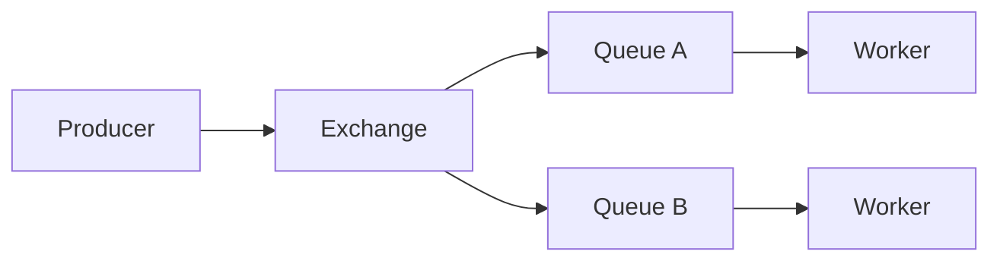

# 01. Зачем RabbitMQ: очереди задач, Kafka и SQS

## Введение: «отправь в Kafka» для каждой кнопки

Команда checkout после каждого заказа пишет в **Kafka** «отправить email». Email-сервису не нужна **история за 30 дней** и **replay** — нужно **один раз** обработать задачу и **убрать** сообщение из очереди. Ops тратит недели на tuning retention, а разработчик ждёт **priority** и **dead letter** для писем с ошибкой SMTP. SRE предлагает **RabbitMQ**: AMQP, routing по ключу, ack/nack, Management UI на инциденте. Эта глава — **когда RabbitMQ уместен**, а когда лучше **Kafka** ([kafka-basic/18](../kafka-basic/18-vs-queues.md)) или **Amazon SQS** ([aws-intermediate/07](../aws-intermediate/07-sqs-dlq.md)).

## Что вы узнаете

- Отличие **очереди задач** от **лога событий** (Kafka).
- Сценарии: work queue, fan-out уведомлений, RPC-style reply.
- Почему на стенде логин **`course` / `course`** и vhost **`/`**.
- Связь с курсом Kafka: [18. Kafka vs RabbitMQ vs SQS](../kafka-basic/18-vs-queues.md).

## Три модели обмена сообщениями

| Модель | Вопрос | Пример |
|--------|--------|--------|
| **Task queue** | Кто выполнит работу один раз? | resize картинки, отправка SMS |
| **Pub/Sub** | Кто узнает о событии? | order.created → billing + analytics |
| **Event log** | Кто прочитает историю с offset? | CDC, stream processing |

**RabbitMQ** силён в **первых двух** через **exchanges** и **bindings**. **Kafka** — в **третьей** (retention, consumer groups, replay).



## RabbitMQ в одном абзаце

**RabbitMQ** — брокер **AMQP 0-9-1**: producer публикует в **exchange**, exchange по **rules** кладёт копии в **queues**, consumer **pull/push** из очереди и **подтверждает (ack)** обработку. Сообщение **исчезает** из очереди после ack (в отличие от log, где offset двигает consumer).

Учебный стенд: [`deploy/rabbitmq`](../../deploy/rabbitmq/README.md) — AMQP `localhost:5672`, UI [localhost:15672](http://localhost:15672).

## Kafka vs RabbitMQ (кратко)

| Критерий | Kafka | RabbitMQ |
|----------|-------|----------|
| Хранение | retention по времени/размеру | до ack / TTL / DLX |
| Replay | да | обычно нет |
| Routing | topic + partition | exchange types + routing key |
| Throughput | очень высокий log | средний/высокий queue |
| Ops | свой кластер, ZooKeeper/KRaft | Erlang cluster, policies |

Подробная таблица и interview — [kafka-basic/18-vs-queues](../kafka-basic/18-vs-queues.md).

## Amazon SQS (когда не Rabbit)

**SQS** — managed queue в AWS: visibility timeout, DLQ, Lambda trigger. Нет exchanges и сложного topic routing «из коробки» на уровне одного брокера. Выбирайте SQS, если **уже в AWS** и не хотите поднимать Rabbit. Выбирайте Rabbit, если нужен **on-prem / multi-cloud**, **topic/direct routing**, **priority**, единый брокер для десятков паттернов.

## Когда выбирать RabbitMQ

**Подходит:**

- **Фоновые задачи** (email, PDF, webhook retry) с удалением после обработки.
- **Сложный routing** (topic: `orders.eu.#`, direct: `payment.failed`).
- **Несколько подписчиков** на одно событие через fanout или отдельные bindings.
- **RPC** (reply-to queue) внутри одного data center.

**Сомнительно:**

- Новый сервис должен **прочитать все события за месяц** — Kafka/лог.
- **Миллионы msg/s** в один logical stream без шардинга — Kafka partitions.
- Только AWS, минимум ops — **SQS**.

## На стенде: первое касание

```bash
cd deploy/rabbitmq
docker compose up -d
docker compose ps
bash scripts/smoke.sh
```

```bash
docker exec mock-rabbitmq rabbitmq-diagnostics -q ping
docker exec mock-rabbitmq rabbitmqadmin -u course -p course list exchanges name type
```

| URL / порт | Назначение |
|------------|------------|
| [localhost:15672](http://localhost:15672) | Queues, Exchanges, Bindings (UI) |
| `localhost:5672` | AMQP (приложения, лабы через `rabbitmqadmin` в контейнере) |

## Типичные ошибки

| Ошибка | Почему плохо | Как правильно |
|--------|--------------|---------------|
| «Везде Kafka» | лишний ops, нет приоритетов задач | задачи → queue; история → log |
| Публиковать **в queue** напрямую (в коде) | обход routing | publish в **exchange** + binding |
| Игнорировать **ack** | сообщения возвращаются при disconnect | manual ack после успеха |
| Один vhost на prod и lab | путаница прав | отдельный vhost `/lab` |
| Секреты в репозитории | утечка | переменные окружения, не `course` в проде |

## В продакшене

- **Cluster** 3+ узла, **quorum queues** (intermediate), мониторинг [Prometheus plugin](https://www.rabbitmq.com/docs/prometheus).
- **TLS** и отдельные пользователи с **permissions** на vhost.
- **Policies**: TTL, max-length, DLX (dead letter exchange).
- **Идемпотентность** consumer: at-least-once → дубликаты возможны.
- **Гибрид**: outbox в PostgreSQL → Rabbit для workers; Kafka для analytics.

## Заметки для собеседования

- **Exchange** не хранит сообщения долго — маршрутизирует в очереди.
- **At-least-once** при manual ack и redelivery.
- **Prefetch** ограничивает «занятые» unacked сообщения на consumer.
- Rabbit **не** distributed log; не путать **queue** с **Kafka partition**.

## Резюме

RabbitMQ — **брокер очередей и гибкого routing** для задач и уведомлений. Kafka — **лог** для replay и stream processing. SQS — **managed queue** в AWS. Basic-курс учит AMQP-модели на локальном `mock-rabbitmq`; сравнение с Kafka закрепляется в [главе 12](12-vs-kafka-sqs.md) и [kafka-basic/18](../kafka-basic/18-vs-queues.md).

## Чек-лист

- Одно предложение: чем task queue отличается от event log?
- Кейс для Rabbit priority + DLX (preview)?
- URL Management UI и учётные данные стенда?
- Когда SQS предпочтительнее self-hosted Rabbit?

Следующий урок: [02. Архитектура](02-architecture.md).
