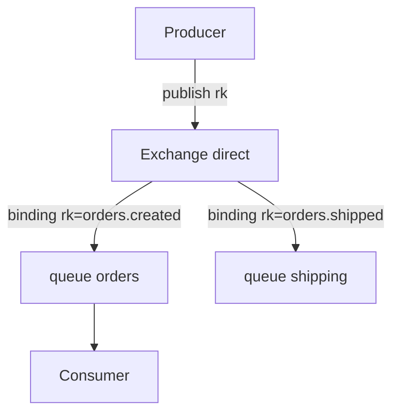

# 02. Архитектура: broker, exchange, queue, binding

## Введение: «сообщение пропало» — а binding есть?

Инцидент: producer шлёт в exchange `orders`, consumer слушает queue `orders.q`, но **очередь пуста**. В UI видно exchange без **binding** на эту очередь с нужным **routing key**. Сообщения ушли в **alternate** или отброшены (`mandatory` / unroutable). Эта глава — **ментальная модель AMQP** на single-node стенде `mock-rabbitmq`; в кластере те же сущности, плюс репликация (intermediate).

## Что вы узнаете

- Иерархия: **connection → channel → exchange → queue → consumer**.
- Типы **exchange**: direct, fanout, topic, headers (overview).
- **Binding**, **routing key**, **vhost**.
- Поля сообщения: **payload**, **properties**, **headers**.

## Broker и vhost

**Broker** — процесс RabbitMQ (узел). **Virtual host (vhost)** — логическая изоляция (как «база»): свои exchanges, queues, permissions. На стенде один vhost **`/`**, пользователь **`course`**.

```bash
docker exec mock-rabbitmq rabbitmqctl list_vhosts
docker exec mock-rabbitmq rabbitmqctl list_permissions -p /
```

## Connection и channel

Клиент открывает **TCP connection** (AMQP `5672`), внутри — **channels** (лёгкие multiplexed сессии). Правило: **не делить channel между потоками** в приложении; в лабах один shell — один неявный channel в `rabbitmqadmin`.

| Сущность | Роль |
|----------|------|
| Connection | TCP + auth |
| Channel | declare, publish, consume |
| Consumer | подписка на queue |

## Exchange

**Exchange** принимает сообщения от producer и **маршрутизирует** в очереди по типу exchange и bindings.

| Тип | Поведение |
|-----|-----------|
| **direct** | routing key **совпадает** с binding key |
| **fanout** | во **все** привязанные очереди (routing key игнорируется) |
| **topic** | wildcard: `*` — одно слово, `#` — ноль и более |
| **headers** | match по заголовкам (реже в лабах) |
| **default** (`""`) | прямо в queue по имени routing key = имя queue |



Встроенные exchanges: `amq.direct`, `amq.fanout`, `amq.topic` — в лабах создаём **свои** имена `lab.*`.

## Queue

**Queue** — буфер FIFO (с оговорками priority). Сообщение лежит, пока consumer не **ack** или не истечёт **TTL**.

```bash
docker exec mock-rabbitmq rabbitmqctl list_queues name messages consumers
```

| Параметр | Смысл |
|----------|--------|
| `durable` | переживает restart broker (не содержимое без persistent messages) |
| `exclusive` | только этот connection |
| `auto_delete` | удалить, когда отключится последний consumer |

## Binding

**Binding** — связь **exchange → queue** (+ routing key для direct/topic). Без binding сообщения **не попадают** в очередь (если не default exchange к имени queue).

```bash
docker exec mock-rabbitmq rabbitmqadmin -u course -p course \
  declare binding source=lab.ex destination=lab.q routing_key=lab.key
```

## Сообщение

- **Body** — payload (JSON, bytes).
- **Properties**: `content_type`, `delivery_mode` (1 non-persistent, 2 persistent), `reply_to`, `correlation_id`.
- **Headers** — произвольные метаданные (routing в headers exchange).

Persistent (`delivery_mode=2`) + durable queue **снижают** потерю при crash, но не дают exactly-once.

## Management UI

[http://localhost:15672](http://localhost:15672) → **Queues**, **Exchanges**, **Bindings** — визуальная проверка лаб. Вкладка **Get messages** — ручной consume (как `rabbitmqadmin get`).

## На стенде: обзор объектов

```bash
docker exec mock-rabbitmq rabbitmqadmin -u course -p course list exchanges name type
docker exec mock-rabbitmq rabbitmqadmin -u course -p course list queues name messages
docker exec mock-rabbitmq rabbitmqadmin -u course -p course list bindings source destination routing_key
```

После [лабы 03](03-lab-first-queue.md) появятся `lab.first.ex` / `lab.first.q`.

## Типичные ошибки

| Ошибка | Симптом | Исправление |
|--------|---------|-------------|
| Publish без binding | 0 messages в queue | создать binding или проверить rk |
| Путать **queue name** и **routing key** | сообщения не туда | явная схема имён |
| Exclusive queue в двух consumer | второй не подключится | общая durable queue |
| Ожидать ordering между queues | разный порядок | один consumer или shard |
| `guest` на remote | ACCESS_REFUSED | пользователь `course` на стенде |

## В продакшене

- Именование: `{domain}.{event}.{version}` для exchanges/topics в Kafka; для Rabbit — `orders.events` + rk `order.created.v1`.
- **Quorum queues** вместо classic mirrored (RabbitMQ 3.8+).
- **Limits**: max-length, message TTL, overflow `reject-publish` или DLX.
- Мониторинг: `rabbitmq_queue_messages_ready`, consumers, **unacked**.

## Заметки для собеседования

- Exchange **не обязан** хранить сообщения — очередь хранит.
- **Default exchange** — прямой route в queue по имени rk.
- **Channel exception** закрывает channel, не весь connection.
- **Prefetch (QoS)** — на channel, лимит unacked на consumer.

## Резюме

RabbitMQ маршрутизирует через **exchange + binding + routing key** в **queues**, откуда **consumers** забирают работу и **ack**. Понимание этой цепочки объясняет 90% лаб «сообщение не дошло».

## Чек-лист

- Чем exchange отличается от queue?
- Зачем нужен binding?
- Какие два типа exchange вы изучите в basic (direct, fanout, topic)?
- Команда list queues в контейнере?

Следующий урок: [03. Лаба: первая очередь](03-lab-first-queue.md).
