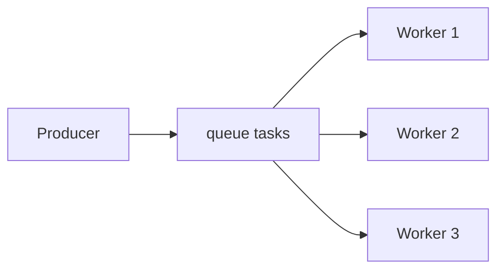

# 04. Work queues: competing consumers и fair dispatch

## Введение: один worker не успевает

Очередь `resize.thumb` копит **10 000** сообщений, один consumer обрабатывает **2 msg/s** — SLA горит. Добавляете второй и третий pod с тем же **queue name** — RabbitMQ раздаёт сообщения **round-robin** между consumer. Это паттерн **work queue** (task queue): много исполнителей, **одна** очередь, каждое сообщение обрабатывает **ровно один** consumer. Эта глава — распределение нагрузки и **prefetch** (детали ack — [10](10-ack-prefetch.md)).

## Что вы узнаете

- Паттерн **competing consumers** на одной очереди.
- **Round-robin** и влияние **prefetch (QoS)**.
- Почему долгая задача без prefetch блокирует «справедливость».
- Отличие от **Kafka**: partition закреплены за consumer в group.

## Work queue



Producer публикует в exchange → binding → **одна** queue `lab.work.q`. Несколько consumer подписаны на **одну и ту же** queue — брокер отдаёт следующее сообщение **свободному** consumer (с учётом prefetch).

| | Work queue (Rabbit) | Kafka consumer group |
|---|---------------------|----------------------|
| Единица параллелизма | consumers на **одной** queue | **partitions** |
| Сообщение после read | удаляется после **ack** | offset commit |
| Масштаб | больше consumer | больше partition |

## Round-robin

По умолчанию RabbitMQ отправляет сообщения по очереди consumer **по кругу**. Если Worker1 получил тяжёлое сообщение и **не ack**, при `prefetch=1` он не получит следующее, пока не завершит — остальные workers продолжают (fair dispatch).

Пример на 4 сообщениях и 2 consumer (A и B):

```text
msg1 → A
msg2 → B
msg3 → A
msg4 → B
```

Если A «завис» на msg1 (unacked), при `prefetch=1` следующие msg3 пойдут B — очередь не простаивает полностью.

## Сообщение как «задача»

Payload work queue — обычно JSON с полями job:

```json
{
  "job_id": "550e8400-e29b-41d4-a716-446655440000",
  "type": "resize.thumbnail",
  "s3_key": "uploads/42.jpg",
  "attempt": 1
}
```

Properties:

| Property | Зачем |
|----------|--------|
| `message_id` | дедупликация в consumer |
| `correlation_id` | связь с HTTP request |
| `expiration` | TTL в ms (не замена business TTL в DB) |
| `priority` | 0–255 (нужен `x-max-priority` на queue) |

Publisher в лабе: `rabbitmqadmin publish … payload='…'`. В коде — `basic_publish` после declare топологии.

## Prefetch (preview)

**`basic.qos(prefetch_count=N)`** — не более **N unacked** сообщений на channel. На стенде `rabbitmqadmin get` эмулирует одноразовый consume; в приложениях (Python `pika`, Java client) prefetch обязателен для work queues.

| prefetch | Эффект |
|----------|--------|
| нет / большой | один consumer может «захватить» пачку |
| 1 | максимально fair, меньше throughput |
| 10–50 | баланс для быстрых задач |

## Durable и persistent

Для задач, переживающих restart:

- queue `durable=true`
- сообщения `delivery_mode=2` (persistent)

На лаб-стенде single-node это учебная привычка; в проде — **quorum queues** (intermediate).

## На стенде: концепт

Топология для [лабы 05](05-lab-work-queue.md):

- exchange `lab.work.ex` (direct)
- queue `lab.work.q`
- routing key `task`

```bash
# после лабы 05
docker exec mock-rabbitmq rabbitmqctl list_queues name messages consumers | grep lab.work
```

Ожидаете **consumers=2** при двух параллельных `get` в разных терминалах (или скрипте).

## Типичные ошибки

| Ошибка | Симптом | Исправление |
|--------|---------|-------------|
| Разные имена queue у workers | дублирование обработки / пустая очередь | **одно** имя queue |
| Auto-ack при сбое | потеря задачи | manual ack после успеха |
| Слишком большой prefetch | один pod забрал всё | prefetch 1–10 |
| Отдельная queue на каждый worker | нет competing | одна shared queue |
| Считать Kafka partition = Rabbit queue | неверное масштабирование | см. [kafka-basic/06](../kafka-basic/06-consumer.md) |

## Масштабирование и backpressure

| Сигнал | Действие |
|--------|----------|
| `messages_ready` растёт | добавить consumer pods |
| `messages_unacknowledged` высокий | проверить зависшие workers, prefetch |
| `ack rate` << `publish rate` | ускорить обработку или throttle producer |
| RAM broker растёт | max-length policy, DLX, отложить publish |

**Backpressure** на producer: при depth > порога — 429 HTTP или pause publish; не бесконечно забивать очередь.

## В продакшене

- **Horizontally scale** consumers по метрике `messages_ready`.
- **Dead letter exchange** для poison messages (intermediate).
- **Идемпотентность**: повторная доставка после nack/requeue.
- **TTL** на задачи «протухли через 24ч».
- K8s **HPA** по `rabbitmq_queue_messages` (Prometheus).

## Заметки для собеседования

- Work queue = **одна очередь**, N consumers, **один** обработчик на сообщение.
- **At-least-once** → возможны дубликаты при redelivery.
- Kafka масштабирует consumption **partitions**, не «ещё одна копия topic».

## Резюме

Work queue распределяет **задачи** между workers через общую очередь и round-robin. **Prefetch** и **manual ack** делают распределение предсказуемым под разную длительность задач.

## Чек-лист

- Сколько consumer обработают одно сообщение?
- Чем work queue отличается от fanout?
- Зачем prefetch=1 для тяжёлых job?
- Как проверить число consumers на стенде?

Следующий урок: [05. Лаба: work queue](05-lab-work-queue.md).
