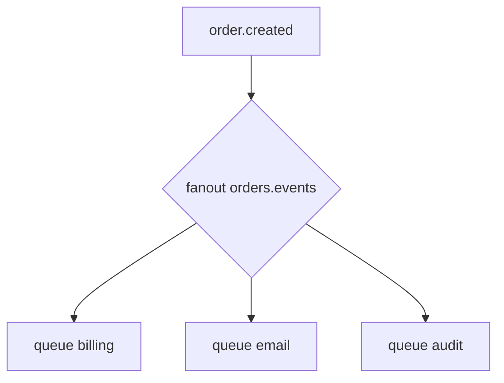

# 06. Pub/Sub: fanout exchange

## Введение: одно событие — три подсистемы

Заказ создан: нужно списать бонус, отправить email и записать в audit. **Work queue** не подходит — одно сообщение должно попасть в **три независимые** очереди. **Fanout exchange** доставляет **копию** каждого сообщения во **все** привязанные очереди. Routing key при fanout **игнорируется** — важны только bindings.

## Что вы узнаете

- Паттерн **publish/subscribe** на fanout.
- Отличие от **direct** (одна очередь на ключ) и от **Kafka** (отдельные consumer groups читают один topic).
- Именование очередей для каждого subscriber.
- Когда fanout избыточен — topic exchange ([08](08-routing-direct-topic.md)).

## Fanout



| Тип exchange | Куда идёт сообщение |
|--------------|---------------------|
| direct | в очереди с **совпадающим** rk |
| fanout | во **все** bound queues |
| topic | по **шаблону** rk |

## Отдельная очередь на подписчика

Anti-pattern: два разных сервиса читают **одну** queue — они **делят** сообщения (work queue). Для pub/sub каждый сервис создаёт **свою** queue и bind к fanout:

- `orders.events.billing`
- `orders.events.email`
- `orders.events.audit`

## Kafka analogy (осторожно)

В Kafka **один** topic, **разные consumer groups** — каждая группа получает все сообщения. В Rabbit **fanout + N queues** — тот же эффект «каждый подписчик видит всё», но модель — **копии в очередях**, не log offsets. Replay — слабая сторона Rabbit; см. [12](12-vs-kafka-sqs.md).

| Задача | Kafka | Rabbit fanout |
|--------|-------|---------------|
| Новый подписчик «с нуля» | новая group, offset=earliest | только **новые** msg (нет backlog в чужой queue) |
| Удаление после read | нет (log) | ack удаляет из **своей** queue |
| Фильтр по типу события | отдельный topic или stream filter | topic exchange вместо fanout |

## Временные очереди (preview)

Подписчик может объявить **exclusive auto-delete queue**, привязать к fanout и получать события только пока он online (классический **pub/sub с отвалом**). В проде чаще **durable** queue на сервис — пережить restart consumer.

```text
fanout events
  └─ exclusive queue tmp-7f3a (auto-delete) ← websocket gateway
```

## Согласованность порядка

Fanout копирует **одно и то же** сообщение; порядок **между** очередями не гарантирован. Внутри **одной** queue порядок FIFO (с оговоркой requeue). Если audit должен видеть события **до** email — не полагайтесь на fanout ordering; используйте **saga** или один orchestrator.

## На стенде

Топология [лабы 07](07-lab-fanout.md):

```text
lab.fanout.ex (fanout)
  ├─ lab.fanout.a.q
  └─ lab.fanout.b.q
```

```bash
docker exec mock-rabbitmq rabbitmqadmin -u course -p course \
  declare exchange name=lab.fanout.ex type=fanout durable=true
```

Binding **без** routing_key:

```bash
docker exec mock-rabbitmq rabbitmqadmin -u course -p course \
  declare binding source=lab.fanout.ex destination=lab.fanout.a.q
```

## Типичные ошибки

| Ошибка | Симптом | Исправление |
|--------|---------|-------------|
| Два сервиса на одной queue | только один получает событие | queue per service |
| Ждать фильтрации по rk на fanout | rk игнорируется | direct/topic |
| Забыть durable на очереди | потеря при restart | durable + persistent |
| Fanout на 100 сервисов без лимитов | memory pressure | TTL, max-length, отдельные vhost |

## В продакшене

- **Topic exchange** часто заменяет fanout, когда подписчиков много и нужна фильтрация (`orders.*.created`).
- **Federation / shovel** для cross-DC (intermediate).
- Мониторинг **depth** каждой subscriber queue отдельно.
- Не путать с **work queue** на одной queue name.

## Когда fanout не подходит

- Нужна доставка **только** в `billing` — используйте **direct** или **topic**.
- Подписчиков **сотни** с разными фильтрами — **topic** `orders.<service>.#` вместо сотни fanout exchanges.
- Нужен **replay** месячной истории — Kafka / лог, не Rabbit fanout.

## Заметки для собеседования

- Fanout = **broadcast** ко всем bindings.
- Pub/sub в Rabbit = **несколько queues**, не «одна queue на всех».
- Для selective routing — **topic** или **headers**.

## Резюме

Fanout рассылает **копию** события во все привязанные очереди — классический **pub/sub** внутри брокера. Каждый consumer-сервис владеет **своей** очередью.

## Чек-лист

- Игнорируется ли routing key у fanout?
- Почему два микросервиса не должны делить одну queue в pub/sub?
- Чем fanout отличается от work queue?
- Когда вместо fanout нужен topic?

Следующий урок: [07. Лаба: fanout](07-lab-fanout.md).
