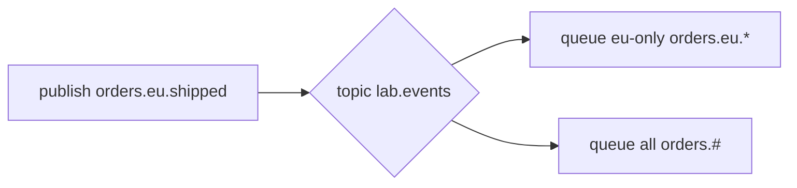

# 08. Routing: direct и topic exchange

## Введение: «все события» в одну очередь — перегруз

Fanout на `orders.events` шлёт **всё** в audit, email и billing. Billing хочет только `payment.captured`, email — `order.shipped` и `order.delivered`. **Direct** маршрутизирует по **точному** routing key; **topic** — по **шаблону** (`orders.eu.*`, `orders.#`). Эта глава — selective routing без десятка fanout exchanges.

## Что вы узнаете

- **Direct exchange**: rk = binding key.
- **Topic exchange**: `*`, `#` в binding pattern.
- Схема имён routing key: `domain.entity.action`.
- Когда topic заменяет множество direct bindings.

## Direct exchange

Producer:

```text
exchange: lab.notify.direct
routing_key: sms.sent
```

Binding:

```text
queue lab.sms.q  ←  routing_key sms.sent
queue lab.email.q ← routing_key email.sent
```

Сообщение с `rk=sms.sent` попадёт **только** в `lab.sms.q`.

| publish rk | binding rk | Доставка |
|------------|------------|----------|
| `sms.sent` | `sms.sent` | да |
| `sms.sent` | `email.sent` | нет |

Несколько binding на **одну** очередь с разными rk — OR (любое совпадение).

## Topic exchange

Binding pattern использует слова, разделённые **точкой**:

| Символ | Значение |
|--------|----------|
| `*` | ровно **одно** слово |
| `#` | **ноль или больше** слов |

Примеры binding → принимает rk:

| binding | routing key | match? |
|---------|-------------|--------|
| `orders.*.created` | `orders.eu.created` | да |
| `orders.*.created` | `orders.eu.uk.created` | нет (`*` одно слово) |
| `orders.#` | `orders.eu.created` | да |
| `orders.#` | `orders` | да (ноль слов после) |
| `*.error` | `api.error` | да |



## Именование routing keys

Рекомендация:

```text
<domain>.<entity>.<action>
orders.payment.failed
orders.shipment.delivered
```

Версионирование: суффикс `.v1` или header `schema_version`.

## Direct vs topic vs fanout

| Нужно | Exchange |
|-------|----------|
| Всем подписчикам всё | fanout |
| Фиксированный набор каналов | direct |
| Фильтр по иерархии / региону | topic |
| Match по заголовкам без rk | headers |

## На стенде

Лаба [09](09-lab-routing.md) использует:

- `lab.route.direct` + очереди `sms` / `email`
- `lab.route.topic` + `orders.eu.*` и `orders.#`

```bash
docker exec mock-rabbitmq rabbitmqadmin -u course -p course \
  declare exchange name=lab.route.topic type=topic durable=true
```

## Типичные ошибки

| Ошибка | Симптом | Исправление |
|--------|---------|-------------|
| Путать `*` и `#` | пропуск или лишние msg | таблица выше |
| rk без точек при topic | pattern не матчится | единый формат слов |
| Один direct rk на всё | взрыв bindings | topic `orders.#` |
| Topic для 2 статичных rk | избыточно | direct проще |
| Case-sensitive rk | silent drop | lowercase convention |

## В продакшене

- **Consistent hashing exchange** для shard по ключу (редко, advanced).
- **Alternate exchange** для unroutable (мониторинг потерь).
- Документировать **таблицу rk → queue → owner team**.
- Topic patterns тестировать unit-таблицей match (как в лабе 09).

## Заметки для собеседования

- Direct = **exact match** rk.
- Topic = **wildcard** match; `#` только в binding, не в rk publish.
- Несколько bindings на queue — **union** маршрутов.

## Резюме

**Direct** — точечная доставка по routing key. **Topic** — подписка по шаблону для иерархических событий. Вместе они покрывают большинство enterprise routing без fanout-шторма.

## Чек-лист

- Чем `orders.#` отличается от `orders.*`?
- Сколько очередей получит fanout vs direct с одним rk?
- Пример rk для `payment.failed`?
- Когда direct проще topic?

Следующий урок: [09. Лаба: routing](09-lab-routing.md).
