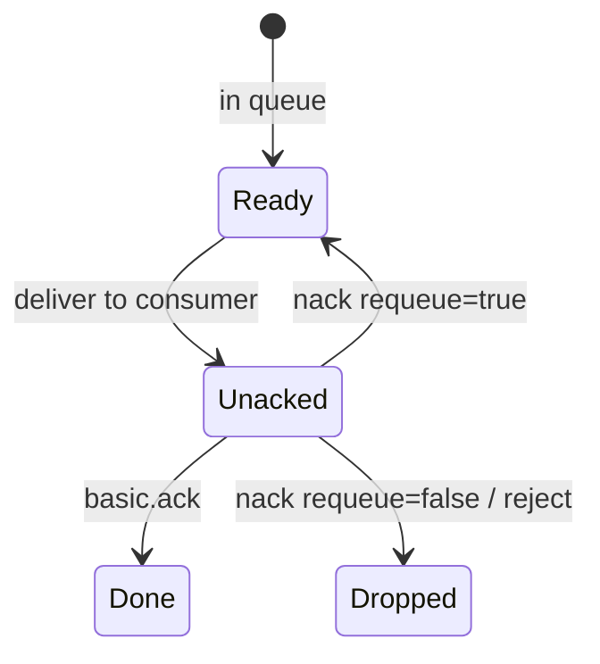

# 10. Ack, nack и prefetch

## Введение: consumer упал — задача вернулась

Worker взял сообщение «списать деньги», упал до commit в БД. Без **ack** брокер считает доставку незавершённой: при закрытии channel сообщение **redelivered** другому consumer (или тому же). Команда включила **manual ack** и **prefetch=1** — fair dispatch и контроль «в полёте». Эта глава — семантика **at-least-once** и обработка ошибок через **nack**.

## Что вы узнаете

- **Auto ack** vs **manual ack**.
- **Ack**, **nack**, **requeue** true/false.
- **Prefetch (QoS)** и unacked сообщения.
- **Poison message** и зачем нужен DLX (preview intermediate).

## Жизненный цикл доставки



| Режим | Когда ack |
|-------|-----------|
| autoAck=true | сразу при deliver |
| manual | после успешной обработки |

На стенде `rabbitmqadmin get ackmode=…` имитирует варианты.

## Ack modes в rabbitmqadmin

| ackmode | Поведение (лаб) |
|---------|-----------------|
| `ack_requeue_true` | прочитать и **вернуть** в очередь |
| `ack_requeue_false` | прочитать и **удалить** (успех) |
| `reject_requeue_true` | отклонить, вернуть |
| `reject_requeue_false` | отклонить, отбросить |

В клиентах: `basic_ack(delivery_tag)`, `basic_nack(requeue=…)`.

## Nack и requeue

**Временная** ошибка (timeout к API): `nack(requeue=true)` — retry с backoff в consumer.

**Постоянная** ошибка (битый JSON): `nack(requeue=false)` или publish в **DLX** — иначе бесконечный цикл redelivery.

| Ситуация | Действие |
|----------|----------|
| DB недоступна 30 с | requeue + retry limit |
| Невалидная схема | reject → DLQ |
| Успех | ack |

## Prefetch

```text
basic_qos(prefetch_count=10)
```

Брокер не отправит consumer больше **10 unacked** сообщений. Сочетается с work queue: медленный worker не блокирует очередь при prefetch=1.

| Значение | Когда |
|----------|-------|
| 1 | тяжёлые job, fair |
| 10–50 | быстрые idempotent tasks |
| слишком большой | один consumer монополизирует |

## At-least-once и идемпотентность

Rabbit гарантирует **at-least-once** при ack после обработки: сбой **до** ack → redelivery → **дубликат**. Consumer обязан быть **идемпотентным** (`idempotency_key`, UPSERT).

Сравнение: [kafka-basic/14](../kafka-basic/14-failures.md), [18-vs-queues](../kafka-basic/18-vs-queues.md).

## На стенде

Лаба [11](11-lab-ack-nack.md): очередь `lab.ack.q`, сценарии requeue.

```bash
docker exec mock-rabbitmq rabbitmqctl list_queues name messages_unacknowledged | head
```

## Типичные ошибки

| Ошибка | Симптом | Исправление |
|--------|---------|-------------|
| Ack до записи в БД | потеря при crash | ack после commit |
| Бесконечный requeue | poison loop | DLX, max retries |
| Нет prefetch | один pod жрёт всё | qos prefetch |
| Долгая обработка без heartbeat | channel closed | увеличить timeout, меньшие msg |
| Считать exactly-once | иллюзия | идемпотентность + outbox |

## В продакшене

- **Publisher confirms** + mandatory для unroutable.
- **DLX** + очередь `*.dlq` + алерт на depth.
- **Quorum queues** для HA ack semantics.
- Трейсинг: `correlation_id`, OpenTelemetry (intermediate).
- **TTL** + dead-letter для «зависших» retry.

## Заметки для собеседования

- **Unacked** — сообщения «в руках» consumer.
- **Redelivery** flag в properties после nack/requeue.
- Prefetch на **channel**, не на connection глобально.
- Rabbit vs SQS: **visibility timeout** ≈ lease до ack.

## Резюме

**Manual ack** связывает удаление сообщения с успехом бизнес-логики. **Nack/requeue** — controlled retry. **Prefetch** балансирует workers. Всё вместе — надёжная work queue без иллюзии exactly-once.

## Чек-лист

- Когда ack безопасен?
- Разница nack requeue true/false?
- Что такое unacked?
- Почему нужна идемпотентность?

Следующий урок: [11. Лаба: ack и nack](11-lab-ack-nack.md).
