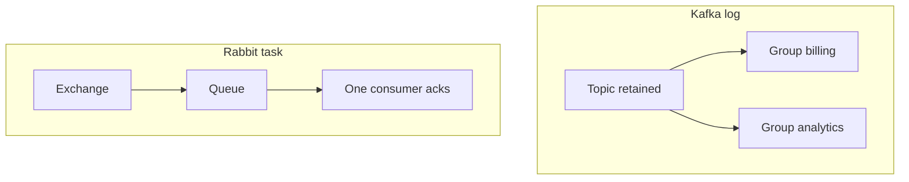

# 12. RabbitMQ vs Kafka vs SQS (собеседование)

## Введение: «у нас уже Kafka — зачем Rabbit?»

Architect board: микросервис заказов пишет в **MSK**, email-worker читает из **того же topic** и «теряет» offset при баге. Analytics хочет **все** события, email — **одну доставку** и удаление. Platform предлагает **Rabbit** для task queue и оставляет Kafka для **event log**. Interview спрашивает trade-offs без фанатизма. Эта глава систематизирует [kafka-basic/18](../kafka-basic/18-vs-queues.md) с акцентом на **RabbitMQ**.

## Что вы узнаете

- Сравнение **модели данных**, **гарантий**, **ops**.
- Когда **Rabbit**, когда **Kafka**, когда **SQS**.
- Формулировки ответов и типичные ловушки.
- Связь с AWS: [07-sqs-dlq](../aws-intermediate/07-sqs-dlq.md).

## Сводная таблица

| Критерий | **Apache Kafka** | **RabbitMQ** | **Amazon SQS** |
|----------|------------------|--------------|----------------|
| Модель | Distributed **log** | **Queue** + exchanges | Managed **queue** |
| Replay | да (retention) | обычно **нет** | **нет** |
| Fan-out | consumer **groups** | fanout / topic bindings | **несколько consumers делят** одну queue |
| Routing | topic + partition key | direct / topic / headers | нет (FIFO — group id) |
| Порядок | в **partition** | в одной queue | FIFO queue — да |
| Throughput | очень высокий | средний/высокий | высокий (managed) |
| Ops | KRaft/ZK, tuning | Erlang cluster | serverless |
| Семантика | at-least-once, EOS опции | ack / nack / DLX | visibility timeout |
| Типичный кейс | streaming, CDC, analytics | tasks, routing, RPC | AWS decouple, Lambda |

## RabbitMQ — когда да

- **Work queue** с competing consumers и **prefetch**.
- **Сложный routing** (`orders.eu.*`, приоритеты).
- **TTL**, **per-message** DLX, **RPC** reply-to.
- On-prem / multi-cloud **без** привязки к AWS.

## RabbitMQ — когда нет

- Новый сервис должен **прочитать историю за месяц**.
- Единый **event backbone** с stream processing (Flink) на всех доменах.
- Команда не готова **оперировать** брокер (маленький MVP в AWS → SQS).

## Kafka — когда да (напоминание)

- **Replay**, несколько **независимых** подписчиков через groups.
- Высокий объём, **долгое** хранение.
- **Stream processing**, log aggregation.

Подробнее: [kafka-basic/18-vs-queues](../kafka-basic/18-vs-queues.md), [01-why-kafka](../kafka-basic/01-why-kafka.md).

## SQS — когда да

- Уже **AWS**, нужен managed, pay-per-use.
- **Lambda** event source, простой worker pool.
- Допустима семантика **visibility timeout** без routing graph.

Ограничения: нет exchanges; **FIFO** throughput лимиты; нет «прочитай с начала квартала».

## Пары для interview

**В: Rabbit — это Kafka поменьше?**  
О: Нет. Rabbit — **брокер очередей** с маршрутизацией; Kafka — **лог** с offset. Разные модели.

**В: Как сделать fan-out в Rabbit vs Kafka?**  
О: Rabbit — **fanout/topic** + отдельная queue на сервис. Kafka — один topic, **разные consumer groups**.

**В: Дубликаты?**  
О: Rabbit at-least-once при redelivery; SQS — после visibility timeout; Kafka — после rebalance без commit.

**В: Заказы в AWS — SQS или Rabbit?**  
О: Один worker pool, простота — **SQS**. Сложный routing on-prem — **Rabbit** или **MSK** + отдельный task adapter.

## Гибрид в продакшене

- **Outbox** в PostgreSQL → Debezium → **Kafka**; side-effect workers на **Rabbit**.
- **MSK** для analytics, **SQS** к legacy Lambda.
- **Rabbit** внутри DC, **shovel** в cloud (intermediate).

## Типичные ошибки на собеседовании

| Плохой ответ | Лучше |
|--------------|-------|
| «Kafka всегда лучше» | критерии: replay, throughput, ops |
| «SQS не масштабируется» | масштабируется; нет log semantics |
| «Rabbit не надёжен» | cluster, quorum, ack |
| Путать **partition** и **queue** | partition = shard лога |
| «Fanout SQS» | нужна **SNS** + несколько queues |

## На стенде

Rabbit: [`deploy/rabbitmq`](../../deploy/rabbitmq/README.md). Kafka: [`deploy/kafka`](../../deploy/kafka/README.md). Сформулируйте, куда ушло бы событие `order.created` в каждом брокере (topic vs exchange rk).

## Резюме

**Kafka** — лог и streaming. **Rabbit** — очередь, routing, задачи. **SQS** — managed queue в AWS. Выбор по **replay**, **fan-out модели**, **routing**, **облаку** и **компетенции ops**.

## Чек-лист

- Одно предложение: log vs queue?
- Кейс для Rabbit DLX + priority?
- Кейс для Kafka replay?
- Почему 10 consumers SQS **делят** очередь, а 10 groups Kafka — **нет**?

Следующий урок: [13. Финальный проект](13-final-project.md).
