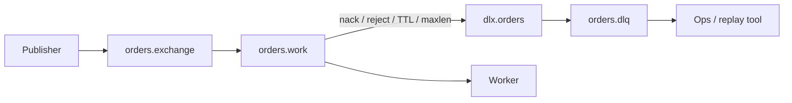

# 03. Dead Letter Exchange (DLX) и Dead Letter Queue (DLQ)

## Введение: «сообщение ушло в никуда после третьего nack»

Worker падает на «битом» JSON заказа. Без политики повторных доставок сообщение бесконечно крутится между брокером и consumer — растёт **ready**, падает throughput, срабатывают алерты. В AWS SQS вы настраиваете **redrive policy**: после `maxReceiveCount` сообщение попадает в **DLQ**. В RabbitMQ тот же паттерн строится на **Dead Letter Exchange**: рабочая очередь при отказе или истечении TTL **перенаправляет** копию в exchange, откуда оно попадает в **DLQ**.

Эта глава — сердце intermediate: DLX — не «мусорка», а **контракт** между командами разработки и эксплуатации.

## Что вы узнаете

- Аргументы **`x-dead-letter-exchange`**, **`x-dead-letter-routing-key`**.
- Когда сообщение **dead-letter**'ится (reject, expire, maxlen, admin).
- Топология **work queue → DLX → DLQ**.
- Сравнение с [SQS DLQ](../aws-intermediate/07-sqs-dlq.md) и retry-topic в Kafka.

---

## Механизм



| Триггер | Условие |
|---------|---------|
| `basic.reject` / `basic.nack` | `requeue=false` |
| TTL | message или queue expires |
| `max-length` / `max-length-bytes` | очередь переполнена |
| `delivery-limit` (quorum) | превышен лимит redelivery |

## Аргументы очереди

Эталон из стенда: [`deploy/rabbitmq/examples/dlx-policy.json`](../../deploy/rabbitmq/examples/dlx-policy.json):

```json
{
  "queue": "orders.work",
  "durable": true,
  "arguments": {
    "x-dead-letter-exchange": "dlx.orders",
    "x-dead-letter-routing-key": "failed"
  }
}
```

- **`x-dead-letter-exchange`** — куда маршрутизировать «мёртвое» сообщение (часто **topic** или **direct**).
- **`x-dead-letter-routing-key`** — ключ для binding в DLQ; если не задан, используется routing key исходной публикации.

**Важно:** DLX должен **существовать**, binding **DLX → DLQ** должен быть создан **до** потока poison messages.

## Сравнение с SQS и Kafka

| | RabbitMQ DLX | SQS DLQ | Kafka (паттерн) |
|---|--------------|---------|-----------------|
| Конфиг | аргументы очереди + bindings | `redrive_policy` | отдельный topic `*.dlq` |
| Счётчик попыток | `delivery-limit` / ручной nack в app | `maxReceiveCount` | consumer retry + commit |
| Просмотр | Management UI, `get` на DLQ | ReceiveMessage на DLQ | consume DLQ topic |
| Порядок | не гарантирован при competing consumers | Standard — нет | в partition — да |

Подробнее SQS: [07-sqs-dlq.md](../aws-intermediate/07-sqs-dlq.md), лаба poison: [08-lab-sqs-dlq.md](../aws-intermediate/08-lab-sqs-dlq.md).

В Kafka нет встроенного DLX — команда публикует в **retry topic** или **DLQ topic** явно ([delivery semantics](../kafka-intermediate/09-delivery-semantics.md)).

## Семантика и идемпотентность

DLQ не отменяет **at-least-once**: сообщение могло частично обработаться до nack. Handler должен быть **идемпотентным** (`orderId` в БД, dedup table), как для SQS Standard и Kafka consumer.

## Операционная модель

1. **Alarm** на `messages_ready` DLQ > 0 (глава 09).
2. **Runbook**: просмотр payload → fix bug → **replay** (publish обратно в work exchange) или ручная обработка.
3. **Не** удалять DLQ без разбора — это audit trail.

## Типичные ошибки

| Ошибка | Симптом |
|--------|---------|
| Нет binding DLX → DLQ | сообщения теряются или unroutable |
| DLX = default exchange без ключа | не туда |
| `requeue=true` при poison | бесконечный цикл |
| Забыли durable на DLQ | потеря после рестарта |

## Резюме

DLX — стандартный способ изолировать «плохие» сообщения. Конфигурация очереди + exchange topology; эталон — `dlx-policy.json` на стенде.

## Чек-лист

- Какие два аргумента задают DLX?
- Чем DLQ в RabbitMQ похожа на SQS DLQ?
- Почему consumer всё равно должен быть идемпотентным?
- Когда сообщение dead-letter'ится без nack?

Следующий урок: [04-lab-dlx.md](04-lab-dlx.md).
