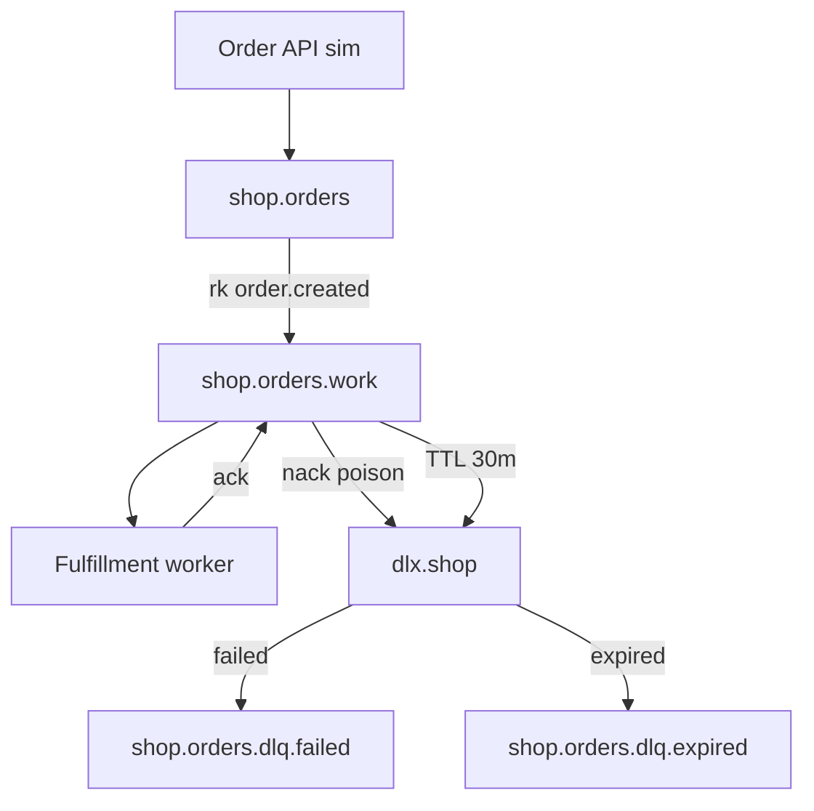

# 12. Финальный проект: надёжный конвейер заказов с DLX

## Введение: intermediate в одном контуре

Вы прошли **quorum**, **DLX/DLQ**, **TTL**, **publisher confirms**, **мониторинг**. **Финал** — конвейер **заказов** на [`deploy/rabbitmq`](../../deploy/rabbitmq/README.md): topic exchange, work-очередь с DLX, отдельные DLQ для **failed** и **expired**, publisher с confirms, consumer с ack/nack, runbook и отчёт. Без обязательного микросервисного фреймворка — достаточно Python/скриптов и Management API.

## Что вы сдаёте

Папка `rabbitmq-intermediate-project/` (или ветка в fork) с **`PROJECT.md`** (≤5 страниц): диаграмма, таблица объектов брокера, скриншоты/вывод API, runbook инцидента DLQ, сравнение с SQS DLQ в 1 абзаце.

## Архитектура



| Объект | Тип | Аргументы / примечание |
|--------|-----|------------------------|
| `shop.orders` | topic exchange | durable |
| `shop.orders.work` | classic или quorum | DLX как [`dlx-policy.json`](../../deploy/rabbitmq/examples/dlx-policy.json), rk `failed` |
| `checkout.hold` (опц.) | classic | `x-message-ttl`, rk `expired` |
| `dlx.shop` | topic | |
| `shop.orders.dlq.failed` | queue | binding rk `failed` |
| `shop.orders.dlq.expired` | queue | binding rk `expired` |

**Routing keys:**

- `order.created` — новый заказ
- `failed` — poison / nack
- `expired` — TTL checkout

## Требования

| # | Требование | Критерий |
|---|------------|----------|
| 1 | Стенд | `deploy/rabbitmq` up, smoke OK |
| 2 | Топология | exchange + ≥3 очереди + bindings |
| 3 | DLX | work-очередь с `x-dead-letter-exchange` / rk (как deploy example) |
| 4 | Publish | ≥10 заказов JSON с `orderId`, **publisher confirms** + `delivery_mode=2` |
| 5 | Consume | worker обрабатывает ≥8, **basic.ack** |
| 6 | Poison | 2 заказа с `simulateError:true` → **dlq.failed** |
| 7 | TTL (опц.) | hold-очередь → **dlq.expired** за время лабы |
| 8 | Quorum (опц.) | одна очередь `x-queue-type=quorum` на cluster compose |
| 9 | Monitoring | curl API: depth work + DLQ; строка из `:15692/metrics` |
| 10 | Drill | без consumer ready≥15, затем drain до 0 ([10-lab](10-lab-management-drill.md)) |
| 11 | Runbook | таблица: симптом → проверка → действие (DLQ, unacked, alarm) |
| 12 | Сравнение | абзац: Rabbit DLX vs [SQS DLQ](../aws-intermediate/07-sqs-dlq.md) vs [Kafka EOS](../kafka-intermediate/09-delivery-semantics.md) |
| 13 | PROJECT.md | диаграмма, выводы, что бы изменили в проде |

## Рекомендуемый порядок

### Фаза 1: инфраструктура

Адаптируйте [`examples/dlx-setup.sh`](examples/dlx-setup.sh):

```bash
# переименуйте exchange/queues под shop.* или расширьте скрипт
export API=http://localhost:15672/api
# shop.orders, dlx.shop, shop.orders.work, shop.orders.dlq.failed, ...
```

Сверьте work-очередь с [`deploy/rabbitmq/examples/dlx-policy.json`](../../deploy/rabbitmq/examples/dlx-policy.json).

### Фаза 2: publisher

- `confirm_delivery()`
- correlation `orderId` в JSON
- лог ack/nack

### Фаза 3: consumer

- `prefetch_count=10`
- при `simulateError` → `basic.nack(requeue=False)`
- иначе → `basic.ack`
- идемпотентность: in-memory set `processed_order_ids` (учебно)

### Фаза 4: инциденты

1. Остановить consumer, publish 15 заказов — зафиксировать `messages_ready`.
2. Запустить consumer — ready → 0.
3. Отправить poison — `shop.orders.dlq.failed` > 0.
4. (Опц.) TTL hold → expired DLQ.

### Фаза 5: отчёт

**PROJECT.md** разделы:

1. Цель и диаграмма (mermaid).
2. Таблица объектов RabbitMQ.
3. Скрин UI или `jq` вывод API.
4. Runbook (минимум 5 строк).
5. Сравнение с AWS SQS и Kafka (ссылки на курсы).
6. Quorum: single vs cluster — что выбрали бы в проде.

## Критерии приёмки (самопроверка)

- [ ] Ни одного «потерянного» poison: всё в **failed** DLQ
- [ ] Confirms включены на publisher
- [ ] DLQ depth проверяется API за <30 с
- [ ] Runbook упоминает **unacked** и **memory alarm**
- [ ] Есть ссылка на `deploy/rabbitmq` и `dlx-policy.json`

## Дальше

- Планируемый [rabbitmq-advanced](../rabbitmq-advanced/README.md) (если появится): federation, shovel, streams plugin.
- [kafka-intermediate](../kafka-intermediate/README.md) — event sourcing рядом с task queues.
- [aws-intermediate](../aws-intermediate/README.md) — SQS + Lambda вместо self-hosted AMQP.

Удачи. Сдайте `PROJECT.md` и архив выводов CLI — этого достаточно для зачёта intermediate.
